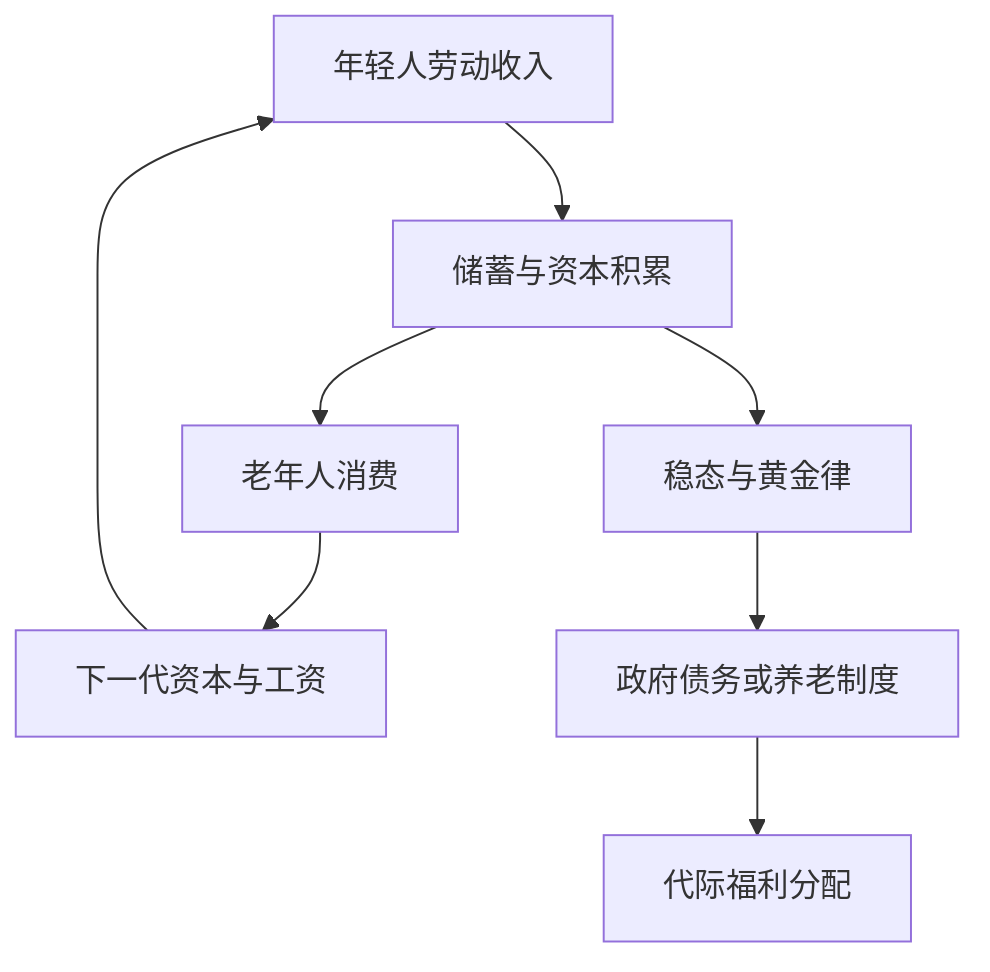

## 代际交叠模型

> 核心关系：OLG 模型通过不同代际的储蓄与消费刻画资本积累，并检验稳态效率及政策的代际分配。

## 决策环境

代际交叠模型（OLG）把无限期界增长经济拆解为一代代仅生活两期的消费者。同一时点上，第 $t$ 期的年轻人与第 $t-1$ 期出生的老年人并存，世代不断交叠。储蓄在其中同时扮演跨期配置与代际配置的角色。

出生于 $t$ 期的消费者的偏好：

$$u(c_{1t},c_{2t+1})=u(c_{1t})+\beta u(c_{2t+1})$$

$c_{1t}$ 为第 $t$ 期年轻人的消费，$c_{2t+1}$ 为同一行为人老年期的消费。期效用函数连续可微、严格递增、严格凹、满足稻田条件。

生产技术 $Y_t=F(K_t,N_t)$ 严格准凹、一次齐次，可用密集形式 $y_t=f(k_t)$ 表述。人口以外生速率 $n$ 增长，$N_{t+1}=(1+n)N_t$。每个年轻人拥有 1 单位劳动禀赋并无弹性供给，老年期无劳动禀赋。资源约束：

$$N_tc_t+K_{t+1}=(1-\delta)K_t+Y_t$$

## 消费者与企业最优化

效用函数取 CRRA 型。年轻消费者求解 $\max\frac{c_{1t}^{1-\theta}-1}{1-\theta}+\beta\frac{c_{2t+1}^{1-\theta}-1}{1-\theta}$，约束 $c_{1t}+s_t=w_t$ 与 $c_{2t+1}=s_t(1+r_{t+1})$。一阶条件为欧拉方程：

$$\frac{c_{2t+1}}{c_{1t}}=\left[\frac{1+r_{t+1}}{1+\rho}\right]^{1/\theta}$$

两期消费的边际替代率等于跨期相对价格。合并预算约束得现值预算约束 $c_{1t}+c_{2t+1}/(1+r_{t+1})=w_t$。储蓄函数：

$$s_t=s(w_t,r_{t+1})=\frac{(1+r_{t+1})^{(1-\theta)/\theta}}{(1+\rho)^{1/\theta}+(1+r_{t+1})^{(1-\theta)/\theta}}w_t$$

工资上升储蓄增加。储蓄对利率的符号取决于 $\theta$：$\theta<1$ 时储蓄随利率递增，$\theta>1$ 时递减，$\theta$ 决定替代效应与收入效应的相对强弱。

企业求解静态利润最大化，一阶条件 $f'(k_t)=r_t+\delta$、$f(k_t)-k_tf'(k_t)=w_t$。

## 竞争均衡与稳态

竞争均衡是数量序列与价格序列的组合，满足消费者最优、企业最优、市场出清。按瓦尔拉斯定理省略商品市场。利用年轻消费者的储蓄成为下一期资本：$K_{t+1}=N_ts(w_t,r_{t+1})$，人均形式 $(1+n)k_{t+1}=s(w_t,r_{t+1})$，把要素价格代入得到人均资本运动方程。

对数效用与柯布-道格拉斯特例（$\theta=1$、$f(k)=k^\alpha$）：最优储蓄率恒为 $\beta/(1+\beta)$，与利率无关。资本运动方程 $k_{t+1}=\frac{1-\alpha}{(1+n)(2+\rho)}k_t^{\alpha}\equiv Dk_t^{\alpha}$。稳态人均资本：

$$k^*=\left[\frac{1-\alpha}{(1+n)(2+\rho)}\right]^{1/(1-\alpha)}$$

$k_{t+1}$ 曲线从原点出发、上凸，与 45 度线交于 $k^*$，从任意 $k_0$（0 除外）出发经济逐渐收敛，$k^*$ 全局稳定。

经济收敛至平衡增长路径后，与索洛模型、新古典增长模型的特性完全相同：储蓄率不变，不考虑技术进步时人均变量增长率均为 0，总量变量按人口增长率 $n$ 增长。

## 收敛速度

把运动方程在 $k^*$ 附近作一阶泰勒展开，$k_{t+1}\cong k^*+\alpha(k_t-k^*)$。该差分方程的解：

$$k_t-k^*\cong\alpha^t(k_0-k^*)$$

若 $\alpha=1/3$，资本每期向 $k^*$ 移动两者距离的 $2/3$。OLG 中一期相当于一个人寿命的一半，收敛速度按一代人而非一年度量。

## 社会计划最优与动态无效率

社会计划者控制生产、资本积累及消费品在年轻人和老人之间的分配。稳态计划者问题：

$$\max\{u(c_1)+\beta u(c_2)\}\quad s.t.\quad c_1+\frac{c_2}{1+n}=f(k)-(n+\delta)k$$

两个一阶条件为 $u'(c_1)=\beta(1+n)u'(c_2)$ 与 $f'(k)=n+\delta$。后者即黄金律资本存量条件。

分散经济稳态资本一般不等于黄金律资本存量：对数效用与柯布-道格拉斯下 $k^*=[\beta(1-\alpha)/((1+n)(1+\beta))]^{1/(1-\alpha)}$，而黄金律 $\hat{k}=(\alpha/(n+\delta))^{1/(1-\alpha)}$。稳态竞争均衡一般不是社会最优，经济遭遇动态无效率，资本存量可能过多或过少。

动态无效率源于经济的跨期结构。代际的无限性使计划者拥有一条通过市场得不到的途径：直接把资源在年轻人与老年人之间转移。市场经济中一个人年老时消费的唯一选择是持有资本，即使资本报酬率非常低。若资本的边际产品小于 $n$，即资本存量超过黄金律，代际转移比储蓄更有效率。当前活着的行为人不能与未出生的行为人交易，市场的不完全性是动态无效率的根源。修正须引入使老年人与年轻人交易成为可能的机制。

## 政府债务与代际转移

以税收融资的政府购买：政府向年轻人征一次性总额税 $g_t$，税后收入下降，人均资本运动方程化为 $k_{t+1}=\frac{1}{(1+n)(2+\rho)}[(1-\alpha)k_t^{\alpha}-g_t]$，$g_t$ 越高则 $k_{t+1}$ 越低。政府购买永久性增加使 $k_{t+1}$ 函数下移，稳态人均资本下降，财政扩张挤出资本积累。

以税收与债券融资的政府购买：政府充当金融中介，向当期年轻人借债、把融资转移给当期老年人，再向下一期年轻人征税偿还本息。政府债券利率必定等于资本租金率，否则行为人不会同时愿意持有资本和债券。政府预算约束人均化得 $\tau_t=g_t+\frac{r_t-n}{1+n}b$。

政府选择债券数量，使稳态资本收敛于黄金律。设 $g_t=0$，最优债券数量 $\hat{b}$ 满足 $k^*(\hat{b})=\hat{k}$。经济收敛到黄金律稳态时政府税收为零，政府债务以速率 $n$ 增加，该速率等于利率。政府债券一对一挤出私人储蓄，政府债务替代私人储蓄、减少资本积累。

## 养老保险：基金制与现收现付制

社会养老保险制度的目的有二：保证行为人退休后的最低收入，防止行为人缺乏远见。两种筹资模式。基金制下职工工作期间缴费建立基金，退休后支取至死亡，收益 $b_{t+1}=(1+r_{t+1})d_t$，收益率等于市场利率。现收现付制下以当期在职职工缴费支付当期退休工人养老金，收益 $b_{t+1}=(1+n)d_{t+1}$，收益率等于人口增长率。

基金制完全中性。社保系统收益率等于私人储蓄收益率，现值预算约束与无制度时完全相同，强制贡献 $d_t$ 与私人储蓄 $s_t^f$ 作用相同，总量 $s_t^f+d_t$ 恰好等于无制度时的储蓄。消费者不关心由谁储蓄，只关心收益率，通过私人储蓄抵消社保系统代表的储蓄。现实中的基金制仍有意义：行为人并非都完全理性，且行为人可能预期政府不会坐视自己在老年时贫困潦倒而在年轻时过度消费，强制储蓄维持自我保障理性下的储蓄水平。

现收现付制产生挤出效应。最优私人储蓄 $s_t^p=\frac{\beta(1+r_{t+1})(w_t-d_t)-(1+n)d_{t+1}}{(1+\beta)(1+r_{t+1})}$。局部均衡中 $\partial s_t^p/\partial d_t<0$：社保贡献使私人储蓄减少。一般均衡中资本减少引致工资下降、利率上升，在唯一、稳定、非振荡均衡假定下，$d_t$ 增加使资本运动轨迹下移，稳态资本存量减少。

福利判断取决于稳态所处区域。若 $r^*<n$（动态无效），现收现付制减少人均资本、使其更接近黄金律水平，是帕累托改进；若 $r^*>n$（动态有效），则不是。

## 人口老龄化效应

现实中生育率和死亡率下降使两代人口比率下降。无养老保险制度时，最优储蓄不依赖人口增长率 $n$，$n$ 只通过资本运动方程分母 $(1+n_{t+1})$ 影响 $k_{t+1}$。$n$ 下降使资本运动轨迹上移，稳态人均资本增加。基金制不改变最优储蓄决策，老龄化影响与无制度时完全相同。

现收现付制下 $n$ 下降同时降低未来养老金收益，激励私人储蓄增加：$\partial s_t^p/\partial n_{t+1}<0$。一般均衡分析得到 $dk_{t+1}/dn_{t+1}<0$，稳态人均资本增加。

结论隐含假定：老龄化发生后年轻人贡献不变、老年人收益必然下降。现实中减少老年人收益有政治阻力，若不减少收益则年轻人贡献必须增加，此时人口老龄化对经济的影响需重新做一般均衡比较静态，两个渠道方向相反。
