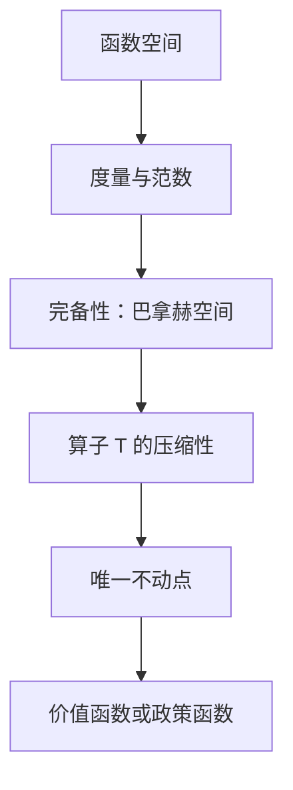

## 数学方法专题

> 核心关系：函数空间的完备性与压缩映射条件保证递归算子存在唯一不动点，从而支撑动态模型求解。

## 从贝尔曼方程到函数空间

贝尔曼方程 $V(x)=\max_y\{u(x,y)+\beta V(y)\}$ 缩写为 $TV=V$，是泛函方程：方程右端把函数映成函数，解 $V$ 本身是一个函数。动态优化问题的价值函数生活在无限维空间里，解方程之前必须先给 $V$ 找一个"家"——一个既有代数结构又能度量距离的空间。

不动点视角：$TV=V$ 即算子 $T$ 的不动点，迭代 $V_{n+1}=TV_n$ 即逐次逼近与时间迭代，若 $V_n$ 与 $V_{n-1}$ 的距离趋于 0，则得到方程的解。

## 向量空间

实向量空间是集合配加法与标量乘法两种运算，标量取自实数域。减法由两者导出：$x-y=x+(-1)\cdot y$。向量空间满足 8 条代数公理：加法交换律、结合律、零向量存在、负向量存在、标量乘法结合律、两种分配律、单位元 $1\cdot x=x$。欧几里得空间是向量空间的特例。

例子一：全体实数列构成向量空间，逐元素相加、逐元素乘标量，零向量是零序列。例子二：$C[a,b]$ 表示闭区间上的全体连续函数，连续函数之和仍连续、标量倍仍连续，各公理逐点验证成立，零向量是零函数。向量空间概念从平面向量推广到抽象对象，这是给价值函数找家的第一步。

## 度量空间

度量空间是集合配度量 $\rho:S\times S\to\mathbb{R}$，$\rho(x,y)$ 给出两点间的距离。度量三条公理：非负且 $\rho(x,y)=0$ 当且仅当 $x=y$；对称性 $\rho(x,y)=\rho(y,x)$；三角不等式 $\rho(x,y)\le\rho(x,z)+\rho(z,y)$。

相等由距离定义：$\rho(x,y)=0$ 定义两个元素相等，不同度量给出不同的相等概念。函数空间上的 sup 度量 $\rho(f,g)=\max_t|f(t)-g(t)|$ 给出强相等，积分度量 $\rho(f,g)=\int|f(t)-g(t)|dt$ 只表示平均意义下的相等。

## 赋范向量空间与空间谱系

赋范向量空间是向量空间与范数的结合，范数 $\|x\|$ 刻画向量长度。范数三条公理：非负且 $\|x\|=0$ 当且仅当 $x=0$；齐次性 $\|\alpha x\|=|\alpha|\|x\|$；三角不等式 $\|x+y\|\le\|x\|+\|y\|$。$C[a,b]$ 配 sup 范数 $\|f\|=\sup_t|f(t)|$ 是赋范向量空间。

空间层级从外到内：拓扑空间、度量空间、赋范向量空间、巴拿赫空间（完备的赋范向量空间）、内积空间、希尔伯特空间（完备的内积空间）、欧几里得空间。所有赋范向量空间都是度量空间，令 $\rho(x,y)=\|x-y\|$ 即可；反之不成立，度量空间只含几何结构。

## 完备性与巴拿赫空间

收敛：序列 $\{x_n\}$ 收敛到 $x$，对任意 $\varepsilon>0$ 存在 $N$ 使 $n\ge N$ 时 $\rho(x_n,x)<\varepsilon$。柯西序列：尾部元素彼此间的距离趋于 0。

收敛与柯西不等价。空间 $X=(0,1]$ 中序列 $x_n=1-1/n$ 是柯西序列，收敛到 1，但 $1\notin X$，序列在空间外收敛。完备性：空间中每个柯西序列都收敛到空间内的点。实数集完备。完备的赋范向量空间即巴拿赫空间。

**定理**：有界连续函数空间 $C(X)$ 配 sup 范数是巴拿赫空间。状态空间 $X\subset\mathbb{R}^l$，$C(X)$ 为定义在 $X$ 上的全体有界连续函数，配 sup 范数 $\|f\|=\sup_{x\in X}|f(x)|$。

证明分三步。第一步逐点构造极限函数：任取柯西序列 $\{f_n\}\subset C(X)$，固定 $x$，$\{f_n(x)\}$ 是实数柯西序列，由实数完备性存在 $f(x)=\lim_nf_n(x)$，对每个 $x$ 定义 $\hat{f}(x)=f(x)$。第二步证明 $\|f_n-\hat{f}\|\to0$：三角不等式加一项减一项，$|f_n(x)-\hat{f}(x)|\le|f_n(x)-f_m(x)|+|f_m(x)-\hat{f}(x)|$，用 $\varepsilon/2+\varepsilon/2$ 拆分；按 sup 范数收敛即一致收敛，强于点态收敛。第三步证明 $\hat{f}\in C(X)$：有界性由三角不等式拆分，连续性用 $\varepsilon/3$ 论证借用某个 $f_k$ 的连续性。未证明极限函数属于原空间之前不得对其使用该空间的范数，否则循环论证。

## 压缩映射定理

压缩映射：度量空间上的自映射 $T:S\to S$，若存在 $\beta\in(0,1)$ 使 $\rho(Tx,Ty)\le\beta\rho(x,y)$ 对任意 $x,y$ 成立，则称 $T$ 是模为 $\beta$ 的压缩映射。不能写成 $\|Tx-y\|\le\beta\|x-y\|$：$T$ 不一定是线性算子，一般不能把 $T$ 拆进差号里面。

压缩映射定理（巴拿赫不动点定理）：设 $(S,\rho)$ 是完备度量空间，$T$ 是模为 $\beta$ 的压缩映射，则方程 $Tv=v$ 存在唯一的解 $v^*$；对任意初值 $v_0$，迭代 $v_{n+1}=Tv_n$ 以几何速度 $\beta^n\rho(v_0,v^*)$ 收敛到 $v^*$。

证明分四步。构造：任取 $v_0$ 令 $v_{n+1}=Tv_n$。柯西性：用三角不等式逐项拆分并求和，$\rho(v_m,v_n)\le\sum_{i=n}^{m-1}\rho(v_{i+1},v_i)\le\frac{\beta^n}{1-\beta}\rho(v_1,v_0)\to0$，由完备性 $v_n\to v^*\in S$。不动点：$\rho(Tv^*,v^*)\le\rho(Tv^*,Tv_n)+\rho(v_{n+1},v^*)\to0$。唯一性：若 $u\neq v$ 都是不动点，则 $\rho(u,v)=\rho(Tu,Tv)\le\beta\rho(u,v)<\rho(u,v)$，矛盾。

经济学意义：解无限期动态模型即解贝尔曼方程 $TV=V$，从任意初值迭代必收敛到唯一真解，数值上极方便。

## Blackwell 充分条件

直接按定义验证算子压缩需要找 $\beta$，往往不易。Blackwell 充分条件给出两条容易验证的条件，合起来充分保证压缩性。

单调性：若 $f\le g$ 处处成立，则 $Tf\le Tg$。贴现：存在 $\beta\in(0,1)$，对任意常数 $a$，$T(f+a)=Tf+\beta a$。

证明技巧：任意 $f,g$ 不一定可比较，但恒有 $f\le g+\|f-g\|_\infty$，单调性给出 $Tf\le T(g+\|f-g\|_\infty)$，贴现给出 $Tg+\beta\|f-g\|_\infty$；对称地 $Tg\le Tf+\beta\|f-g\|_\infty$；合并取上确界得 $\|Tf-Tg\|_\infty\le\beta\|f-g\|_\infty$。

## 单部门增长模型中的应用

单部门增长模型的贝尔曼算子：

$$TV(k)=\max_{0\le y\le f(k)}\{u(f(k)-y)+\beta V(y)\}$$

验证单调性：设 $W\ge V$ 处处成立，取 $V$ 问题的最优解 $y^*$，$TV(k)=u(f(k)-y^*)+\beta V(y^*)\le u(f(k)-y^*)+\beta W(y^*)\le TW(k)$。两问题的最优 $y$ 可以不同，第二处只能写小于等于。验证贴现：$T(V+a)(k)=\max_y\{u(f(k)-y)+\beta(V(y)+a)\}=TV(k)+\beta a$，常数 $a$ 被贴现后整体提出。

贝尔曼算子是压缩映射，$C(X)$ 是巴拿赫空间，贝尔曼方程存在唯一解，从任意初值做值函数迭代都收敛到真解。

论证中有两个尚待解决的环节。其一，最优解的存在性与唯一性是隐含假设：若同一状态对应多个最优下一期资本，政策函数无法定义，需用最大值定理刻画。其二，有界性：除非把问题限制在紧集上，$u(f(k)-y)$ 不一定属于 $C(X)$，无界回报的处理需加权 sup 范数等工具。
