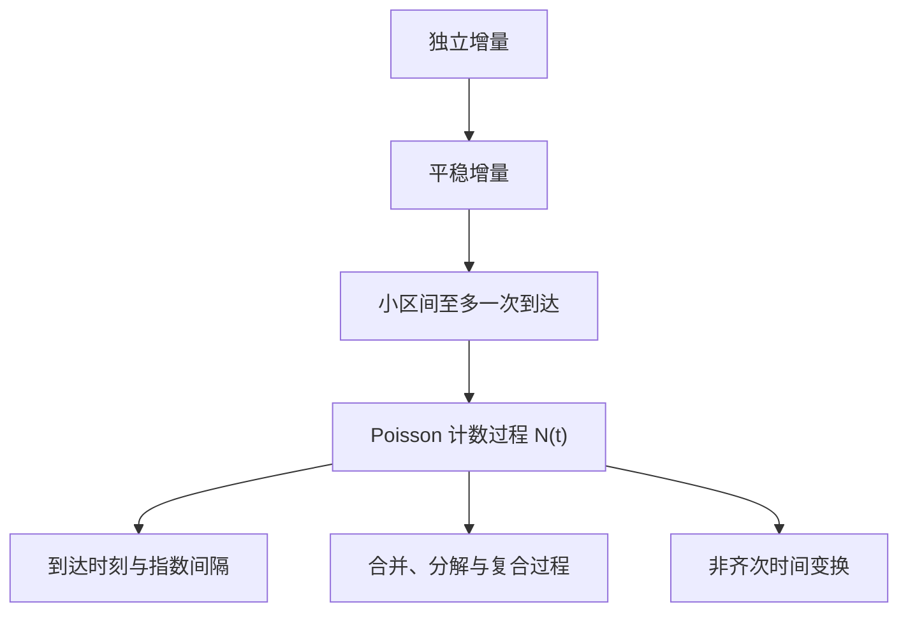

## Poisson 过程

> 核心关系：Poisson 过程用独立、平稳且稀疏的到达假设统一连接计数、间隔时间和复合事件。

## 定义与基本性质

### 计数过程与三条基本假设

**计数过程** $\{N(t),t\ge0\}$ 记录 $(0,t]$ 内事件累计发生次数，满足 $N(0)=0$、取值非负整数、单调不减。随机服务系统的顾客流是典型背景：服务设施固定，顾客何时到达是随机的。

**Poisson 流**由三条理想化假设刻画。**平稳性**要求增量分布只与时间长度有关，$N(t)-N(s)\overset{d}{=}N(t-s)$。**独立性**要求不相交时间区间内的增量独立。**稀有性**要求短时间内最多一名顾客，
$$P(N(t+\Delta t)-N(t)=1)=\lambda\Delta t+o(\Delta t),\qquad P(N(t+\Delta t)-N(t)\ge2)=o(\Delta t),$$
其中 $\lambda$ 称为流的强度，反映系统繁忙程度。

**计数定理**：强度为 $\lambda$ 的 Poisson 流在 $(0,t]$ 内的顾客数服从参数 $\lambda t$ 的 Poisson 分布：
$$P(N(t)=k)=\frac{(\lambda t)^k e^{-\lambda t}}{k!}.$$
证明把 $[0,t]$ 等分为 $n$ 个小区间，由独立性与平稳性把概率化为每个小区间至多一个顾客的组合。

### 形式化定义

**Poisson 过程**是非负整数值随机过程 $\{N(t),t\ge0\}$，满足四条性质：初始值 $P(N(0)=0)=1$；增量平稳；增量独立；$N(t)\sim\mathcal{P}(\lambda t)$。强度 $\lambda=EN(1)$ 是单位时间平均到达数。等价定义只要求 $N(0)=0$、增量独立且增量 $N(t)-N(s)\sim\mathcal{P}(\lambda(t-s))$。

### 数字特征

**均值函数** $\mu_t=EN(t)=\lambda t$，**方差函数** $\mathrm{Var}(N(t))=\lambda t$，均为过原点的线性函数。**相关函数**：设 $s<t$，把 $N(t)$ 拆成 $N(s)+(N(t)-N(s))$，由增量独立与平稳性得
$$EN(s)N(t)=\lambda^2 st+\lambda s,\qquad \mathrm{Cov}(N(s),N(t))=\lambda\min(s,t).$$
计算不依赖联合分布，只用增量独立把期望拆成矩的乘积。

### 有限维分布

设 $t_1<t_2<\cdots<t_k$，非重叠时段的增量相互独立，
$$P(N(t_1)=m_1,\dots,N(t_k)=m_k)=\prod_{i=1}^{k}\frac{(\lambda(t_i-t_{i-1}))^{m_i-m_{i-1}}e^{-\lambda(t_i-t_{i-1})}}{(m_i-m_{i-1})!}.$$

## 到达时刻与间隔时间

### 样本曲线与到达时刻

**样本曲线**是跳高恒为 1 的阶梯函数，跳跃时刻即顾客到达时刻。第一个顾客到达时刻记为 $S_1$，第 $n$ 个记为 $S_n$。

**到达时刻的分布**：事件 $\{S_1>t\}$ 等价于 $\{N(t)=0\}$，故 $S_1\sim\exp(\lambda)$，分布函数 $F(x)=1-e^{-\lambda x}$。事件 $\{S_n>t\}$ 等价于 $\{N(t)\le n-1\}$，故
$$P(S_n>t)=\sum_{k=0}^{n-1}\frac{(\lambda t)^k}{k!}e^{-\lambda t},$$
$S_n\sim\Gamma(n,\lambda)$，密度为 $\frac{\lambda^n t^{n-1}}{(n-1)!}e^{-\lambda t}$。

### 间隔时间与等价刻画

**间隔时间** $X_1=S_1$，$X_n=S_n-S_{n-1}$。给定 $S_1=s$，$P(X_2>t\mid S_1=s)=e^{-\lambda t}$ 与 $s$ 无关，逐次递推得 $\{X_i\}$ 独立同分布 $\exp(\lambda)$。

**更新过程路线**：设 $X_1,X_2,\dots$ i.i.d. $\exp(\lambda)$，$S_n=X_1+\cdots+X_n$，$N(t)=\max\{n:S_n\le t<S_{n+1}\}$，由此构造的计数过程必为强度 $\lambda$ 的 Poisson 过程。两条刻画等价：公理化定义与间隔 i.i.d. 指数分布的更新过程。实际建模常用后者。

### 条件分布

**定理**：给定 $N(t)=n$，到达时刻 $(S_1,\dots,S_n)$ 与 $[0,t]$ 上 $n$ 个 i.i.d. 均匀随机变量的次序统计量同分布，联合密度 $\frac{n!}{t^n}$。特例：$S_1\mid N(t)=1\sim U(0,t)$。

**应用**：随机个数的和先条件于 $N=n$，化为 $n$ 项期望后再对 $N$ 的分布求和。电视台收费节目贴现收益 $Z=\sum_{i=1}^{N}a(1-S_i)e^{-\alpha S_i}$ 的期望按此计算。

## 合并、分解与复合

### 合并定理

两个相互独立的 Poisson 过程 $N_1(t)$、$N_2(t)$（强度 $\lambda_1$、$\lambda_2$）之和仍是 Poisson 过程，强度为 $\lambda_1+\lambda_2$。分布验证用事件的分解与二项式定理。任意有限个相互独立的 Poisson 过程合并，结果仍为 Poisson 过程，强度为各强度之和。

### 分解定理

每个到达点独立地以概率 $p$ 归为第一类、以概率 $1-p$ 归为第二类，则 $N_1(t)\sim\mathcal{P}(p\lambda t)$、$N_2(t)\sim\mathcal{P}((1-p)\lambda t)$，且两过程相互独立。给定 $N(t)=n$ 时 $N_1(t)\sim B(n,p)$，由全概率公式得 $N_1(t)$ 的 Poisson 分布。分类概率为常数、与到达时刻无关，是结论成立的关键。

分类概率随时间变化的推广：设 $p(s)$ 为时刻 $s$ 发生且被保留的概率，则保留次数服从 $\mathcal{P}(\lambda\int_0^t p(s)ds)$。推导处理三层随机性，用对称函数把排序区域的积分化为 $[0,t]^n$ 上的期望。

### 复合泊松过程

**复合泊松过程**：$N(t)$ 是强度 $\lambda$ 的 Poisson 过程，$K_1,K_2,\dots$ 独立同分布且与 $N(t)$ 独立，则
$$Z(t)=\sum_{i=1}^{N(t)}K_i$$
是随机和。保险索赔总额、离子加速器总能量、零件总磨损量是典型应用。

数字特征：设 $\mu=E[K]$、$\sigma^2=\mathrm{Var}(K)$，
$$E[Z(t)]=\mu\lambda t,\qquad \mathrm{Var}(Z(t))=\lambda t(\sigma^2+\mu^2)=\lambda t E[K^2].$$
$Z(t)$ 具有增量独立与增量平稳性；分布一般写不出闭式。工程应用：零件受撞击磨损，磨损次数为强度 $\lambda$ 的 Poisson 过程，单次磨损量 $K_i\sim\exp(\beta)$，磨损超过上限 $\alpha$ 强制更换，平均使用寿命 $E[T]=\frac{\alpha\beta}{\lambda}$。

## 非齐次泊松过程

### 定义与分布定理

**非齐次 Poisson 过程**与齐次情形的差别只在去掉增量平稳：到达强度是随时间变化的函数 $\lambda(t)$，记 $m(t)=\int_0^t\lambda(u)du$。急救设施呼叫次数在不同时段频率不同，用非齐次过程描述。

**分布定理**：对任意 $s<t$，
$$P(N(t)-N(s)=k)=\frac{(\int_s^t\lambda(u)du)^k}{k!}e^{-\int_s^t\lambda(u)du},$$
参数是强度函数曲线在区间下方的面积。证明把概率递推化为非齐次一阶常微分方程 $p_k'(t)=-\lambda(t)p_k(t)+\lambda(t)p_{k-1}(t)$ 求解。

非齐次情形下间隔时间不再独立同分布、不再服从指数分布：$P(X_2>t\mid X_1=s)=e^{-\Lambda(s,s+t]}$ 依赖起点 $s$。

### 时间变换

$m(t)$ 严格递增，存在逆函数 $m^{-1}$。**时间变换定理**：令 $N(t)=\tilde{N}(m^{-1}(t))$，则 $\{N(t)\}$ 是强度为 1 的齐次 Poisson 过程。非齐次过程按累积强度拉伸时间轴即化为齐次流，这是生成与模拟非齐次过程的理论基础。

## 多维泊松点过程

**泊松点过程** $\mathcal{X}$ 是 $\mathbb{R}^d$ 上的随机局部有限点集，满足两条公理：任意有界区域 $A$ 内点数服从 Poisson 分布，均值 $m(A)=\int_A f(x)dx$；任意两个不相交的有界区域内点数相互独立。$f(x)$ 为强度函数，反映点在 $x$ 附近的密集程度。森林中动物的栖息地、宇宙中星星的位置是典型应用。

四个运算定理。**叠加**：独立泊松点过程之并仍为泊松点过程，强度相加。**条件分布**：给定区域 $A$ 内 $n$ 个点，各点独立同分布，密度为 $f(x)/m(A)$。**分色**：按位置概率 $p(x)$ 描色，各色点集是相互独立的泊松点过程，强度分别为 $f(x)p(x)$ 与 $f(x)(1-p(x))$，即给顾客贴标签的数学模型。**映射**：可测映射 $\zeta$ 下，像集 $\zeta(\mathcal{X})$ 是泊松点过程，强度为 $f\circ\zeta^{-1}$；时间变换定理即映射定理在一维、$\zeta=m$ 时的表现。
