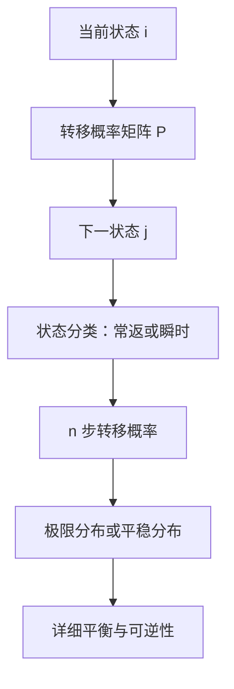

## 马尔可夫链

> 核心关系：马尔可夫链以转移矩阵刻画状态演进，长期行为由状态分类、极限分布与平稳方程共同决定。

## 定义

### 马尔可夫性质

**马尔可夫链**是离散时间、可数状态的随机序列 $\{X_n,n\ge0\}$。事件 $\{X_n=i\}$ 表示第 $n$ 时刻处于状态 $i$。

**马尔可夫性质**：对任意 $n\ge0$、任意状态 $i,j$ 及 $i_0,\dots,i_{n-1}$，
$$P(X_{n+1}=j\mid X_n=i,X_{n-1}=i_{n-1},\dots,X_0=i_0)=P(X_{n+1}=j\mid X_n=i).$$
给定当前时刻所处状态，将来与过去条件独立，即一步相依。马尔可夫性质由马尔可夫于 1905 年提出。时间参数与状态空间有多种组合：连续时间、可数状态是连续时间马尔可夫链；连续时间、连续状态是马尔可夫过程。

### 转移概率矩阵

**转移概率矩阵** $P=(p_{ij})$ 是行和为 1 的非负矩阵，$p_{ij}=P(X_{n+1}=j\mid X_n=i)$。$n$ 步转移概率 $p_{ij}^{(n)}=P(X_n=j\mid X_0=i)$ 组成矩阵 $P^n$。

## 状态分类

### 常返与瞬时

**首达时** $T_j=\inf\{n\ge1:X_n=j\}$ 是首次处于状态 $j$ 的时刻，$X_0=j$ 时称首次返回。

**常返状态**满足 $P(T_j<\infty\mid X_0=j)=1$，从该状态出发有限时间内返回的概率等于 1。**瞬时状态**满足该概率小于 1，存在正概率出去后永不回来。

**正常返**：常返且平均返回时间 $\tau_j=E(T_j\mid X_0=j)<\infty$。**零常返**：常返但 $\tau_j=\infty$。两级分类先按返回概率是否等于 1 分常返与瞬时，常返再按返回时间期望是否有限分正常返与零常返。

**类性质**：状态按互通关系分类，$i\leftrightarrow j$ 时两者的常返性、瞬时性、正常返性相同；定量数值（平均返回时间）类内可以不同。

### 级数判别法

首次返回概率 $f_{jj}^{(n)}=P(T_j=n\mid X_0=j)$ 的通项一般写不出。**判别定理**：
$$j\text{ 常返}\iff\sum_{n\ge1}p_{jj}^{(n)}=\infty;\qquad j\text{ 瞬时}\iff\sum_{n\ge1}p_{jj}^{(n)}<\infty.$$
$p_{jj}^{(n)}$ 是普通 $n$ 步转移概率，不要求首次，判别敛散只需上下界估计。证明由递推 $p_{jj}^{(n)}=\sum_{k=1}^n f_{jj}^{(k)}p_{jj}^{(n-k)}$ 得 $\sum f_{jj}^{(k)}=\frac{\sum p_{jj}^{(n)}}{1+\sum p_{jj}^{(n)}}$，两者同敛散。

### 简单随机游动的常返性

一维简单对称随机游动 $p_{00}^{(2k)}=\binom{2k}{k}/2^{2k}\sim1/\sqrt{\pi k}$，级数发散，常返；平均返回时间发散，零常返。二维简单对称随机游动 $p_{00}^{(2m)}\sim1/(\pi m)$，同样零常返。三维 $p_{00}^{(2m)}\sim C m^{-3/2}$，级数收敛，瞬时。一般结论：$d$ 维简单对称随机游动 $p_{00}^{(2m)}\sim C m^{-d/2}$，$d\le2$ 常返、$d\ge3$ 瞬时。一维非对称随机游动（$p\ne1/2$）每个状态瞬时，大数定律给出 $S_n/n\to p-q>0$，与无限次返回矛盾。

## 极限性质

**定理 4.6**：$j$ 瞬时或零常返时 $\lim_n p_{jj}^{(n)}=0$；$j$ 非周期正常返时 $\lim_n p_{jj}^{(n)}=1/\tau_j$。**推论 4.1**：对任意起点 $i$，$j$ 零常返或瞬时时 $\lim_n p_{ij}^{(n)}=0$；$j$ 非周期正常返时 $\lim_n p_{ij}^{(n)}=f_{ij}/\tau_j$，其中 $f_{ij}$ 是从 $i$ 出发最终到达 $j$ 的概率。

**返回次数** $N_j$：$j$ 常返时 $P(N_j=\infty\mid X_0=j)=1$，即无限次返回；$j$ 瞬时时令 $\rho=P(T_j<\infty\mid X_0=j)<1$，$N_j$ 服从参数 $1-\rho$ 的几何分布，
$$P(N_j=m\mid X_0=j)=\rho^{m-1}(1-\rho).$$
有限状态马尔可夫链必存在正常返状态：若所有状态均瞬时或零常返，由推论得 $p_{ij}^{(n)}\to0$，但 $\sum_{j}p_{ij}^{(n)}=1$ 取极限得 $0=1$，矛盾。

## 极限分布与平稳分布

### 极限分布

**极限分布** $\mu=(\mu_i)$ 满足：对每个状态 $j$，$\lim_{n\to\infty}p_{ij}^{(n)}=\mu_j$ 与初始状态 $i$ 无关，且 $\mu$ 构成概率分布。直观含义：无论链从哪个状态出发，运行足够长时间后处于各状态的概率都趋近同一组数，初始状态的影响完全消失。极限不一定存在，存在时各极限值也不保证构成分布。

两种计算方法。**直接算矩阵幂**：$P^n$ 收敛到各列相同的矩阵时，任一列读出极限分布，收敛速度按特征根模指数衰减。**特征分解法**：$P=Q\Lambda Q^{-1}$，$P^n=Q\Lambda^nQ^{-1}$；$\lambda=1$ 必为特征根，其余特征根模不超过 1；模小于 1 的特征根对应项指数衰减，模为 1 且不等于 1 的特征根（如 $-1$）使极限不存在。两状态周期链 $P=\begin{pmatrix}0&1\\1&0\end{pmatrix}$ 的特征根为 $1$ 与 $-1$，$P^{2n}=I$、$P^{2n+1}$ 为交换阵，极限不存在。

### 平稳分布

**平稳马尔可夫链**：初始分布满足 $\pi P=\pi$ 是链严平稳的充要条件。**平稳分布** $\pi$ 满足平稳性方程
$$\pi P=\pi,\qquad \pi_j=\sum_i\pi_i p_{ij},$$
与概率约束 $\pi_i\ge0$、$\sum_i\pi_i=1$。解线性方程组 $\pi P=\pi$ 加归一化即得。以平稳分布为初始分布，各时刻处于各状态的概率由该分布决定、不再改变。

**核心定理**：非周期不可约马尔可夫链，平稳分布存在当且仅当链正常返；存在时唯一，且 $\pi_j=1/\mu_j$，$\mu_j=E\tau_j$ 为平均常返时间。由此由平稳分布立得平均常返时间，避免直接算 $P^n$ 的通项。极限分布描述长时间后的渐近行为，平稳分布描述分布的不变点，两者是不同概念，在不可约非周期链中恰好相等。

**例**：两状态天气模型 $P=\begin{pmatrix}1/2&1/2\\1/3&2/3\end{pmatrix}$，解 $\pi P=\pi$ 得极限分布 $(0.4,0.6)$，长时间后晴天概率 0.4、阴天概率 0.6，与今天晴雨无关。

## 可逆马尔可夫链

### 详细平衡方程

**可逆马尔可夫链**：不可约链以平稳分布 $\pi$ 为初始分布，若倒序有限维分布 $(X_n,X_{n-1},\dots,X_0)$ 与正序 $(X_0,X_1,\dots,X_n)$ 的联合分布相同，则称链可逆。直观如电影回放。

**详细平衡方程**：
$$\pi_i p_{ij}=\pi_j p_{ji}$$
对任意状态对成立，是链可逆的充要条件。方程对 $j$ 求和即得 $\pi=\pi P$，故它比平稳性条件强；平稳分布存在不等于链可逆。判定流程：先解 $\pi P=\pi$ 求平稳分布，再逐对验证详细平衡方程，有一个等式不成立即否定可逆性。

**Kolmogorov 环路准则**给出不依赖平稳分布的等价判定，在随机模拟部分展开。
