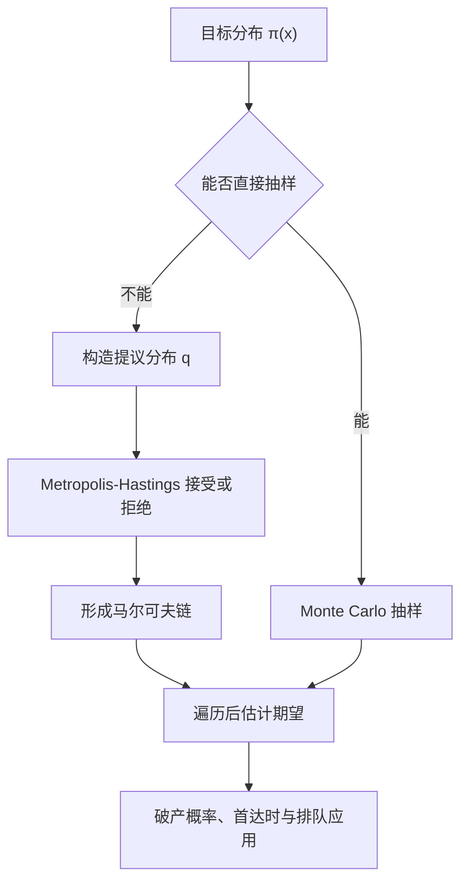

## MCMC 与随机模拟

> 核心关系：Monte Carlo 直接用样本平均计算期望，MCMC 则用收敛到目标分布的链解决难抽样问题。

## 蒙特卡罗方法

### 积分化期望

要计算 $A=\int_{\mathbb{R}^d}f(\mathbf x)\,d\mathbf x$，把 $f$ 分解为 $f(\mathbf x)=g(\mathbf x)p(\mathbf x)$，其中 $p$ 是概率密度，则 $\int f\,d\mathbf x=E[g(\mathbf X)]$，$\mathbf X\sim p$。由强大数定律，$\frac1n\sum_{k=1}^ng(\mathbf X_k)\to E[g(\mathbf X)]$ 几乎必然，$\mathbf X_k$ 独立同分布。

### 抽样困难

$g$ 与 $p$ 的选择既要 $g$ 容易计算，又要方便取得 $p$ 的样本。单位立方体上容易取联合均匀样本；单位球或一般凸体上保证每点等可能并不容易。混合高斯模型有多个峰谷，分布函数写不出原函数，难以直接高效抽样，是统计与机器学习中的常见分布。

**困难转移原理**：问题原本困难，任何方法中必有一个环节仍然困难；概率化方法把积分的困难转成抽样的困难。这正是马尔可夫链蒙特卡罗（MCMC）出现的原因。

## Metropolis-Hastings 算法

### Metropolis 算法

反向问题：给定目标分布 $\pi$，构造转移概率矩阵使 $\pi$ 是其平稳分布。满足 $\pi=\pi P$ 的解不唯一，直接求解困难，于是给出构造性算法。

**Metropolis 算法**（1953，Metropolis、Rosenbluth、Teller 等合作）四步：
1. 任选初始分布 $p_0$ 和对称转移矩阵 $Q=(q_{ij})$，$q_{ij}=q_{ji}$；
2. 按 $p_0$ 抽样 $X_0$；
3. 给定 $X_k=i$，以概率 $q_{ij}$ 选择候选状态 $j$；
4. 定义接受概率 $\alpha_{ij}=\min\{1,\pi_j/\pi_i\}$，以 $\alpha_{ij}$ 接受候选、以 $1-\alpha_{ij}$ 拒绝并原地不动。

由此得到的链每步只依赖当前状态与一次独立的抛硬币，是马尔可夫链，转移概率
$$p_{ij}=\begin{cases}\alpha_{ij}q_{ij},&j\ne i\\[2pt]1-\sum_{j\ne i}p_{ij},&j=i\end{cases}$$
代入定义验证 $\pi_i p_{ij}=\pi_j p_{ji}$ 对一切 $i,j$ 成立，详细平衡方程满足，$\pi$ 是该链的平稳分布。初始分布不能取 $\pi$，任意取定后靠长时间运行使链的分布逼近 $\pi$。

### Hastings 推广

对称性 $q_{ij}=q_{ji}$ 有局限。**Hastings**（1970）去掉该要求，接受概率改为
$$\alpha_{ij}=\min\left\{1,\frac{\pi_j q_{ji}}{\pi_i q_{ij}}\right\},$$
同样验证详细平衡方程。$Q$ 对称时两项相消，退回 Metropolis 原版。该推广适用于贝叶斯统计推断，文献中普遍称 Metropolis-Hastings 算法。

### 遍历定理

**遍历定理**（MCMC 的理论保障）：设 $\{X_n\}$ 为非周期不可约马尔可夫链，$\pi$ 为其平稳分布，$g$ 为实值可测函数，则对任何初始分布 $p_0$，
$$\frac1n\sum_{k=0}^{n-1}g(X_k)\to E_\pi g,\quad a.s.$$
链的样本以平稳分布为初始分布时同分布但不独立，大数定律不直接适用；该定理以链上的时间平均替代独立同分布平均。完整流程：把 $f=gp$ 分解，按 Metropolis-Hastings 构造以 $\pi\propto p$ 为平稳分布的链，由遍历定理链上 $g$ 值的平均收敛到目标积分。

## Kolmogorov 环路准则

**Kolmogorov 环路准则**：不可约平稳马尔可夫链可逆，当且仅当对任意闭路径 $i_0,i_1,\dots,i_{m-1},i_m=i_0$，
$$p_{i_0i_1}p_{i_1i_2}\cdots p_{i_{m-1}i_0}=p_{i_0i_{m-1}}\cdots p_{i_2i_1}p_{i_1i_0}.$$
左边是沿环路走一圈的转移概率乘积，右边是原路返回的乘积。必要性由详细平衡方程逐对连乘、$\pi$ 的乘积左右抵消而得。

**用途**：不必先求平稳分布，直接由 $P$ 判断可逆性；否定可逆只需找出一条不满足等式的环路。状态空间大时环路很多，把链的转移图画出来找路径容易一些。两状态不可约链唯一的环路是 $1\to2\to1$，正反乘积都是 $p_{12}p_{21}$，自动可逆。

## 应用：首达时与金融

### 股票价格首达时

股票价格 $X_n$ 为状态空间 $\{1,2,3,4,5\}$ 的马尔可夫链，转移矩阵
$$P=\begin{pmatrix}1/2&1/2&0&0&0\\1/3&1/3&1/3&0&0\\0&1/4&1/4&1/2&0\\0&0&1/2&1/4&1/4\\0&0&1/8&1/2&3/8\end{pmatrix},$$
初始分布 $P(X_0=2)=P(X_0=3)=1/2$。

**先到 4 不到 1 的概率**：引入首达时 $T_4=\min\{n>0:X_n=4\}$、$T_1$，令 $q_i=P(T_4<T_1\mid X_0=i)$，边界 $q_1=0$、$q_4=1$。一步分析法按第一步转移列方程
$$q_2=\frac13q_1+\frac13q_2+\frac13q_3,\qquad q_3=\frac14q_2+\frac14q_3+\frac12q_4,$$
解得 $q_2=2/5$、$q_3=4/5$，由全概率公式 $P(T_4<T_1)=\frac12\cdot\frac25+\frac12\cdot\frac45=\frac35$。

**到达 4 的平均时间**：设 $\tau_i=E(T_4\mid X_0=i)$，一步分析法列 $\tau_i=1+\sum_jp_{ij}\tau_j$，目标量牵出相关状态的方程，写全后联立求解，按初始分布加权得 $E\tau=\frac12\tau_2+\frac12\tau_3=7$。一步分析法把未知量相互牵连成线性方程组，必须把相关方程写全才能求解。

### 破产概率

保险公司初始盈余 $u_0$，单位时间保费收入 $c$，$t$ 时刻盈余 $u_0+ct-Z(t)$，其中 $Z(t)=\sum_{i=1}^{N(t)}K_i$ 为复合 Poisson 过程：$N$ 为索赔次数 Poisson 过程，$K_i$ 为单次索赔额，独立同分布。**破产概率**为
$$P(u_0+ct-Z(t)<0\text{ 对某个 }t>0).$$
复合 Poisson 过程 $Z(t)$ 的分布一般无闭式，估破产概率须面对该分布，是保险精算的核心问题。

### 排队系统

顾客按到达先后排队等待服务，服务时间随机。$N_a(t)$ 为到达人数，$N_q(t)$ 为队列长度。单服务台模型：到达是强度 $\lambda$ 的 Poisson 过程，服务时间 i.i.d. 指数分布（参数 $\mu$）且与到达独立，即 M/M/1 队列。若 $\lambda<\mu$，稳态队列长度的极限分布
$$p_n=\lim_{t\to\infty}P(N_q(t)=n)=\rho^n(1-\rho),\qquad \rho=\frac{\lambda}{\mu},$$
是几何分布。一个服务系统的输出作为下一个系统的输入串联成排队网络，输出过程须做数学推导，不能随意假定为 Poisson 流。
