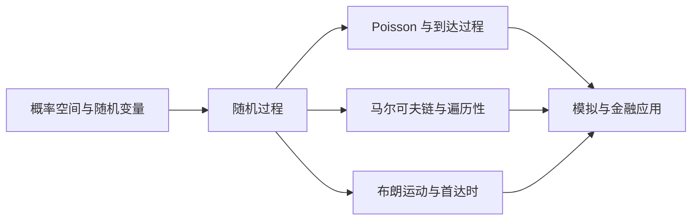

## 随机过程

随机过程是面向金融学背景的数学方法课，讲授 Poisson 过程、马尔可夫链、分支过程、平稳过程遍历性与布朗运动五大主题，为股价建模、期权定价、破产概率与排队系统等金融应用提供随机分析基础。

> 核心关系：随机过程课程从概率基础出发，逐步建立离散、连续和状态转移模型，并落到模拟与金融应用。

**文章清单**：

| 文章 | 说明 |
|---|---|
| [00-intro.md](00-intro.md) | 概率论系统复习（概率空间、特征函数、极限定理）与随机过程基本概念：数字特征、有限维分布、平稳性与过程分类 |
| [01-poisson-process.md](01-poisson-process.md) | 泊松过程的定义、数字特征、样本曲线、到达时刻与间隔时间分布、条件分布、合并分解、复合泊松过程、非齐次泊松过程与多维泊松点过程 |
| [02-markov-chains.md](02-markov-chains.md) | 马尔可夫性质与转移概率矩阵、状态分类（常返/瞬时、级数判别法）、简单随机游动常返性、极限性质、极限分布与平稳分布、可逆性与详细平衡方程 |
| [03-branching-processes.md](03-branching-processes.md) | 高尔顿-沃森过程的历史背景、数学模型、概率生成函数方法、均值方差与最终灭绝概率 |
| [04-stationary-processes-and-ergodicity.md](04-stationary-processes-and-ergodicity.md) | 均值遍历性的定义与判别定理、连续时间遍历定理、渐近独立、时间平均的推广与两类遍历定理 |
| [05-brownian-motion.md](05-brownian-motion.md) | 布朗运动的历史背景与数学定义、数字特征、有限维分布、样本轨道性质、派生过程、最大值与反射原理、首中时 |
| [06-mcmc-and-stochastic-simulation.md](06-mcmc-and-stochastic-simulation.md) | Metropolis-Hastings 算法与遍历定理、Kolmogorov 环路准则，及股票价格首达时、破产概率、排队系统应用 |
