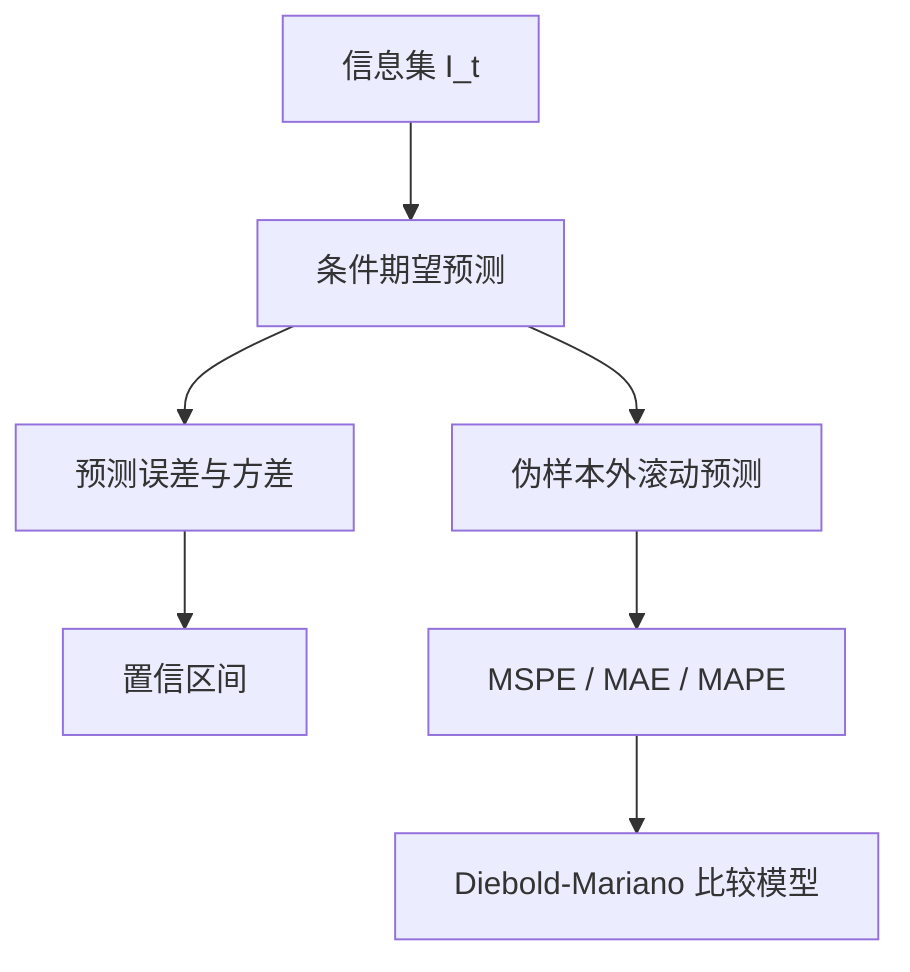

## ARMA 模型预测

> 核心关系：预测先由当前信息集产生条件期望，再用样本外损失与 DM 检验比较不同模型的预测能力。

## 最优预测：条件期望

在时刻 $T$（预测原点）用信息集 $\mathcal{F}_T$ 预测 $y_{T+1}$。预测函数 $g$ 必须属于 $\mathcal{F}_T$，只能用当前可得的信息。**均方误差（mean squared error, MSE）**：$E[(y_{T+1}-g)^2|\mathcal{F}_T]$。

**最优预测定理**：MSE 损失下最优预测是条件期望，
$$E_ty_{t+1}\equiv E(y_{t+1}|\mathcal{F}_t)=\arg\min_g E[(y_{t+1}-g)^2|\mathcal{F}_t]$$
证明用加一项减一项技巧：把 $y_{t+1}-g$ 拆成 $[y_{t+1}-E_ty_{t+1}]+[E_ty_{t+1}-g]$，交叉项为零，目标化为预测误差方差加 $(E_ty_{t+1}-g)^2$，仅当 $g=E_ty_{t+1}$ 时最小。$j$ 步预测同理。

前置概率工具。**条件期望性质**：给定信息集时，确定函数可拿出条件期望。**期望迭代法则**：$\mathcal{F}_1\subseteq\mathcal{F}_2$ 时 $E[E(X|\mathcal{F}_2)|\mathcal{F}_1]=E(X|\mathcal{F}_1)$，是全期望公式的推广。**均值独立性** $E(\varepsilon_{t+1}|\mathcal{F}_t)=0$ 比白噪声更强，条件均值为 0 的序列称鞅差过程，由均值独立性可推出序列不相关。

预测问题分两种。**真实预测**面对未来尚未观测的值，如预测下季度 GDP。**伪样本外预测**假装评估期内数据不可观测，预测后与真实值对比，用作模型评估与选择。两种预测的原理相同。损失函数不唯一：绝对值、四次方均可取，依研究者对误差的惩罚偏好选择，平方最常用。

## MA(1) 与 AR(1) 的最优预测

**MA(1) 模型** $x_t=\mu+\beta_1\varepsilon_{t-1}+\varepsilon_t$：
- 一步最优预测 $E_tx_{t+1}=\mu+\beta_1\varepsilon_t$；
- $j\ge 2$ 步最优预测 $\mu$，即无条件均值。MA(1) 记忆只有一期，二期以后信息集不再提供有用信息；
- 预测误差一步为 $\varepsilon_{t+1}$（方差 $\sigma^2$），$j\ge 2$ 步为 $\beta_1\varepsilon_{t+j-1}+\varepsilon_{t+j}$（方差 $(1+\beta_1^2)\sigma^2=\mathrm{Var}(x_t)$）。

**AR(1) 模型** $y_t=\phi_0+\phi_1y_{t-1}+\varepsilon_t$：
- 一步最优预测 $E_ty_{t+1}=\phi_0+\phi_1y_t$；
- 递推式 $E_ty_{t+j}=\phi_0+\phi_1E_ty_{t+j-1}$，前向迭代得 $E_ty_{t+j}=\phi_0\sum_{i=0}^{j-1}\phi_1^i+\phi_1^jy_t$；
- $j\to\infty$ 时收敛到 $\phi_0/(1-\phi_1)=E(y_t)$。

**远期预测收敛于无条件均值**，对任意平稳 ARMA 模型成立。平稳模型的自相关以指数速度衰减，历史信息对远期预测的价值迅速消失。

## 预测误差与置信区间

预测误差 $e_t(j)=\sum_{i=0}^{j-1}\phi_1^i\varepsilon_{t+j-i}$，方差 $\mathrm{Var}(e_t(j))=\sigma^2\sum_{i=0}^{j-1}\phi_1^{2i}$ 是 $j$ 的增函数，$j\to\infty$ 时收敛到 $\sigma^2/(1-\phi_1^2)=\mathrm{Var}(y_t)$。远期预测的不确定性等于序列本身的不确定性。

**95% 置信区间**：预测值 $\pm 1.96\times$ 预测误差标准差。一步为 $\phi_0+\phi_1y_t\pm 1.96\sigma$。误差为标准化 t 分布时临界值按自由度查表。

## 伪样本外预测评估

**伪样本外预测（pseudo out-of-sample forecast）**：把全样本切成估计样本与评估样本，只用估计样本估计模型，对评估样本逐期预测并记录预测误差。流程：用前 $R$ 个观测估计模型，预测第 $R+1$ 期，记录误差；再用前 $R+1$ 个观测重新估计，预测第 $R+2$ 期……重复 $H$ 次，得到一步预测误差序列。

课件例题取全样本 150 个观测，前 100 个估计 AR(1) 与 MA(1)，后 50 个评估。预测 $y_{101}$ 时 $f_{AR,1}=\hat\phi_0+\hat\phi_1y_{100}$，$f_{MA,1}=\hat\mu+\hat\beta_1\hat\varepsilon_{100}$；MA 的 $\hat\varepsilon_{100}$ 由迭代式从可观测数据算出，初值取 0 或 0.2 差别不大，但要求 $|\beta_1|<1$。

**扩张窗口（expanding window）**：估计样本逐期加长。**滚动窗口（rolling window）**：窗口长度固定，每步丢弃最旧观测。金融数据量大，常用滚动窗口。

预测误差包含未来值的不确定性与参数不确定性，后者随模型复杂度上升而增大。含参数不确定性的预测误差置信区间很难构造，软件用 bootstrap 处理。简单模型乃至朴素预测可能优于复杂模型，截面数据与面板数据中也有类似现象。

**预测精度度量**（评估样本大小 $H$）：
$$\text{MSPE}=\frac{1}{H}\sum_{j=1}^{H}e_j^2,\qquad \text{MAE}=\frac{1}{H}\sum_{j=1}^{H}|e_j|,\qquad \text{MAPE}=\frac{1}{H}\sum_{j=1}^{H}\left|\frac{e_j}{y_{T+j}}\right|\times100$$
MSPE 最常用。MSPE 本身是随机变量，一次实现的大小比较没有统计依据，需要假设检验。

## Diebold-Mariano 检验

**损失函数** $g(e_j)$ 度量第 $j$ 期预测误差的代价，常用 $g(e)=e^2$ 或 $g(e)=|e|$。**损失差** $d_j=g(e_{1j})-g(e_{2j})$ 是同一时期两个模型损失之差。损失取平方时 $\bar d=\text{MSPE}_1-\text{MSPE}_2$。

原假设 $H_0:E(d_j)=0$，两个模型预测精度相同；备择 $E(d_j)\neq 0$、$E(d_j)<0$（模型 1 更好）、$E(d_j)>0$（模型 2 更好）。

$\bar d=\frac{1}{H}\sum d_j$ 是 $E(d_j)$ 的一致估计。平稳性与遍历性成立时，中心极限定理给出渐近正态。方差分两种情形：$d_j$ 序列不相关时 $\mathrm{Var}(\bar d)=\mathrm{Var}(d_j)/H$，用样本方差估计；$d_j$ 序列相关时协方差项量级约 $H^2$，在遍历性（协方差随间隔衰减）前提下用 **Newey-West 估计量**（HAC，异方差自相关一致估计）。遍历性不成立时中心极限定理失效，需函数中心极限定理。

检验统计量 $\text{DM}=\bar d/\sqrt{\widehat{\mathrm{Var}}(\bar d)}$ 渐近 $N(0,1)$。5% 水平下双边 $|DM|>1.96$ 拒绝，左尾 $DM<-1.645$ 判模型 1 更好，右尾 $DM>1.645$ 判模型 2 更好。检验的前提是评估样本 $H$ 足够大，否则 $\bar d$ 不是一致估计；模型本身接近时，不同样本划分会带来细微差别。

检验的一般套路可迁移到其他假设检验：先找原假设量化目标的一致估计，再找该估计量的极限分布，构造 t 统计量，最后按备择假设形式判定。

**实证解读**：宏观价格指数样本外比较中，绝对误差损失下 DM 双边 p 值约 0.30，三个检验均不拒绝，两模型预测精度无显著差异；平方误差损失下 DM 双边 p 值约 0.067，模型 1 更优的单边检验 p 值约 0.03，平方误差标准下模型 1 更好。模型表现接近时，不同损失函数可能给出分歧结论，数据证据不足时结论摇摆属正常。
