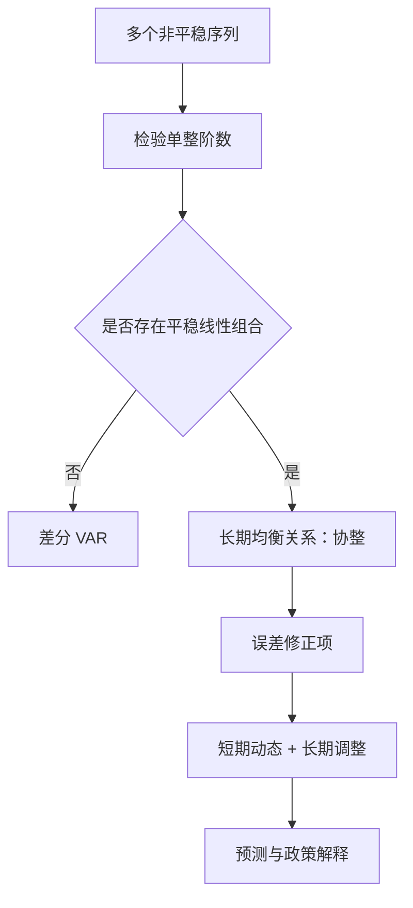

## 协整与误差修正模型

> 核心关系：协整把非平稳变量的共同长期趋势与短期偏离统一到误差修正模型中。

## 长期均衡与协整定义

**长期均衡**：$z_t=(z_{1t},\ldots,z_{kt})'\sim I(1)$，系统处于长期均衡当 $\beta_0'z_t=\beta_{0,1}z_{1t}+\cdots+\beta_{0,k}z_{kt}=0$。对均衡的偏离称**均衡误差** $e_t=\beta_0'z_t$，均衡要有意义，$e_t$ 必须平稳（I(0)）。

**协整（cointegration）**：存在 $k\times1$ 向量 $\beta_0$ 使 $\beta_0'z_t\sim I(0)$。协整要求 $z_t$ 各分量均为 I(1)，I(0) 变量与 I(1) 变量之间不存在协整。存在长期均衡关系的 I(1) 序列不会漂移得太远，经济力量把系统拉回均衡。美国 3 个月与 6 个月 T-bill 利率走势几乎重合：单个利率是 I(1)，两者之差（利差）却是平稳的，是协整的典型形态。均衡误差 $e_t$ 刻画系统偏离均衡的程度，是误差修正模型中驱动短期调整的核心变量。

**协整向量不唯一**：对任意非零标量 $c$，$c\beta_0'z_t$ 同样平稳。常用标准化 $\beta_0=(1,-\beta_{0,2},\ldots,-\beta_{0,k})'$，把 $z_{1t}$ 写成其余变量的函数：
$$\beta_0'z_t=z_{1t}-\beta_{0,2}z_{2t}-\cdots-\beta_{0,k}z_{kt}=e_t\sim I(0)$$

**多重协整**：可能存在 $m$ 个线性无关协整向量（$1\le m\le k-1$），任意线性组合仍是协整向量，$\{\beta_1,\ldots,\beta_m\}$ 构成协整向量空间的基。三个期限利率 $r_1,r_2,r_3$ 中 $r_2-r_1$ 与 $r_3-r_1$ 都平稳时，存在两个协整向量，$m=2=k-1$。

单整运算事实：I(0)+I(0)=I(0)，I(0)+I(1)=I(1)，I(1)+I(1) 结果不确定——可能仍为 I(1)，也可能因协整降为 I(0)。

## 协整与伪回归

两个 I(1) 变量直接回归分三种结果。两者均 I(1) 且残差仍 I(1) 时为**伪回归（spurious regression）**：两条独立的 I(1) 序列在样本期内可能表现出共同走势，回归得到高 $R^2$ 与显著的 t 值，但残差仍非平稳，OLS 不一致，常规推断失效。两者均 I(1) 且残差 I(0) 时为协整，回归关系真实存在。

蒙特卡洛模拟显示协整情形下回归系数估计量的分布明显左偏，与正态相差甚远，常规 t、F 检验失效，须用专门临界值。模拟时序图直观对照：协整序列贴着走，不协整序列各走各的。

构造例辨析协整关系。例 1：两条独立随机游走 $y_t=y_{t-1}+\epsilon_{1t}$、$x_t=x_{t-1}+\epsilon_{2t}$ 的任何线性组合仍含两个独立趋势，不协整。例 2：$y_t=0.8v_t+\epsilon_{yt}$、$x_t=v_t+\epsilon_{xt}$（$v_t$ 随机游走，误差独立）时 $y_t-0.8x_t=\epsilon_{yt}-0.8\epsilon_{xt}$ 平稳，协整向量 $(1,-0.8)'$，共同趋势 1 个。例 3：三个序列由同一 $v_t$ 驱动且误差独立时，任意两个之间两两不协整，三个放在一起协整，$m=2$、共同趋势 1 个。例 4：$y_t=v_t+\epsilon_{yt}$、$x_t=u_t+\epsilon_{xt}$、$w_t=v_t+u_t+\epsilon_{wt}$（$v_t,u_t$ 独立随机游走）时两两均不协整，但 $w_t-y_t-x_t$ 平稳，协整向量 $(-1,-1,1)'$，共同趋势 2 个。

## 共同趋势与多重协整

**Stock-Watson 共同趋势关系**：$K=M+$ 独立随机趋势个数，$K$ 为序列个数，$M$ 为协整关系数。协整的两个 I(1) 过程共享同一随机趋势，仅差常数倍。**共同趋势定理**：$y_t=v_t+e_{yt}$、$x_t=u_t+e_{xt}$（$v_t,u_t$ 为随机游走，$e$ 为平稳项）协整时 $v_t=\lambda u_t$，两个过程的新息完全相关，趋势成比例。

协整关系的个数 $m$ 决定系统的共同趋势个数：$m$ 越大，独立随机趋势越少，系统越受少数共同力量驱动；$m=k-1$ 时只剩 1 个共同趋势。

## 协整的检验

检验路径分两步。第一步对每个变量做单位根检验确定单整阶数，只有同为 I(1) 的变量才存在协整可能。第二步做水平回归并对残差做平稳性检验：残差平稳（I(0)）即协整成立，残差仍 I(1) 即伪回归。回归残差均值近似为零，对其做平稳性检验选 DF 检验 Case I（无截距）。回归方程两边单整阶数必须一致（balanced）：$z_{1t}$ 与右侧变量都应为 I(1)，线性组合才可能降到 I(0)。

经济金融中的经典协整关系：永久收入假说下消费与收入协整（收入为共同趋势），增长理论下收入、消费、投资协整（生产率为共同趋势），购买力平价下汇率与国内外价格协整，一价定律下同一资产跨市场同价，现货与期货价格由套利驱动协整。

## 误差修正模型

含单位根的二元 VAR(1) $z_t=\Phi_0+\Phi_1z_{t-1}+a_t$ 等价地写成
$$\Delta z_t=\Phi_0+\Pi z_{t-1}+a_t,\qquad \Pi\equiv\Phi_1-I$$
$z_t$ 含单位根意味着 $\lambda=1$ 是特征方程 $\det(I-\Phi_1\lambda)=0$ 的根，即 $\det(\Pi)=0$，$\Pi$ 奇异。K=2 时 rank(Π) 取 0 或 1。

**Case 1：rank(Π)=0**，$\Phi_1=I$，方程组有两个单位根，无协整、无共同趋势，模型退化为一次差分 VAR：$\Delta z_t=\Phi_0+a_t$。

**Case 2：rank(Π)=1**，存在协整。记 $\Phi_1=\begin{pmatrix}\phi_{11}&\phi_{12}\\\phi_{21}&\phi_{22}\end{pmatrix}$，$\Pi$ 的元素可表为 $\alpha_1=\phi_{11}-1$、$\beta_0=\phi_{12}/(1-\phi_{11})$、$\alpha_2=\phi_{21}$，模型写成**误差修正模型（error correction model, ECM）**：
$$\Delta y_t=\phi_{10}+\alpha_1[y_{t-1}-\beta_0x_{t-1}]+a_{1t}$$
$$\Delta x_t=\phi_{20}+\alpha_2[y_{t-1}-\beta_0x_{t-1}]+a_{2t}$$
方括号中 $e_{t-1}=y_{t-1}-\beta_0x_{t-1}$ 是上一期的**均衡误差**，系数 $\alpha_1$、$\alpha_2$ 为调整速度。上一期 $y$ 高于均衡时 $e_{t-1}>0$，一般 $\alpha_1<0$、$\alpha_2>0$，$\Delta y_t$ 回落、$\Delta x_t$ 上升，系统产生拉回力量。

ECM 的经济含义：系统变量的短期动态受均衡偏离的驱动。协整关系的经典来源是套利——现货与期货价格、即期与远期利率价差偏离均衡时，套利交易产生拉回力量。估计 ECM 即估计均衡参数 $\beta_0$ 与调整速度 $\alpha_1$、$\alpha_2$；调整速度的符号决定系统回归均衡的方向，绝对值决定回归的快慢。

**格兰杰表示定理（Granger representation theorem）**：对任意一组 I(1) 变量，误差修正表示与协整表示等价。
