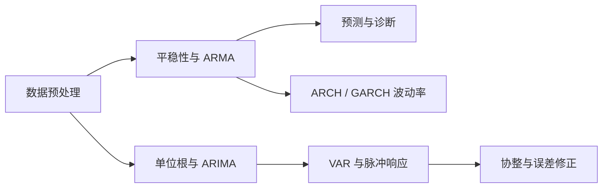

## 金融计量模型

> 金融与宏观领域的时间序列计量：一元时间序列（ARMA）→ 波动率建模 → 趋势与单位根 → 多元时间序列（VAR）与协整

> 核心关系：金融计量先处理时间序列性质，再按研究目标选择动态、波动率或多元系统模型。

## 课程简介

- [金融计量模型课程导论](00-intro.md)：时间序列定义与时序图、对数回报与结构变化、偏度峰度与厚尾、白噪声与 MA/AR/ARMA 模型入门

## 一、一元时间序列模型

- [平稳性与 ARMA 模型](01-stationarity-and-arma-models.md)：时间序列大数定律、弱平稳三条件、MA/AR/ARMA 平稳性条件、ACF 与 Yule-Walker 方程、PACF
- [ARMA 模型识别、估计与检验](02-arma-identification-estimation-and-testing.md)：样本 ACF/PACF 与 Q 检验、ARMA 建模三步法、AIC/BIC 模型选择、极大似然估计与可逆性、过拟合与公因子问题
- [ARMA 模型预测](03-arma-forecasting.md)：最优预测与条件期望、预测误差与置信区间、伪样本外预测评估、预测精度度量与 Diebold-Mariano 检验

## 二、波动率建模

- [波动率建模：ARCH 与 GARCH](04-volatility-modeling-arch-and-garch.md)：波动率聚集、GARCH(1,1) 设定与平稳性、ARCH 效应检验（Ljung-Box 与 Engle LM）、QMLE 估计、模型诊断与波动率预测

## 三、趋势与单位根

- [趋势、单位根与 ARIMA](05-trends-unit-roots-and-arima.md)：确定性趋势与随机趋势、趋势平稳/随机游走/带漂移随机游走、单位根与 I(d) 单整、DF/ADF 检验与 ARIMA

## 四、多元时间序列

- [向量自回归模型](06-vector-autoregression.md)：多元弱平稳与互相关、结构式与简化式 VAR、识别与 Cholesky 分解、方差分解、脉冲响应、格兰杰因果检验
- [协整与误差修正模型](07-cointegration-and-error-correction.md)：伪回归、协整概念与协整向量、共同趋势、含单位根 VAR(1) 的误差修正模型
