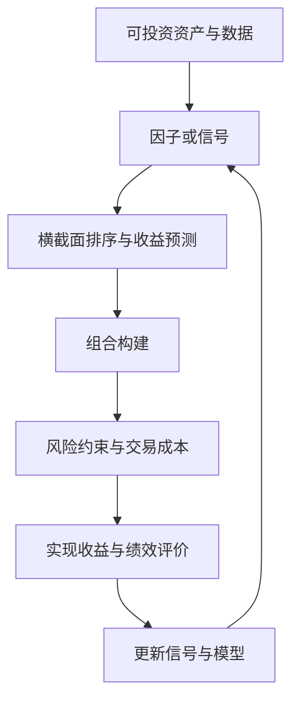

## 量化投资课程导论

> 核心关系：量化投资用可重复的信号替代主观择时，并在组合约束、成本和绩效反馈中持续迭代。

## 量化投资的定义与三要素

**量化投资（Quantitative Investment）**：通过数量化方式及计算机程序化发出买卖指令，以获取稳定收益为目的的交易方式。另一表述为通过经验形成的数量化的决策流程进行投资，把经验固化为可重复的决策规则。

量化投资包含三个要素。

**Idea（推理）**：基于交易、数据规律提出想法。**数量化（实现）**：将想法转换为机器可以理解的决策条件。**验证（统计）**：通过一定的验证方法，在大样本前提下计算统计结果，得出结论。

经验提炼不可依赖小样本下的偶发事件。量化投资、程序化交易、高频交易三个概念相关但不等同。

## 主动投资与量化投资

**主动管理投资（Active Management）**：主观性、集中性、实地性、非系统性、前瞻性。主动投资偏向基本面价值投资，寻找优秀、质地好且便宜的公司，赚企业成长的钱，依赖深度调研能力与基金经理判断。事件驱动交易与看图、打板等偏技术的交易以行为金融学为理论基础，该领域主动投资的优势有限。

**量化投资**：客观性、分散性、纪律性、系统性、时效性。量化从数据角度分析公司基本面，用指标衡量经营能力，优势在广度，可做更好的个股分散。

量化在短周期交易、大概率事件统计套利、避免人的非理性行为方面占优；在宏观信息解读、债券市场与长周期策略上不占优。

## CAPM 的因子视角

**因子（factor）**：解释资产收益差异的共同变量，如市场因子、规模因子。

用面包—热量类比翻译因子语言：糖与脂肪是成分，热量是结果。对应到资产定价，糖、脂肪类比因子，总热量类比收益，单位成分的热量贡献类比因子收益。

**CAPM（资本资产定价模型）**：

$$E(r_p) - r_f = \beta_p \cdot (E(r_M) - r_f)$$

其中 $\beta_p$ 是**因子载荷（factor loading）**，是风险测度（risk measure）；$E(r_M) - r_f$ 是**因子收益**，即风险溢价（risk premium）。因子载荷乘以风险溢价等于期望超额收益。载荷度量暴露了多少风险，溢价度量每单位风险的补偿。

**市场因子（market factor）**：收益率等于全市场股票按市值加权平均得到的收益率，即市值加权市场组合的收益率。在整个因子体系里，唯一有严格理论基础（在严格理论框架和假设下推导出来）的因子就是市场因子；其他因子都先在实证中发现管用，再事后寻找解释。只有 CAPM 对风险溢价给出严格定义，其他因子的载荷与收益都是构造出来的。

**CAPM 的核心结论**：不是风险越大收益越大。只有与市场组合相关的系统性风险（systematic risk）得到补偿，非系统性风险（unsystematic risk）得不到补偿。在 CAPM 体系中，$\beta$ 度量的是风险，不能按计量回归系数的思路理解。

**假设错不等于结论错**：CAPM 的假设（所有人拥有全部信息、随时按无风险利率无限借贷、所有资产可交易）并不现实，但 CAPM 是「假设 A 推出结论 B」；假设错不必然推出结论错。CAPM 抽象出一种形式，这种形式有没有用要单独检验。CAPM 问世后很长时间，学界的主要工作就是检验它是否成立。

## 横截面量化选股

**实证回归式**：

$$r_{it} - r_{ft} = \alpha_{it} + \beta_{it}(r_{mt} - r_{ft}) + \varepsilon_{it}$$

现实中 $\beta$ 既随资产变化、又随时间变化，下标写成 $t-1$：用 $t-1$ 时刻的 $\beta$ 预测 $t$ 时刻的收益。今天买股票、明天看收益，明天的 $\beta$ 不可能提前知道，只能做一期——用今天的 $\beta$ 排序，去买明天的股票。

**横截面量化（cross-sectional quant）**：用因子载荷（$\beta$）横截面排序、选择资产的投资方式。预测工具是因子载荷或风险溢价。

**典型选股策略**：用电脑计算 4000 多只股票的 $\beta$ 并排序，每次选 $\beta$ 最高的 100 只，每月换仓一次，机器自动搜索、调仓，一期一期持续下去。策略相信市场长期不会一直跌，长期可能获益，单期不保证获益。

**量化投资的边界**：量化需要大量资金与交易系统，由证券公司、基金公司运作；调仓买卖都要交手续费；每次只按原则选一只股票必死。这套工具不是为个人炒股准备的。

## 指数化投资与宽基指数

**指数化投资（index investing）**：按指数的编制规则（样本股及其权重）构造投资组合，目标是获得与所跟踪指数尽可能相同的回报率。市场指数（标普 500、沪深 300、中证 500 等）被视为代表整个市场或某个特定部分的良好代理。

**中证宽基指数体系**：中证 100（市值前 100）加中证 200（其后 200）合成沪深 300；300 之后的 500 只构成中证 500；沪深 300 加中证 500 构成中证 800；其后 1000 只构成中证 1000；再后 2000 只构成中证 2000。最外层是中证全指，按 CAPM 原则构建，用的人较少。

**指数基金与 ETF**：ETF 可在二级市场盘中直接买卖，交易费用低、跟踪指数误差小，交易灵活、流动性高，每日公布投资组合。**完全复制法（full replication）**：按指数样本股与权重全量复制组合，实现对指数的紧密跟踪。华泰柏瑞沪深 300ETF 联接 A 采用完全复制法，是全被动指数基金。

**指数化与主动投资**：若超额收益完全被市场因子解释（$\alpha_p = 0$），主动基金就没有意义；$\alpha_p \neq 0$ 说明因子模型不能完全解释超额收益，正是寻找更多因子的起点。
