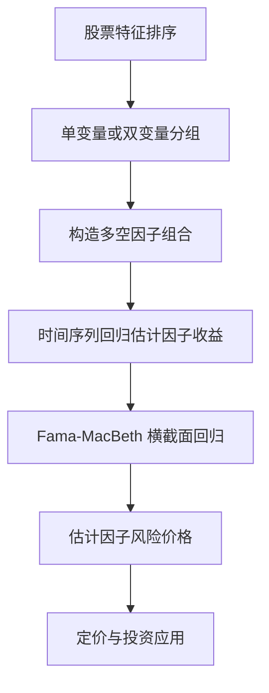

## 多因子模型与因子收益度量

> 核心关系：因子收益由分组组合实现，因子风险价格则通过时间序列暴露和横截面回归共同估计。

## 因子收益的度量框架

**因子回归方程**：

$$R_{i,t+1} = \alpha_{t+1} + \beta_{i,t} F_{t+1} + \varepsilon_{i,t+1}$$

其中 $\beta_{i,t}$ 是**因子载荷（factor loading）**，在 t 时刻已知（靠历史数据估计或特征代理）；$F_{t+1}$ 是**因子收益（factor return）**，t+1 时刻才实现。

因子按「知道哪一个特征」分为两类。**宏观因子**（如 GDP 增速、通胀）：因子收益已知、因子载荷未知，用递归时序回归（recursive time series regression）把收益率对已知因子逐期滚动估计。**风格因子**（如市值、账面市值比）：因子载荷有代理变量、先按特征定载荷，因子收益未知、由组合收益反推。

## 单变量投资组合分析

**思路**：按某个特征（如市值）把全部股票分成 10 组（十分位组合），比较各组下一期平均收益，最高组减最低组得到**差异组合（difference portfolio）**，用它度量因子收益。

**断点（breakpoint）选择是第一个关键**。全部市场断点下第一组平均市值仅约 600 万美元、占全市场市值 0.08%；仅 NYSE 断点套用到三个市场时第一组有 2372 只股票、平均市值约 3200 万美元、占市值 1.82%。NYSE 断点位置更高，使小盘组混入较多相对较大的 NYSE 小盘股，把小盘股与微盘股（micro-cap）分开。

**等权与市值加权**：等权让微小盘股在组内权重极高、效应更强；市值加权把权重集中到大盘股、效应减弱。

**结论**：全样本下小市值组合的超额收益主要由占全市场市值不到 0.1% 的微盘股子集驱动；微盘股策略容量很小；市值加权后差异组合收益大幅缩小甚至不再显著。

## 双变量投资组合分析

**动机**：单变量分析无法排除其他因子的干扰。回答「控制 X 之后 Z 是否仍然有效」需要双变量组合分析（bivariate portfolio analysis）。

**独立分组（independent sort）**：两个因子各自分组、交叉成网格。10×10=100 组时每组平均约 48 只，20×20=400 组时每组平均约 5 只。两因子完全相关时股票集中在对角线、多数格子近乎空置，分组前检查单元格计数与两因子的相关符号。

**课堂实例**（beta 按 30/70 分位分 3 组、size 按 25/50/75 分位分 4 组，共 12 个组合）：控制 size 后跨 beta 比较，平均收益差异不显著，beta 没有横截面预测力；控制 beta 后跨 size 比较，平均收益差异显著，size 效应独立于 beta 存在。

**依次（相依）分组（dependent sort）**：先按一个因子分组，再在各组内按另一因子分组，可以做到每个格子股票数相等。

## Fama-French 三因子模型

**六个基础组合**：size 按市值中位数分 2 组（小 S、大 B），BE/ME 按 30/70 分位分 3 组（低 L、中 M、高 H），独立交叉得 S/L、S/M、S/H、B/L、B/M、B/H。

**SMB（小减大，Small Minus Big）**：

$$\mathrm{SMB} = \frac{R_{S/L}+R_{S/M}+R_{S/H}}{3} - \frac{R_{B/L}+R_{B/M}+R_{B/H}}{3}$$

**HML（高减低，High Minus Low）**：

$$\mathrm{HML} = \frac{R_{S/H}+R_{B/H}}{2} - \frac{R_{S/L}+R_{B/L}}{2}$$

中间组合 S/M、B/M 不进入 HML。HML 比较高账市比与低账市比两个极端，中间组合不含价值信息，放入会稀释多空价差。

**账面市值比（book-to-market，BE/ME）**：账面价值（净资产）除以市值。BE/ME 高是相对便宜的价值股（value），低是相对贵的成长股（growth）。

**冗余检验（25 个测试组合）**：size 与 BE/ME 各分 5 组、交叉成 5×5=25 个测试组合。只用市场因子回归时，25 个 α 中至少 10 个显著；加入 SMB 与 HML 后几乎全部 α 不显著。SMB 与 HML 吸收了绝大部分定价偏差。市场因子虽缺乏横截面区分度（β 在 0.84 至 1.42 之间），但时间序列贡献大，承担解释组合收益整体水平的角色，不能删。

## Fama-MacBeth 回归

组合分析是非参数方法：不假设收益与载荷之间的函数形式、稳健，但控制变量一多就维度爆炸。**FM 回归（Fama and MacBeth 1973）** 是参数化方法：假设各控制变量与结果变量的关系为线性，可同时控制大量变量。

**两步法**：第一步，每个时点 t 做一次横截面回归——因变量为当期收益，自变量为期初已知的特征或载荷，得到每期的斜率系数与截距；第二步，把每个回归系数当成一条时间序列，计算均值、标准误与 t 统计量，检验平均系数是否为零。

**解读要点**：斜率系数本身不能直接解释为因子收益或风险溢价（量纲与构造不同）；但「平均系数不为零」与「平均因子风险溢价不为零」是同一件事。

**结果**：beta 不显著，size 显著，BE/ME 显著（t ≈ 3.89）。横截面回归的调整 R² 仅约 0.002，而归因型时序回归 R² 可达 0.9——横截面收益预测极为困难，金融数据噪声极大。

## 因子模型的应用

**排序选股**：由因子载荷按因子值排序取 Top N 只股票，等权或市值加权构建组合。

**收益预测与方差预测**：由因子收益与波动做收益预测（AR、GARCH、机器学习、神经网络、LSTM）与方差预测，进入组合优化与资产配置。

**业绩归因**：基金收益对因子收益做时序回归。α 显著非零代表有选股技能；α 可被因子解释则收益可复制、没有「神秘之处」。

**冗余检验**：新因子对已有因子回归，若 α 不显著，说明新因子可被解释、是冗余的。

**业界做法**：因子测试报告常用秩相关（rank IC，rank correlation）度量因子值与未来收益的关系，而非线性相关系数——秩相关对异常值与量纲更稳健。
