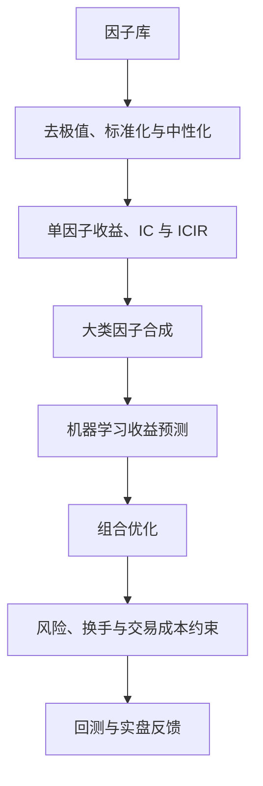

## 多因子选股实践

> 核心关系：多因子选股先清洗并验证信号，再将预测映射为受风险与成本约束的可交易组合。

## 三个模型与因子库

**多因子选股是流水线工程**：数据、因子、模型、组合、风控各司其职。选股靠大数定律——单因子 IC 约 0.15 时 R² 只有约 2%，单只股票根本无法预测；几千只股票、几十个因子叠加起来才有统计上的稳健性。

**收益模型（return model）**：个股超额收益分解为

$$\tilde{r}_j = \sum_k X_{jk} \cdot \tilde{f}_k + \tilde{u}_j$$

其中 $X_{jk}$ 是股票 j 在第 k 个因子上的因子暴露（工业界对横截面做 Z-score 标准化），$\tilde{f}_k$ 是因子收益率（共性收益），$\tilde{u}_j$ 是残差收益率（个性收益）。主动基金经理赚的是残差的钱，量化模型赚的是因子的钱。

**风险模型（risk model）**：结构化风险模型

$$V = X F X^T + \Delta, \quad \sigma_p^2(w) = w^T(XFX^T + \Delta)w$$

组合方差等于因子风险加特质风险。股票数远大于历史期数时直接估计全样本协方差矩阵会出现病态矩阵，结构化正是为了降维和稳健。

**因子库三大类**：基本面（估值、成长、盈利、质量；财报频率低）、量价（动量反转、波动率、换手率；日线/分钟/逐笔）、另类（一致预期、文本舆情、融券票息等）。

## 因子库构建

### 估值类因子

**PE（市盈率）** = 总市值 / 归母净利润。三种口径：LYR（上年度年报）、TTM（最近四个季度）、预期 PE（预测净利润）。财报披露有固定时间轴（一季报四月底前、半年报八月底前、三季报十月底前、年报次年四月底前），算因子必须按实际公告日对齐，否则用到未来信息。

**EP = 1/PE**：PE 越小股票越便宜，但 PE 在正、负、无穷大之间不可比；取倒数后 EP 越高越便宜，方向单调、横截面可比，且把亏损股的负值、微利股的极大值压缩。类似地有 BP = 1/PB（账面市值比）、SP = 1/PS、OCFP = 1/PCF、DP = 股息率。

**价值因子三种改造**：剩余收益折现（$V_t = B_t + \sum \frac{(FROE - r_e)}{(1+r_e)^t} B_t$，在当期净资产之上折现未来预期剩余收益）；无形资产资本化（研发费用逐年衰减累加，避免把研发支出全部当费用核销而低估科技公司）；用未分配利润替代净资产。

### 成长类因子

**成长因子**：净利润同比、三年复合。**负基数问题**：净利润为负时同比增长率由负转正、数值毫无意义。工业界采用 MSCI 线性回归法：拟合 $y = \beta x + \varepsilon$（x 取 [1, 2]），以回归斜率 $\beta$ 除以 |mean(y)| 作为增长率代理——「每年增长多少、相对于平均规模多大」。

### 质量类因子

质量因子六大维度：盈利能力、收益质量、现金流量、资本结构、偿债能力、营运能力。

**应计量（accruals）**：盈利中未收到现金的部分，是反向指标（应计越多、盈利质量越差）。

**QMJ（Quality Minus Junk，Asness et al. 2013）**：从股利折现模型出发，市净率由盈利、分红率、必要报酬率与成长共同决定。质量拆成三维：profitability（盈利）、growth（过去 5 年增长率）、safety（杠杆、破产风险、盈利波动率）。买入高质量、低杠杆、稳盈利的公司，回避垃圾股。

### 量价因子

**市值因子**：长期看小市值跑赢大市值，1998-2020 年「市值后 20% 减前 20%」累计多空收益约 500%，主升段在 2006-2016 年；2016 年 10-11 月风格拐点后小票持续跑输。单边押注小市值风格的基金在风格切换后损失惨重，这是单因子风险。

**动量反转**：return_1m（近 1 个月收益率，取相反数）是短期反转因子，多空曲线约 500%，优于 return_12m（约 200%）。短期反转（交易驱动，约 1 个月内）、中期动量（产业趋势，1-12 个月）、长期反转（生命周期，5 年）是不同的东西。MSCI 动量 RSTR 用过去 504 个交易日、滞后 21 天（避开短期反转）、半衰期 126 天。

**换手率**：turn_1m（近 1 个月日均换手率）、bias_turn_1m（换手率乖离率），均为反向。分层回测显示空头层净值远低于多头层——流动性因子在空头端筛选能力特别强。

**波动率**：std_1m 反向（低波动异象）；特质波动率以近 1 个月日度涨跌幅为因变量、Fama-French 三因子为自变量回归，取残差标准差，只度量公司层面的风险。

### 高频因子

**峰度（kurtosis）**：分钟收益率四阶矩，正态分布峰度为 3，大于 3 表示尖峰厚尾，反向因子（「图形越妖、风险越大」）。**偏度（skewness）**：三阶矩，正偏态时大于 0，反向因子。**平均单笔流出金额占比**：下跌分钟的平均每笔成交额除以全天平均，正向因子。**Amihud 非流动性**：$|r_i| / (volume_i \times close_i)$ 的均值，值越低流动性越高，正向因子。

### 一致预期因子

一致预期反映分析师情绪：券商研报的盈利预测与评级按机构加权汇总成一致预期。常见因子有 CON_PROFIT（一致预期归母净利润）、评级类（rating_average、rating_change、rating_targetprice）等。

## PEAD 超预期效应

**PEAD（Post-Earnings Announcement Drift，盈余公告后价格漂移，Ball & Brown 1968）**：业绩消息公布后，股价继续向消息方向漂移约 4 个月。经典图形有两个特征：公告前已出现分叉（好新闻组合提前上涨、坏新闻组合提前下跌，提示信息泄露）；公告后继续同向漂移（市场反应不足）。

**因子化三条路径**：财务视角 SUE（标准化预期外盈余）

$$\mathrm{SUE} = \frac{NP_t - E(NP_t)}{\sigma_{NP_t}}$$

即「实际 − 预期」再除以波动标准化；分析师视角（研报标题或摘要含「超预期」、评级调升）；量价视角 JUMP = Open_{t+1}/Close_t − 1，即业绩披露次日跳空高开幅度，又称净利润断层。

**失效风险**：超预期类因子在 2021 年 8-9 月明显失效。报告越有效越要卖给更多人，越多人用越早失效——流水线里没有常青树，只有不断迭代。

## 因子预处理

原始因子值不能直接进模型，需要四步预处理。**去极值**：截断极端值，团队偏好中位数 ± 5 × MAD（中位数绝对偏差），对异常值稳健。**中性化**：以原始因子为因变量，对对数市值加行业哑变量做多元线性回归，取残差——行业间估值天然差异巨大，不剔除会使「低估值选股」退化成「选行业」。**补空值**：基本面因子补前值，量价因子补行业均值。**标准化**：Z-Score 或排序百分位。

## 单因子检验

**分层法**：每个截面日按因子值均等分 5 组，每月调仓回测，得 5 条净值曲线。好因子同时满足单调性（组别越靠前净值越高）与喇叭口（组间差距随时间拉大）。

**IC 值分析法**：IC（信息系数）定义为 T 期因子暴露与 T+1 期股票收益的相关系数，IC = corr(X_t, r_{t+1})。Pearson IC 对极端值敏感，实践中常用 rank IC（Spearman 秩相关）。ICIR = mean(IC)/std(IC)，衡量信号稳定性。

**回归法**：T 期因子暴露对 T+1 期收益做一元线性回归，回归系数即因子收益率，用加权最小二乘（WLS，权重取流通市值平方根）。两层 t 检验：各期回归系数的 t 统计量、因子收益率时间序列的单样本 t 检验。据此区分收益因子（如 EP、反转，方向稳定）与风险因子（如市值，方向反复）。

## 大类因子合成

细分因子高度相关（如 EP、BP、SP 同属估值），一起回归会引发多重共线性，先同类合成再跨类使用。**等权法**简单稳健；**历史 IC 半衰加权**给近期更高权重；**最大化 ICIR 法**求解

$$\max_w ICIR = \frac{w^T \overline{IC}}{\sqrt{w^T \Sigma w}}$$

显式解 $w = \Sigma^{-1}\overline{IC}$ 常给出负权重，实际加 w ≥ 0 约束求解，Σ 用压缩估计（Ledoit & Wolf 2004）。

2018 年实验显示最大 ICIR + 压缩估计的 rank ICIR 0.29 优于等权法 0.20，但市场主流仍用等权法——最大 ICIR 本质是因子动量（强者恒强），与市场风格周期绑定，风格剧烈切换时重伤。因子投资亦有周期，价差拉大到极致后自发回归。

## 机器学习收益模型

机器学习 Y = f(X) 与多因子模型同构：X 是因子，Y 是收益，多因子选股是机器学习落地量化投资的较好切入点。**XGBoost**（决策树串行 boosting 拟合残差，加正则化控制复杂度）综合最优。流程：因子库约 100 个因子 → 特征预处理 → 滚动样本（2005-2010 训练验证，2011 起逐年样本外测试）→ 交叉验证调参。

回测（XGBoost 中证 500 增强，2011-02 至 2019-12，半月调仓）：年化超额 17.55%、信息比率 3.29、月胜率 78.30%。行业里幻方等头部机构仍以线性回归为主力（约 200 个大类因子），便于内部收益归因。

## 组合优化

**标准形式**：带约束的最大化风险调整后收益

$$\max_w\; w^T r - \lambda w^T (XFX^T + \Delta) w$$

λ 为风险厌恶系数，是二次规划。λ 越大组合越保守（年化波动率越小）。约束包括：个股持仓上限（公募「双十规定」：单只股票 ≤ 10%）、总仓位、行业偏离基准为 0、市值风格偏离上限。

**指数增强**：做多型产品成为中国量化主战场。目标函数改为最大化主动收益、最小化跟踪误差：

$$\max_w\;(w-w_{Bench})^T r - \lambda (w-w_{Bench})^T (XFX^T+\Delta)(w-w_{Bench})$$

跟踪误差即超额收益的标准差，信息比率 = 超额收益 / 跟踪误差。实务把年化跟踪误差上限（约 7.5%-8%）、换手率上限、成分股权重下限（≥ 80% 配基准成分股）直接写为硬约束。回测中 λ 从 0 增至 2，跟踪误差从 5.23% 降至 3.24%，信息比率在 λ = 0.25 时最大（3.772）。

**产品形态**：量化对冲（市场中性）为股票多头加期货空头、多头敞口为 0；量化多头为纯多头、风格行业偏离较宽松；指数增强为纯多头、风格行业偏离较严格。
