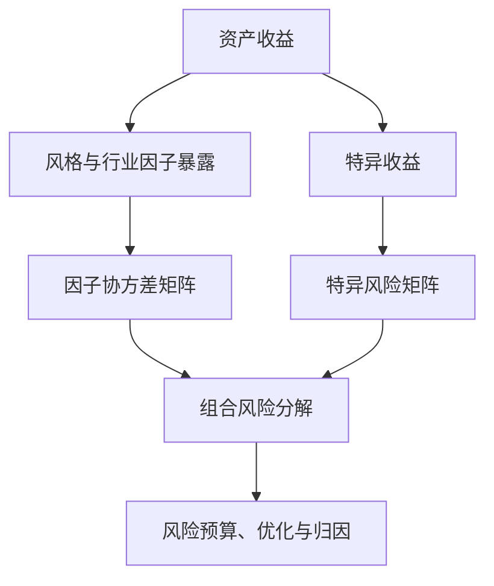

## 风险模型

> 核心关系：Barra 结构化风险模型把总风险拆成因子风险与特异风险，为组合优化和风险归因提供共同语言。

## 风险的定义与估计难题

**风险**：随机变量的方差。单资产风险是其收益率序列的方差；组合风险

$$\sigma_p^2(w) = w^T V w$$

其中 V 是股票收益率的协方差矩阵：对角元为各资产方差，非对角元为协方差。

**核心难点**：股票池 5000 只时 V 是 5000×5000，对称阵自由度约 1250 万，而月度数据仅约 250 个观测，无法估计。股票数量 N 大于样本长度 T 时协方差矩阵不可逆；即使 N 与 T 相近，条件数过大也使解不稳定。

**两种解法**：压缩估计（把样本协方差向单位阵或对角波动率矩阵收缩，统计上保证可逆）与结构化因子模型（Barra）。

## Barra 结构化风险模型

**模型**：把股票收益拆为共同因子部分与特异性部分：

$$r = Xf + u, \quad \Sigma = Var(Xf + u) = XFX^T + \Delta$$

F 是因子收益率协方差矩阵（维度远小于股票数），Δ 是股票特异风险矩阵（对角阵）。推导用到两条强设定：风险因子与残差收益协方差为 0；股票残差收益之间协方差为 0。

**复杂度收益**：待估量从约 1250 万降到 K×K（K 个风险因子，约 40）+ N 个残差方差，约 7500 个参数，数据量可行。计算复杂度由 O(N²) 降至 O(NK)。个人笔记本单次优化从约 2 分钟降到 1 秒以内，高性能服务器约 0.1 秒，C++ 实现可到毫秒级。

**风险分解**：Total Risk = Total Excess Risk + Risk-Free；Total Excess Risk = Benchmark Risk + Active Risk；Active Risk = Active Common Factor Risk + Specific Risk。量化重点关注 active risk（跟踪误差）一项。

**残差即 Alpha**：风险模型希望因子收益的 t 统计量显著（方向正负无所谓），Alpha 模型希望因子方向稳定。Barra 中被风险因子解释后剩下的残差收益视为 Alpha 收益。

**历史与版本**：1975 年 Barr Rosenberg 创立 Barra Inc；2004 年 MSCI 收购后成立 MSCI Barra。版本迭代为 USE3 → USE4 → CNE5 → CNE6。CNE5 是中国版模型，欧洲版、美国版、印度版模型基本都包含十大风格因子。

## CNE5 十大风格因子

**规模（size）**：对数自由流通市值（LNCAP）。市场公认市值大小对 A 股收益有显著区分，但方向不明确。2024 年上半年是大市值主导的市场；2024 年 9 月 24 日行情之后转小市值主导。量化没有强偏好，只针对指数选择指数附近的市值股票。

**贝塔（beta）**：CAPM 模型回归出的市场敏感度，代表股票包含的系统性风险。市场涨 1% 它涨 2% 时 beta 约 2，是高风险的炒作、科技股；银行股涨跌都小于市场，beta 小于 1。2023 年以来市场下跌而 AI 相关股票逆势上涨，回归出的 beta 为负——beta 大概率为正，但不绝对。

**动量（momentum）**：剔除最近 21 天收益后的过去 504 个交易日对数超额收益，半衰期指数加权、半衰期 126 天。美股显著并催生专门基金，A 股只有一点点收益且非常弱。剔除近 21 天因近期收益呈强反转；CNE6、CNE7 把 20 天左右收益专门做成反转因子。

**残差波动（residual volatility）**：CAPM 回归出 beta 后的残差所计算的波动。小类包括 HSIGMA（CAPM 残差标准差，窗口 252 天、半衰期 63 天）、DASTD（半衰期加权日收益标准差）、CMRA（过去 12 个月月收益最大差值，类似最大回撤）。

**非线性市值（non-linear size）**：标准化的 size 因子三次方对 size 因子正交（NLSIZE）。市场存在大小盘风格切换特征；做超额时在大、中、小市值两边都选，形成中间小、两边大的哑铃结构，控制中间股票暴露。

**账面市值比（book-to-price）**：股东权益（不含少数权益）除以总市值（BTOP）。估值类因子：低估值股票如银行、房地产，高估值股票如计算机等 TMT 行业。

**流动性（liquidity）**：表达换手率，不用绝对成交额（成交额与市值高度正相关）。小类：STOM（过去 21 日换手率和取对数）、STOQ（季度）、STOA（年度），对 size 正交。

**盈利（earnings yield）**：小类 EPIBS（分析师预期未来 12 个月 EPS 除以股价）、ETOP（过去 12 个月 EP）、CETOP（经营现金流除以股价）。正向盈利不是风险，负向盈利是风险且显著影响市场，盈利类因子按风险因子处理。

**成长（growth）**：小类 EGIBS（分析师预期未来两年净利润复合增速）、EGIBS_S（预期未来一年净利润增速）、EGRO（过去 3-5 年净利润增速）、SGRO（过去 3-5 年营业收入增速）。

**杠杆（leverage）**：小类 MLEV（非流动性负债除以总市值加 1）、DTOA（总负债除以总资产）、BLEV（非流动性负债除以股东权益加 1）。统计上并不那么显著，但又不得不表达——高杠杆行业风险暴露，如房价下跌后房地产行业表现差。

## 因子评价

**风险因子（risk factor）**：显著影响市场收益走向，但影响方向不稳定、没有可解释的持续性；数值稳定、收益波动性高、信息比低。市值是典型：几乎每天显著影响市场，但今天大票涨明天小票涨，方向不可预期。

**Alpha 因子（alpha factor）**：显著影响市场收益走向，且方向足够稳定，可放心用于未来预测；收益波动性较低、信息比较高。

**回撤来源**：市场逻辑在样本外发生变化——历史上 80% 时间涨、未来持续跌。量化目标：持有预测值最高的股票，同时控制风险因子暴露（不预测市值方向，只控制它）。

## Barra 建模流程

**八步流程**：数据输入（财务、行情、行业分类、分析师预期、上市及停牌数据）→ Descriptor 计算（因子标准化、显著性检验）→ 风险因子（因子合成、缺失值处理、标准化）→ 风险暴露矩阵（缺失值剔除）→ 按日回归（加权最小二乘估计、产生每日因子收益、提取市场收益）→ 因子协方差及特异风险矩阵（Newey-West 调整、特征值调整、线性压缩估计）→ 组合优化（行业、风格、跟踪误差、权重、换手率约束）→ 业绩归因（市场收益、行业主动收益、风格主动收益、残差收益 α）。

**组合优化**：

$$\max_w w^T\alpha - \lambda w^T\Sigma w$$

约束：全投资 $w^T\mathbf{1} = 1$；行业偏离 $(w-w_b)^T X_I \le 0.05$；风格偏离 $(w-w_b)^T X_S \le 0.5$；跟踪误差年化 $(w-w_b)^T\Sigma(w-w_b) \le 5\%$；个股权重 $0 \le w \le 0.05$。

**业绩归因**：由 Barra 模型与组合收益推得

$$r_P = \sum_k X_{Pk} f_k + \sum_j w_{Pj} \tilde{u}_j$$

$X_{Pk}$ 表示组合在第 k 个因子上的总暴露，收益被拆为因子收益贡献与残差（个股）收益贡献。

**半衰期指数加权（half-life exponential weighting）**：计算因子时给近期数据更高权重。半衰期为 100 天时，100 天之前的数据相对当前数据的权重是 1/2。
