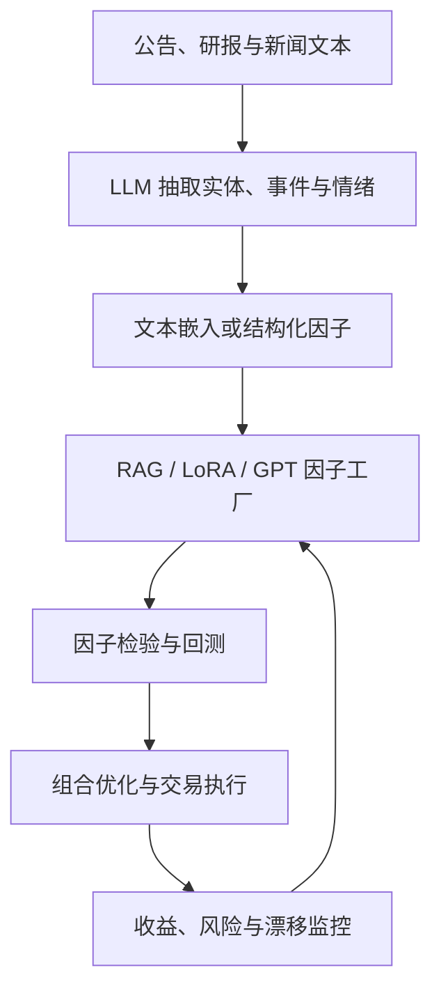

## 大模型在量化投资中的应用

> 核心关系：大模型把非结构化文本转成可检验因子，但仍需通过回测、风险控制和监控才能进入投资流程。

## 语言模型的三代演进

**第一代**：磁带模型——词袋（bag of words）、词频、one-hot 等离散表示。**第二代 Word2Vec**：用神经网络把单词映射为低维稠密向量，本质是降维。训练样本由中心词与上下文词构成（skip-gram 式）：输入 one-hot 向量，隐藏层 300 维向量即词向量。与因子选股同构——5000 只股票降维到几百个因子，1 万维 one-hot 降维到 300 维向量。**第三代**：GPT 与 BERT 等预训练模型。GPT 用自回归预训练（给定前几个词、生成下一个词）；BERT 用掩码语言模型（随机挖掉一个词、学习预测被挖掉的词）。两个模型均用高质量语料先预训练通用模型，再针对特定任务微调。

**编码器与解码器**：BERT 是编码器架构，同时看上下文；千问、GPT、DeepSeek 等生成式大模型是解码器架构，逐词自回归、只看左侧上下文。生成式模型不能直接做文本向量编码。

## 文本因子

**分析师情感因子（2019）**：研报每句话送入微调后的 BERT 输出情感打分；过去 90 个自然日内该股票所有研报做衰减加权（越近权重越高），浓缩为一股一个因子。情绪最积极的前 10%、前 20% 股票表现好，后几层表现差。

**文本 PEAD 因子（第一代，2021）**：输入端改为业绩预告发布后分析师的点评（研报为写而写者众，业绩预告后点评围绕新信息重调目标价与评级、信噪比更高）；输出端改为监督学习模型——X 为研报标题前 100 个高频词与摘要前 500 个高频词构成的词频向量，Y 为研报发布前后一天（T-1 至 T+1）股票相对基准指数的超额收益。标签设计的两处细节：左端取 T-1 因分析师报告滞后、时间戳实质对齐业绩预告事件日；右端只取 T+1 因标签测算的是市场对盈余的反应（PEAD 效应），不是收益率。双重验证：Y 要求股价出现跳空高开（市场已反应），X 要求文本含超预期线索，二者匹配后选出的股票确定性更高。

**FADT 因子（第二代）**：把 X 从业绩预告点评换成盈利预测调整与评级调整两类触发事件。业绩预告受法定披露时间约束，而盈利预测调整、评级调整全年随时可发，因子时间分布更均匀；触发调整即意味着公司发生重大变化，信噪比更高。

**FinBERT（第三代）**：词频 one-hot 向量稀疏、存储效率低、无法处理双重否定（「不会上涨」会被统计成「上涨」出现一次）。改用 FinBERT 把研报摘要文本整段编码为 1×768 稠密向量，效果明显提升。

**LLM-FADT（第四代，2025）**：原始研报交给 GPT 精读，预设 5 个问题（标题是否重构、是否凸显行情催化剂、原文之外有无言外之意、有无未明确表达的潜在风险、对未来收益的指引），生成 5 段增强文本；原始研报与 5 段增强文本共 6 份文本，各自送入 FADT-BERT 得到 6 个因子并取平均。回测显示行情催化剂类增强文本最优，大模型解读文本的最大回撤普遍优于原始文本。分析师看涨时表述直白、看跌时往往隐晦，提问把隐含信息显式化，正因如此「言外之意」重要。

## GPT 因子工厂

**GPT 因子工厂（Alpha Factory）**：华泰金工提出的多智能体因子挖掘流水线。**factor agent** 扮演资深量化研究员生成因子表达式；**code agent** 扮演对冲基金程序员，把表达式翻译成可执行 Python 代码并本地跑通；**backtest agent** 评价回测（计算 IC、Rank IC、分层回测、输出相关性矩阵）并给出改进建议回流迭代，形成循环。意义等价于招 50 名实习生各写一个因子，挑优秀者在样本外跟踪、有效才上实盘；GPT 不吃饭、不睡觉、不发工资。

**2.0 版**：挖掘范围从量价扩展到基本面因子与高频因子。为抑制过拟合，刻意选用知识截止时间较早的模型，等于扩大样本外窗口。50 个因子分层回测中第 5 层跑赢第 1 层；策略年化超额收益达 31.32%。

## GPT 如海与 RAG

**RAG（检索增强生成，Retrieval-Augmented Generation）**：先检索库中相关知识，再生成回答。

**GPT 如海**：解决研报代码复现问题。研报中因子或策略信息散布在文本、图片、公式中，传统方法难以直接利用。四阶段架构：索引——图片经 GPT-4-vision-preview 转成文字，文字统一经 text-embedding-3-large 转为 1536 维嵌入向量存入 Chroma 向量数据库（块大小 500、块间重叠 200）；检索——用余弦相似度从库中取 K=15 个最相关片段；生成——提取复现细节（输入输出数据、数据预处理、网络结构、模型参数）、做自我反思补缺、生成代码；部署——用 Streamlit 打包成本地 Web 界面。输入研报 PDF 或因子图片，输出对应的 Python 代码。

## LoRA 微调

**微调（fine-tuning）**：调整大模型自身参数，用私有数据训练出特定功能或特定风格的大模型或智能体。相比提示工程、RAG、智能体，微调实现最为复杂。

**LoRA（低秩适应，Low-Rank Adaptation，2021）**：在原始预训练语言模型旁边新开一条旁路，先降维（A）再升维（B），用私有数据只训练旁路、训练时固定预训练模型参数。理论假设：大模型中发挥功能的其实是低秩矩阵，特定任务适配时权重变化是低秩的。输出时把 BA 与预训练参数叠加；随机高斯初始化 A、0 矩阵初始化 B；内部低秩维度 r 取 1 或 2。

**参数高效微调（PEFT）**：只训练小部分参数的微调普遍形式，分三类——Additive methods（增加额外参数或层）、Selective methods（选择性微调特定层或稀疏参数）、Reparameterization-based methods（用低秩表示最小化可训练参数数量；LoRA 属于此类）。

## AI 工具链

**Cursor**：辅助编程软件，核心功能是对话生成代码，同时拥有代码补全、行内编辑与对话功能。Tab 键含多行编辑、智能重写、光标预测——光标预测预判下一个要修改的位置，按 Tab 直接跳转。报错直接丢给它解决。**沉浸式翻译**：浏览器插件，把网页英文在原位置下方变成嵌入式中文，格式与颜色一一对应。**pdf2zh**：基于 AI 完整保留排版的 PDF 全文双语翻译工具。**秘塔 AI**：语义理解搜索，抓取知乎、抖音、学术论文、播客等全网数据并标注来源链接；深度研究模式逐步思考后输出一篇报告。

## 大模型的量化研究应用

**技术分析**：把技术指标提供给大模型即可做技术分析。**GPT-Kline** 用多模态思维链（Multimodal Chain-of-Thought，MCoT）把图像推理任务拆成可观察的中间步骤——先看图像、再做逐步推理。自动化流程：任务设定并绘制 K 线 → 读取图像做初步分析、规划分析方向 → 大模型思考标注内容并生成标注指令，由工具在 K 线上标注支撑线、压力线与关键形态，循环迭代 → 汇总成技术分析报告。案例（贵州茅台）：标注支撑/压力位 1400.01、1500 与 1657.99，识别早晨之星、黄昏之星、锤头线形态，输出「持有」建议。

**财务分析**：大模型输入资产负债表和现金流量表、输出盈利预测。GPT-4 turbo 带思维链的准确率 0.604，高于 3 个月分析师 0.567、1 个月分析师 0.527 的一致预期。**文本情感分析**：大模型对新闻标题的情感判断接近人类选择——看到「Rimini Street 被罚 63 万美元」，BERT 类模型判为消极，大模型判为积极（罚款增强投资者对 Oracle 保护知识产权能力的信心）。

**大模型因子（LLM factor）**：对股票涨跌幅做出解释的原因。SKGP（顺序知识提示）分三步：提取上市公司背景知识 → 从新闻中提取可能影响股价的因素 → 对未来股价推理预测。**组合优化**：把 LLM 当作优化器（OPRO），用自然语言描述优化任务，根据先前生成的解决方案及其评分生成新方案，考虑各种约束条件。**经济学模拟**：给 LLM 初始资源、信息、偏好，模拟不同情境下的行为。

## 强化学习因子挖掘

**逆波兰表达式（RPN）**：后缀表达式，运算符位于操作数之后，无需括号。计算机从左到右一次扫描完成计算、无需回溯。中缀 $(A+B)\times(C-D)$ 对应后缀 A B + C D − ×。

**Token 化**：把任意数学表达式映射为可学习、可生成的离散序列，是强化学习因子挖掘的根基。范例 Alpha#4 $(−1 \times \mathrm{TsRank}(\mathrm{Rank}(low), 9))$ 后序遍历编码为 BEG Low Rank 9 TsRank −1 Mul SEP。

**RL 元素对应**：动作 = Token；状态 = 已生成的 Token 序列；轨迹 = 完整因子表达式；奖励 = 因子预测能力（IC、ICIR、超额收益）；环境 = 金融市场数据；智能体 = 因子生成模型（神经网络）。

**稀疏奖励（Sparse Reward）**：因子挖掘中奖励天然稀疏——不完整表达式无法回测，序列完整时才计算 IC，中间步奖励为 0。挑战：信用分配（最终 IC=0.05，不知道哪一步的功劳）、探索困难、学习效率低。缓解手段：分层决策（高层选模板、低层填充）、大模型先验知识引导探索方向。

**PPO（近端策略优化，Proximal Policy Optimization）**：限制新旧策略差异，确保每次更新渐进。重要性采样比率 $r_t(\theta) = \frac{\pi_\theta(a_t|s_t)}{\pi_{old}(a_t|s_t)}$ 衡量同一状态-动作对下新策略相对旧策略的概率变化倍数。裁剪目标：

$$L^{CLIP}(\theta) = \mathbb{E}_t\left[\min\left(r_t(\theta)\hat{A}_t, \; \mathrm{clip}(r_t, 1-\epsilon, 1+\epsilon)\hat{A}_t\right)\right]$$

clip 把 $r_t$ 限制在 $[1-\epsilon, 1+\epsilon]$，取 min 取裁剪前后目标中更悲观者，防止过度乐观的更新。**MaskablePPO**：在策略输出时直接屏蔽非法动作（如栈深度为 1 时不能选双目算子），只从合法动作中选择。

**实证**：沪深 300 指增年化超额 16.41%、信息比率 1.54；融入大模型后（构造基础因子池为 RL 热身、定期注入新因子、去弱留强）提升至年化超额 17.85%。Transformer 优于 LSTM，IC 优于 ICIR。

## 未解问题与展望

**因子对齐（factor alignment）**：因子投资流程为单因子测试 → 因子合成 → 组合优化；AI 模型只覆盖因子挖掘与合成，组合优化仍是传统二次规划，两端脱节。表现为因子 IC 很高，做成指增组合后超额收益不高。**泛化性能**：金融规律今天与昨天不同、数据漂移严重；SAM（锐度感知最小化）通过寻找平坦极小值应对。**异质性**：全 A 股共用一个模型不合理——大盘股交易业绩、小盘股交易弹性，风偏高时炒作高波动风格、风偏低时回归基本面。

**机构应用**：15 家百亿量化私募在 AI 领域取得实质进展，AI 量化从先锋实验走向行业共识。量化私募接受度高，但 95% 以上仍为辅助角色，完全交给大模型的目前没有一家。
