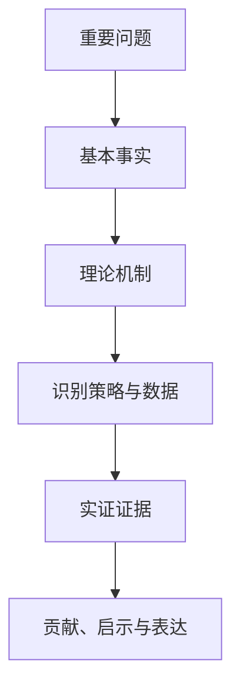

## 金融学论文写作课程导论

金融学论文写作讲授如何做实证经济金融研究、如何写学术论文。课程覆盖从选题、找文献、找基本事实、处理数据、写理论机制到结论、引言、摘要、格式的完整流程，方法部分以面板数据回归为主线。

> 核心关系：论文的说服力来自问题、事实、机制、识别和证据之间的闭环，而不是单独的回归结果。

## 实证研究的两条评判标准

**合理性**：评判每一步操作与解读是否合理。

**一致性**：评判结果是否一致，即换样本、换方法、换度量后核心结论是否保持稳定。

论文评分看规范、合理、一致，与 idea 是否新颖关系不大。数据处理漏洞百出、表格单位混乱的论文拿不到高分。实证研究从数据到结论的每一步都受这两条标准约束。

## 论文写作九步功法

一篇实证金融论文按九步完成：

1. 选题：明确研究问题。
2. 找文献：建立文献基础。
3. 找基本事实：用数据描述 X 与 Y 之间的典型关联。
4. 处理数据、做实证结果。
5. 写理论机制、研究假说。
6. 写结论：先写结论。
7. 写引言：结论确定后倒过来写。
8. 写摘要：最后写，概括全文要点。
9. 参考文献与格式。

引言与摘要最后写。引言的功能是介绍研究问题与贡献，摘要要概括全文要点，两者都依赖已确定的实证结果与结论。

## 大期刊文章的三大特点

### 重要的问题、重要的发现

顶刊文章研究重要问题并给出重要发现。QJE 2017《Household Debt and Business Cycles Worldwide》发现家庭债务上升预测未来经济增长率下降，公司债务没有这种预测能力。同样都是债务，家庭部门与企业部门对经济周期的含义不同，设置公司债务作对照让发现立住。

### 有新意、有趣

选题角度出人意料。RFS 文章研究 CEO 的文化起源如何影响并购决策，另一篇文章研究 CEO 政治倾向是否影响员工政治选择。老问题也要出新意，题目要让审稿人眼睛一亮。

### 新方法、新领域、新理论

**新方法**：JPE《CEO Behavior and Firm Performance》给 CEO 秘书安装应用记录时间分配，用机器学习对 6 个国家 1114 位 CEO 的行为分类，区分战略型与日常管理型 CEO。

**新数据与因果识别**：QJE 2020 用意大利央行调查直接度量企业通胀预期，连接预期与企业定价、借贷、雇佣、投资决策。

**新理论**：QJE《The Deposits Channel of Monetary Policy》提出货币政策存款渠道：央行加息时存款利率上调滞后，利差扩大，存款流出银行体系，银行负债收缩进而收缩贷款。

**新领域**：AER 2020《Home Values and Firm Behavior》研究住房价值上升如何增加当地企业投资；东日本大地震的供应链中断研究把冲击沿上游供应商—地震中心企业—下游客户传导。

## 好题目的产生

好题目有三大来源：经济学与金融学逻辑思维（理论框架）、文献基础、实践经验。实证研究选国家、区域与政策层面都关注的热点问题，紧跟时代脉搏研究中国问题，讲好中国故事。

取题标准：简单明了、抓重点、学术化，题目与内容一致，不宜太大、不要太长。常见通病三类：太大不聚焦，加限定词或副标题收敛；表述模糊，改为「X 对 Y 的影响」；双问题并存，只留专业领域内的一个问题。

## 重事实的研究立场

做研究之前先问现实当中是不是这么回事。研究设计的逻辑先在现实中找到依据，研究中国问题基于中国实际，从改革发展的实践中挖掘新材料、发现新问题。审视一篇学术论文抓三点：文章与事实是否一致、结论的意义在哪里、文章怎么提问题。
