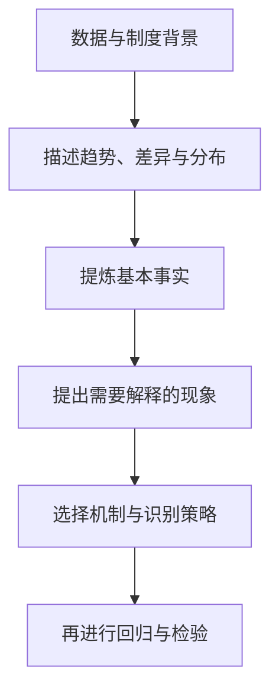

## 找基本事实

> 核心关系：实证研究先用数据确认值得解释的基本事实，再让机制和识别策略服务于事实解释。

## 先事实后回归

找基本事实是论文写作九步功法的第 3 步，包括找数据，以及用数据描述 X 与 Y 之间的关联。它是第 4 步数据处理与实证结果的前提，也是九步中最容易被忽略的一步。

**先讲事实，再讲逻辑**：论证一个观点先问现实中有没有这个事实。回归之前，先用客观数据（描述性统计表、趋势图、散点图）呈现 X 与 Y 之间的典型事实。

**回归是装饰**：有明确的基本事实后，回归结果顺理成章；没有事实依据的回归是「为了回归而回归」。学术研究有两个目的：训练分析问题的能力，学会批判。批判的眼光同样用于顶刊文章，文章发在 JFE 不代表没有问题。

## 呈现基本事实的三种方式

**描述性统计表**：回归之前先做一个表格，描述 X、Y 在样本期内的变化趋势。JF 2014 用 1980—2008 年美国上市公司的到期债务比例与现金持有量分期均值表呈现典型事实：1 年内到期长期债务比例从 0.149 升至 0.191，同期现金持有量从 0.110 升至 0.177，两者同步上升。

**趋势图**：画 X 与 Y 的时序走势图，直观展示同向变化，也可以分组对比。AER 2011 画家庭债务、公司债务与房价指数三张图：1978—2008 年家庭债务增加远多于公司债务，家庭债务收入比持续上升而公司债务收入比没有明显上升趋势。

**散点图**：展示冲击与结果的横截面关联。RFS 文章用房价冲击与家庭资产负债表恶化的散点图描述事实。

三种方式的共同要点：用客观数据回答「X 与 Y 之间有没有关联」，不能只写观点。

## 批判案例：与基本事实不符的顶刊文章

### 音乐情绪与股市收益率

JFE 2022 用 40 个国家 Spotify 每日播放前 200 首歌曲的效价按播放次数加权度量国民情绪，回归发现音乐情绪与本周收益率正相关、与下周收益率负相关。批评者指出 5 条与基本事实不符的疑问：

1. 听歌人群与投资者不匹配。Spotify 用户以 20—40 多岁人群为主，没有证据证明其中股票账户持有占比。
2. 反向因果。股市暴跌当天持有股票的人心情不好，收益率反过来影响情绪。
3. 音乐偏好有沉淀性，很长时间很难变化，「今天情绪 → 明天换歌 → 影响股市」的机制不成立。
4. 不同国家投资者结构差异大，机构投资者比重高的国家散户情绪影响有限。

音乐情绪文章有趣，但对现实没有意义。

### 信任与金融科技贷款

JFE 2025 用富国银行丑闻作为借款人银行信任度的负面冲击，双重差分发现丑闻暴露程度高的地区借款人转向金融科技贷款。批评集中 4 点：

1. 未考虑潜在借款人。丑闻前愿意选择富国银行、已申请贷款尚未审批完毕、丑闻后中止申请的借款人，是信任机制的重要部分，但不可观测。
2. 未考察存款规模变化。稳健性部分显示丑闻暴露度对存款的回归系数显著为正——客户未抽离存款，无法证明信任受损，结论受到根本性冲击。
3. 丑闻严重程度存疑。未经许可开办账户、强制搭售、违规收费对客户损害有限，后果可能主要限于罚金。
4. 借款人未必关心银行安全。中小企业多数只关心能否借到钱，存款人才关心银行安全。存款比贷款更能反映客户对银行的信任。

## 案例方法论：先摆事实再设计识别

**JF 2014 再融资风险与现金持有**：Y 为公司现金持有量，X 为再融资风险，用 1 年期、3 年期、5 年期到期债务比例衡量。描述性统计表先展示再融资风险上升与现金持有量上升的同步事实，回归结果 1 年期、3 年期、5 年期到期债务占比的系数分别为 5.122、5.954、6.811，均高度显著。有了典型事实，回归结果顺理成章。

**AER 2011 房价与家庭债务**：Mian 和 Sufi 用趋势图展示家庭债务与房价指数同向上升，再用 2SLS 识别因果：第一阶段用 1997 年住房供给弹性作工具变量预测房价增长，第二阶段发现拟合房价增长显著提升家庭债务增长。趋势图是 2SLS 之前的基本事实。

**RFS 家庭财务困境**：纯理论文章也先摆两则事实再建模型。财务困境（信用卡逾期 30 天以上）可以度量家庭资产负债表脆弱性；高财务困境区域的房价跌幅是低区域的两倍。带财务困境的生命周期模型使总量消费响应改变约 25%。

## 风险收益不对称：一个需要解释的基本事实

传统命题是风险与收益成正比，由 CAPM 模型推导。金融科技平台公司对传统金融学理论提出挑战：收益很高，逾期率却很低。

**规模事实**：2019 年国内所有平台公司发放的在线消费信贷规模达到 6 万亿元，占全国短期消费信贷比重超过 60%。2020 年上半年蚂蚁集团短期消费信贷达 1.7 万亿元，超过国有大行消费贷合计。

**定价事实**：2017—2020 年各平台公司年化贷款利率 7.2%—18%，同期市场利率 3.91%—4.35%。腾讯微粒贷 18.25%、蚂蚁借呗 21.9%、京东白条超过 23%，而银行快贷约 4.35%。日利率看着低、年化很高，量大面广之下利润巨大。

**风险事实与盈利事实**：2019 年平台公司 30 天贷款逾期率仅 0.8%—1.2%，低于商业银行 2% 左右；净资产收益率高达 28.15%，招商银行为 16.84%。

**机制**：信息垄断 → 市场垄断 → 定价权 → 差别定价。平台同时掌握海量数据，利用大数据技术识别风险，通过信息垄断逐步实现市场垄断，主导利率定价权，形成「高利率、低风险」的定价。风险主要由商业银行承担：某平台 98% 的贷款已实现资产证券化，主要购买者是商业银行；另一平台联合贷款 90% 以上资金来自商业银行。银行有钱但没有数据，平台有数据、有信息垄断，形成中国式助贷、联合贷模式。

这类研究数据难以获得，应对办法是做理论模型加模拟。

## 三个注重、三个事实、三个维度

**三个注重**：注重研究方法（研究方法影响思考问题的方式）、注重文献阅读（读 5—10 篇文献改变分析问题的能力）、注重调查研究（向实务界访谈核实现实情况）。

**三个事实**：历史事实（已发生的数据与事件）、现实事实（正在发生的事件）、文献事实（文献或著作归纳总结的事实）。

**认识金融世界的三个维度**：经济学和金融学的基础理论与基础知识、研究方法、社会实践。
