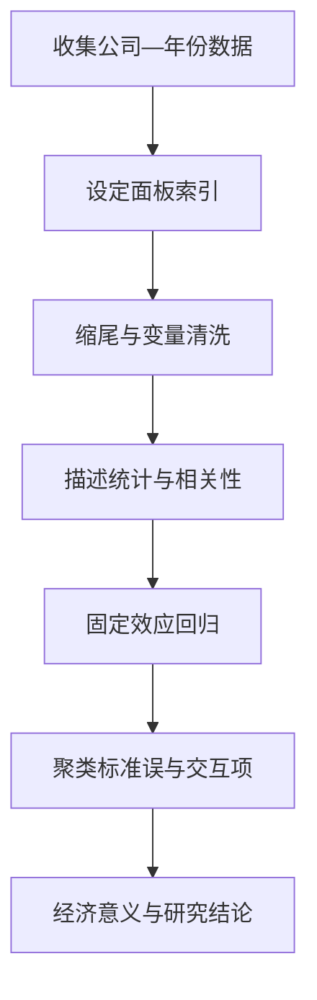

## 实证方法：面板数据与 Stata

> 核心关系：面板实证先建立可比的数据结构，再依次完成清洗、描述、识别、估计和经济解释。

## 六步流程

一篇实证论文从数据到结论按六步制作：

1. 从 Wind 收集数据。
2. 转成面板数据。
3. 缩尾处理（winsorize）。
4. 描述性统计。
5. 相关系数矩阵。
6. 回归分析。

DID、匹配、选择模型、GMM 属于了解性内容。

## 数据收集

**数据来源**：宏观数据用中国统计年鉴、中国金融年鉴、IMF、OECD、美联储、Wind；微观数据用 Wind 与国泰安 CSMAR。

**单位统一**：同一变量全样本必须同一单位。第一大股东持股比例 0.80 与资产负债率 72% 不能放一张表，72% 应写成 0.72。

**绝对数 vs 相对数**：2008 年政府 4 万亿刺激计划与 2023 年增发 1 万亿国债，绝对数相近、占 GDP 比重分别是 1/30 与 1/121，含义完全不同。某硕士论文用 FDI 绝对数做回归系数为负几千，改用 FDI 增长率后结果正常。

## 转成面板数据

Wind 下载的是宽表：一行一个公司、一年一列、变量横排。面板回归要求长表：一行一个「公司 × 年份」观测。国泰安 CSMAR 数据本身即面板形式，Wind 数据必须自行转换。

Stata 命令：`reshape long a, i(gongsi) j(time)` 把宽表变成长表；`xtset gongsi time` 声明面板结构，之后才能用 `xt` 系列命令。

**平衡面板**：每个个体每个时期都有观测。**非平衡面板**：存在缺失观测（上市年份不同、退市）。用 `xtbalance, range(...)` 截取共同区间。

## 缩尾处理

**缩尾处理**：把低于 1% 分位数的观测值替换为 1% 分位数值、高于 99% 分位数的值替换为 99% 分位数值。缩尾保留全部观测，与剔除异常值等价，两种做法的回归结果一致。

**异常值的影响**：异常值扭曲相关系数与回归系数。演示显示：未缩尾时相关系数 -0.6027，对两个异常值缩尾后相关系数变为 0.69，符号都翻转了。先做缩尾再做分析是铁律。

Stata 命令：`winsor var4, gen(var4_w) p(0.01)`；`winsor2 var4 var5` 批量处理。

**适用范围**：只对公司层面的连续变量做缩尾（资产、负债、营收、利润、市值）。不做缩尾：虚拟变量（0/1 无异常值可言）、宏观时间序列（利率、CPI、GDP 增速）、地区宏观数据。宏观序列的极端值是有经济含义的观测，对 CPI、利率缩尾的论文在评审中被要求重改。

## 描述性统计

常用统计量：均值、标准差、中位数、四分位数、极值、偏度、峰度。Stata 命令：`tabstat var4 var5, stats(mean sd median max min count)`。

**均值会被极端值拉高，报告要同时看中位数**：中国城市户均财富均值 247 万元、中位数仅 40.5 万元，贫富差距使均值远高于中位数。看营收、财富等变量要看中位数。

**回归表中变量若出现离谱的 min/max**（如资产负债率最小 -2725），即为未缩尾且单位混乱的证据。

## 相关系数矩阵

相关系数矩阵两个用途：

1. 判断解释变量之间的多重共线性：相关系数小于 0.4 视为无共线性，大于 0.4 说明高度相关。M1 与 M2 相关系数大于 0.9 不能同时放进回归方程。
2. 初步观察 X 与 Y 的相关方向与强度。

Stata 命令：`pwcorr var4 var5, sig star(.05)`。

**X-Y 相关系数低不等于没有影响**。相关不等于因果——树高与年龄的相关系数接近 1，但两者没有因果关系。4 篇顶刊文章中 X-Y 相关系数分别只有 0.04、0.09、0.15、0.16，照样做回归并发表。

## 回归：固定效应与聚类标准误

**静态面板**：解释变量不含被解释变量的滞后项。**动态面板**：含滞后项，需用 GMM 估计（`xtabond`、`xtdpdsys`）。

**固定效应**的三种基本类型：

**公司固定效应**：吸收不随时间变化、随个体变化的不可观测异质性（公司文化）。等价于给每个公司加一个虚拟变量。

**时间固定效应**：吸收随时间变化、对所有个体相同的共同冲击（2008 年金融危机）。

**行业固定效应**：控制不随时间变化（或缓慢变化）的行业特征。常用组合：公司 + 时间，或行业 + 时间。

Stata 实现：`reg var4 var5 var6 i.var1 i.var2, cluster(var1)`；`xtreg var4 var5 i.var2, fe`。

**不用随机效应**：公司金融实证文献中几乎找不到使用随机效应的文章。随机效应假设个体异质性与解释变量不相关，公司金融中该假设几乎必然被违反。课程不做 Hausman 检验选模型，一律用固定效应。

**聚类标准误**：面板数据同一聚类（公司）内存在共同因素同时影响 X 与 Y，模型未控制时残差在聚类内相关，标准误偏小，回归看起来更显著。按公司聚类后标准误变大、显著性下降。只要做面板数据回归就必须聚类调整。判断是否做了聚类调整：在 PDF 中搜索 'standard errors corrected for clustering' 或 'cluster'。Petersen（RFS）约 2012 年完成推导认证，2015 年之前的顶刊文章几乎都没做。

**显著性**：只有三档，*** 为 1% 水平显著、** 为 5%、* 为 10%。做回归至少要求 5% 显著。P 值 0.148 四舍五入报 0.15 无实质意义，不显著就如实报告。

## 控制变量使用态度

**控制变量**：除核心解释变量外，所有影响被解释变量的变量。来源是文献中常用的、公认的变量。

不关注控制变量的系数大小与显著性，关注核心变量系数的稳定性。JFE 2011 中 CEO 任期对 CDS 价差的系数 -0.031 是核心变量，ROA 系数 -402.824 是控制变量，量纲不同不可直接比较。

**装饰不等于造假**：回归是装饰与严密论述的过程。可以换量纲、换衡量方式、换数据呈现方式，不能篡改数据、不能给系数加星号造假，样本范围不宜随意调整。

## 交互项与边际效应

**交互项**：两个变量相乘（X1 × X2）。**边际效应**：在模型 $Y = \beta_1 X_1 + \beta_2 X_2 + \beta_3 X_1 X_2 + \cdots$ 下，$\partial Y/\partial X_1 = \beta_1 + \beta_3 X_2$，X1 每增加一个单位，Y 的变化量取决于 X2 的取值。

交互项是机制分析的标准做法。示例：JFE 2006 行业流动性需求 × 国家金融发展；JIMF 2013 相对价格波动 × 相对生产率。

## 经济意义解读

一个系数三颗星不代表经济上重要。经济意义回答「多喜欢」的问题。

**连续变量的经济意义**：$\beta \times SD(X) / mean(Y)$，即 X 每增加一个标准差，Y 的变化占其均值的比例。文献默认该比例最好大于 10%。某 AI 文章报告流动性系数 -0.091、标准差 0.878、均值 0.504，计算 0.091 × 0.878 ÷ 0.504 ≈ 15.7%，文章自己解释为约 4%。文章若不报告均值与标准差，读者无法复核。

**两个忌讳**：不要解释成「X 每增加 1%，Y 增加百分之几」（除非 log-log 模型）；不能直接比较不同变量系数的大小。

**虚拟变量的经济意义**：把系数直接除以 Y 的均值。IPO 成功虚拟变量系数 -0.137、创新样本均值 1.03，IPO 成功后创新下降约 13%。

**交互项的经济意义（数字游戏）**：固定其他变量（通常取均值）后算边际系数之差再除以基准值。某投资回归中经济周期扩张期托宾 Q 边际效应约 0.395、紧缩期约 0.262，相差 0.133，除以扩张期基准约得 33%。解读交互项的经济意义必须说明所选基准，同一个差除以 0.262 得约 51%。

经济意义一般在 OLS 回归里解读；2SLS 第二阶段的经济意义不大。
