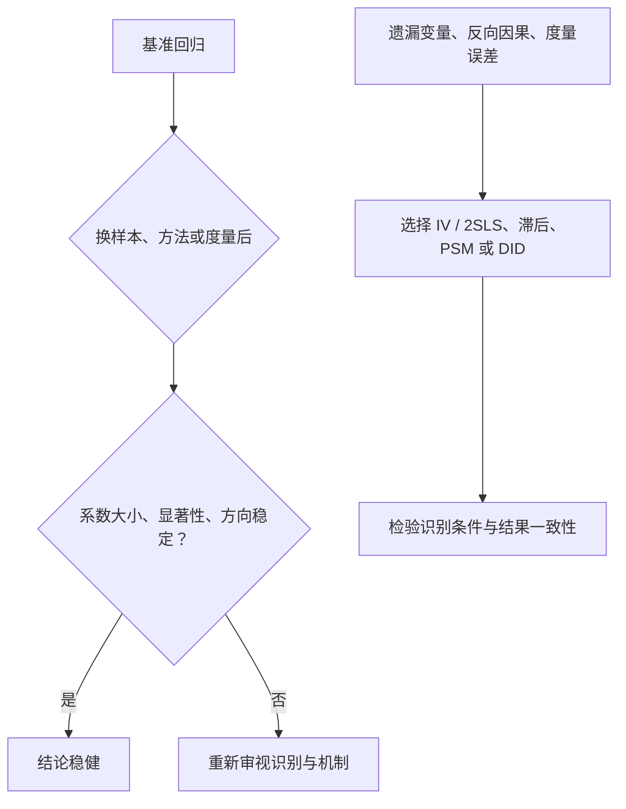

## 稳健性检验与内生性

> 核心关系：稳健性检验检查结论对设定变化的敏感度，内生性处理则针对 X 与误差项相关的识别威胁。

## 稳健性检验

**稳健性检验**：看基准回归结果是否随方法、样本、度量方式的变化而保持稳定，没有统一的操作方式。判定标准盯三点，任一出现明显变化即视为不稳健：

1. 回归系数没有出现跳跃性变化（大小稳定）。
2. 回归系数显著性没有出现明显变化（星级稳定）。
3. 回归系数的方向没有变化（符号稳定）。

反例：基准回归系数 -0.091 且三颗星，换方法后符号翻转为 +0.091，或系数由显著变为不显著，都说明结果不稳健。

常见操作清单：换样本、换时间窗口、换计量方法、换变量度量方式。2SLS 本身也是一种稳健性检验，无非把估计方法从 OLS 换成 2SLS。

## 内生性

**内生性**：模型中的一个或多个解释变量与随机扰动项相关。内生性有三个来源：

**遗漏变量**：核心解释变量与没有控制的因素相关。方法：工具变量、2SLS。

**互为因果**：解释变量与被解释变量之间存在双向因果联系。方法：解释变量滞后一期、PSM、DID。

**度量误差**：解释变量的度量与真实值之间有偏差。方法：增加变量不同的度量方式；样本选择偏误用两阶段选择模型。

方法与变量类型对应：X 为连续变量时用 2SLS 或工具变量；X 为 0/1 选择变量（如是否聘请四大审计机构）时用两阶段选择模型。

**识别靠主观判断，不用统计检验**。期刊里没有文章靠某个检验统计量证明存在内生性。回答一个问题即可：X 是否还受到其他因素的强烈影响？是，则 X 内生。严格外生变量的例子：911 事件、天气、地理位置、历史变量。连续型经济变量（现金流、债务到期日、房价）基本都不可能严格外生。

## 工具变量与 2SLS

**工具变量**：与模型中的随机解释变量高度相关、却不与随机误差项相关的变量，估计过程中被当作工具使用。

工具变量须满足四个条件：

1. 与所替代的随机解释变量高度相关。
2. 与随机误差项不相关。
3. 与模型中其他解释变量不相关。
4. 同一模型中引入多个工具变量时，这些工具变量之间不相关。

经典例子：储蓄方程中农民收入内生，文献用地区降雨量作工具变量——降雨量越多，农作物收成越差，农民收入越低，而降雨量对储蓄方程严格外生。今天再用天气做工具变量已难发表。

最简单的两类工具变量：用行业或地区平均值作为某公司对应变量的 IV；用内生变量自身滞后 1 期（或多期）作工具变量。教科书例子：工资方程中教育水平内生，常用 IV 为母亲教育水平、兄弟姐妹数量。

**识别条件**：方程 $y = \beta_1 + \beta_2 x_2 + \beta_3 x_3 + \beta_4 x_4 + u$ 中 x3、x4 为内生变量，至少需要两个工具变量 z1、z2。一个内生变量至少配一个工具变量，两个内生变量至少配两个工具变量。

**第一阶段是否放入外生变量**：三种情形文献里都出现过——不放入、放入、放入多个外生变量。三种情形不改变第二阶段回归系数的方向，只改变大小；99% 的文献把外生控制变量放入第一阶段。

**软件实现**：手动两步法——第一阶段 `reg var5 var1 var2`（var5 内生，var1、var2 为工具变量），`predict v_w` 存拟合值，第二阶段 `reg var4 v_w`。该写法无法判断工具变量好坏。替代命令 `ivreg2 var4 (var5=var1 var2), endog(var5)`。

**弱工具变量检验**：Stock-Yogo weak ID test。原假设是所选工具变量为弱工具变量；Cragg-Donald 统计量大于 Stock-Yogo 临界值（10% 水平）时拒绝原假设，即不存在弱工具变量问题。

发展趋势：期刊普遍要求严格外生的事件或政策，直接找一个外生冲击做 DID，不再纠缠工具变量是否足够外生。

## 案例一：Jayaraman 与 Milbourn（2012）的稳健性布局

Jayaraman 和 Milbourn（2012，The Accounting Review）研究股票流动性对高管薪酬的影响，全篇按稳健性检验的三点判定逐表安排。

**表 2（基准回归，OLS）**：因变量为现金薪酬占比，核心解释变量为股票流动性 Liq，系数 -0.091、-0.069、-0.041（三列，均显著），控制 Tobin's Q、ROA、CFO、股票回报率及波动率，控制年度与行业固定效应，观测 21750 个。

**表 3（2SLS，换方法）**：第一阶段因变量为 Liq，工具变量为 LagLiq（流动性滞后一期）与 IndLiq（行业股票流动性中位数），系数 0.741 与 0.270 且非常显著；第二阶段自变量换为第一阶段拟合值 PrLiq，系数 -0.103、-0.079、-0.043。表 2 与表 3 对比：系数大小、方向、显著性均未出现明显变化，结论稳健。表 3 观测数比表 2 少 5 个，来自滞后一期造成的样本损失。

**表 5（换变量形态）**：把核心解释变量换成 Liq 的变化量，系数方向与基准一致。

**表 7（换度量方式）**：替换 PPS 与 Liq 的度量方式，系数与表 2 相比未出现明显变化。

## 案例二：Mian 与 Sufi（2011）房价与家庭债务

Mian 和 Sufi（2011，American Economic Review）研究房价上升如何使已有住房者借款增加、推高家庭债务。三个基本事实（Figure 1）：1978—2008 年家庭债务增长远多于公司债务；家庭债务收入比持续上升而公司债务收入比没有明显上升趋势；1997 年拥有住房者的债务与房价指数同步上行。

房价明显内生，作者做 2SLS。第一阶段用 1997 年住房供给弹性作工具变量预测房价增长：

$$HousePriceGrowth0206_{izm} = \delta X_{izm} + \rho \cdot Elasticity_{m,1997} + \varepsilon_{izm}$$

第二阶段因变量为家庭债务增长率，房价代入第一阶段拟合值：

$$LeverageGrowth0206_{izm} = \theta X_{izm} + \beta \cdot \widehat{HousePriceGrowth0206}_{izm} + v_{izm}$$

用历史弹性作工具变量的方式如今用得越来越少，顶级期刊要求找到外生冲击或政策直接做 DID。

## 宏观数据处理要点

**同比与环比**：同比是今年某季度与去年同季度相比，环比是本季度与上一季度相比。多数宏观数据（如 CPI）只公布同比，做模型前要换算为环比；GDP 的同比、环比不能混用。

**差分与平稳性**：宏观时间序列几乎都有增长趋势，直接回归有问题；做差分（增长率）后数据围绕均值变动，才满足平稳性。
