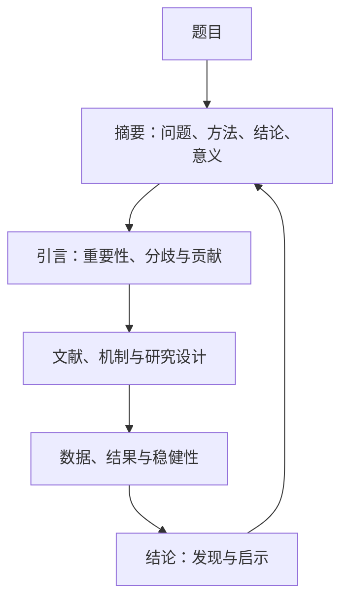

## 论文结构与格式规范

> 核心关系：论文结构围绕题目、摘要、引言建立第一印象，并让研究设计、证据和结论形成可回看的闭环。

## 论文的三张脸

编辑收到稿件先看三处：题目、摘要、引言，其余部分忽略不计。这三处是论文的脸面。结论写完之后回头写引言，摘要最后写。

## 结论突出意义

结论一般写两段话。

**第一段**：总结文章的大致研究思路（从什么角度、构建了什么、用了什么方法），再总结实证结果。实证结果写得比摘要详细。内容与摘要类似，但不能与摘要完全一样，把摘要复制过来是偷懒写法。

**第二段**：讲结论的意义——实证结果的现实意义、启示或政策含义、理论贡献。这里写的是结论的价值，文章的价值（贡献）写在引言里，两者必须区分。

**结论太直观等于没有意义**：现金流增加导致公司投资增加、利率降低导致公司融资成本降低，都直观到想不出政策含义。把经济分为紧缩期与扩张期后，发现经济紧缩期降息更导致融资成本下降、投资增加，政策含义立即浮现——经济下滑时更应使用扩张性利率政策工具。五大刊约 90% 的文章在结论里写意义。

政策建议必须严格基于本文结论。「结论三点、政策建议八点」是反面教材，与结论无关的政绩式建议不要写。摘要写了几条结论，结论与启示部分就对应写几条启示，保证全文逻辑闭环。

反面教材：银行作为税务规划中介一文，结论只说银行帮客户显著降低税负。缺少价值判断——该鼓励还是叫停？没有判断就没有政策含义。

## 引言吸引眼球

引言要告诉读者文章做什么、为什么要研究这个问题，突出研究的重要性、创新性和贡献。

**第一段强调研究的重要性**：该项研究解决或回答什么重要问题，可以是学术问题、实践问题或政策问题。第一段不写背景空话，「1978 年改革开放以来」这类铺垫全部删掉。国内期刊紧跟国家政策，把政策文件、五年规划、重要会议的精神吃透，以政策高度体现研究的重要性。

**如何提问题决定吸引力**。以数字普惠金融与城乡收入差距为例：

方式一（围绕 Y）：「影响城乡收入差距的因素很多，本文从数字普惠金融角度展开研究」。读者第一眼失去兴趣，只是换了一个数据，别人早研究过了。

方式二（围绕 X）：「文献和实践中关于数字普惠金融的影响存在价值分歧：有人认为使用越多越便利、效率越高、社会价值越多；有人认为数字金融发展带来隐私、数据保护、数据垄断问题，导致社会福利下降。本文利用独特的数据试图回答该分歧。」关注点从 Y 转到 X，站位更高：解决分歧、回答文献问题。

**贡献与创新点的写法**：引言中要提到文章贡献，不用过于夸张的语言，贡献点不能写太多。三种常见表述：一是「首次在文献中……」（要小心被批评，须确证）；二是「补充了现有文献……」；三是「与既有文献不同的是……」，后面用 1、2、3 展开。

**不要批评别人的文章**：写「既有文献着重研究……但缺少从公司融资目的转变角度的分析，本文补上这个角度」比「旧文献没考虑类似性问题、本文弥补其缺陷」得体。

## 摘要简明扼要

**学术论文摘要四句话**：第一句突出问题的重要性；第二句介绍文章的基本思路（采用什么模型、探讨什么、分析什么）；第三句为结论，最好用数字或分号；第四句为结论的意义。做研究要做重要的问题，尽量少做有趣但易受批评的问题（如音乐情绪）。

**学位论文摘要三段话**：第一段讲研究的重要性与研究问题，不写背景（若用到某政策可简单介绍）；第二段讲研究思路、方法与结论，结论写「得到的结论是：（1）……；（2）……；（3）……」；第三段讲结论的意义，写「由上述结论得到的启示是……」与「本文的主要创新点是……」。

建议写「启示」而非「政策建议」：学术研究很难说对政策产生什么影响，「启示」包含政策启示、学术启示、实践启示，直接写「政策建议」口气太大。

## 格式规范

格式是评分的重要部分。要点：

1. 图、表尽可能不跨页。
2. 符号级别不要弄错：中文参考《经济研究》，一、（一）、1. 三级即可；英文 1.、1.1、1.1.1，不超过三级。
3. 公式用 Math Type 编辑器。
4. 图表尽可能多，图表里的星号不要跨行。
5. 参考文献格式规范、尽可能引用权威文献。
6. 描述性统计不要出现低级错误。
7. 内生性问题要考虑。
8. 实证结果遵循合理性和一致性。

计量模型要搞清「什么时候用 + 该怎么用」：什么时候用指模型适用于什么经济问题、什么数据类型；怎么用指模型如何在软件中实现并解读结果。

一般期刊文章、百度、Google、大模型的产出不能作为证明文章观点的依据。除几篇核心文章精读外，其他文献不需要精读。看文献要总结观点、建立不同文献之间的联系、加上引用并附在参考文献里。

## 发表路径

**路径一**：自己写、自己投稿。提出一个好想法，向人请教是否可行，可行就写出来并投稿。英文文章可以先写出中文，再翻译并请公司润色。

**路径二**：自己写出初稿，找合作者一起修改并投稿。

两条路径都要求自己写，自己写才能提高。不建议为保研发烂期刊，没有意义，还可能把自己「贴得灰头灰脸」。

## 写作示范要点

顶刊论文共同示范的写法：贡献点明确——度量了别人没度量的东西（间接效应、非用户外部性、价格中信息的含量）；识别策略交代清楚并敢于自我批判；机制分解到位（价格渠道 vs 数量渠道、直接 vs 间接）；结论衔接政策含义；主动列出论文不足并做稳健性检验。非线性模型中虚拟变量系数不宜直接解读，需做指数变换后再解读。
