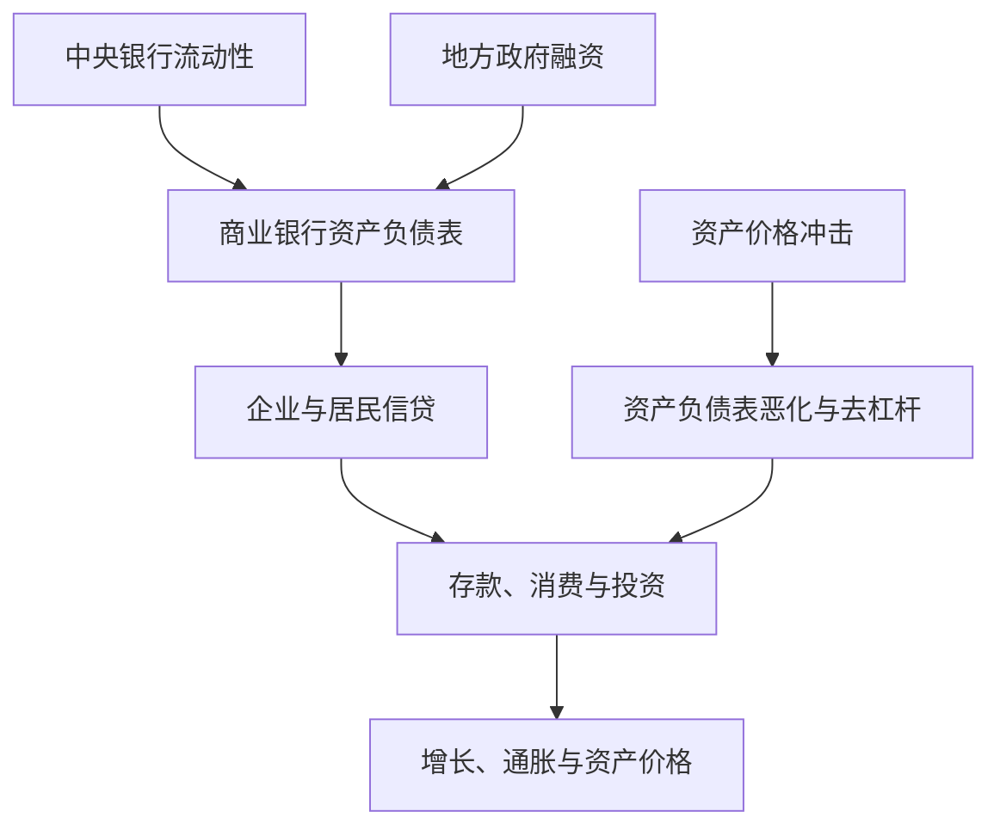

## 宏观金融研究专题

> 核心关系：宏观金融研究把货币、银行、政府和私人部门的资产负债表连接起来，解释流动性如何传导到实体经济与资产价格。

## 宏观经济金融运行机制

**货币创造链条**：人民银行（中央银行）→ 商业银行 → 贷款给企业、个人、家庭 → 形成存款与现金，即 M2。新增 M2 等同新增现金、新增流动性。

**央行对手方**：只有商业银行是人民银行的资金对手方。人民银行不能直接把钱给私募机构，发行货币必定经由商业银行。只有银行能合法吸收公众存款，证券、信托、保险、交易所、PE、VC 不能吸收公众存款，这是银行重要的原因。中国人民银行法规定人民银行只能以商业银行为对手方；美国《联邦储备法》第 13 条特别条款允许美联储在重大冲击时把企业作为对手方。

**国债的三条路径与通胀效应**：社会资金像一盆水，关键看是否新增。

方式一：政府发行国债，资金从居民口袋转移到政府，只动用社会存量资金，无通胀效应。

方式二：商业银行购买国债，同样动用存量资金，钱从「这个盆子倒到那个盆子」，甚至可能产生紧缩效应。

方式三：中央银行发行基础货币 → 给商业银行 → 商业银行购买财政部发行的国债 → 财政支出（如发消费券）→ 社会出现新增资金，才有通胀效应。

「美国发国债就通胀」的说法不成立：美国 M2 增长率高企时确实对应新增资金、有通胀效应，纯粹的存量腾挪没有。

**新增流动性流入实体经济的三个渠道**：央行直接购买企业债券、公开市场操作；商业银行发放信贷或购买企业债券；商业银行购买新发行的国债且政府增加财政支出。

**新增流动性只在金融部门内流转的渠道**：央行向商业银行提供流动性，但银行只用于增加超额准备金、改善金融资产结构，没有投放给企业和个人。2008 年美国金融危机中美联储给商业银行 100 万，银行存回 80 万、自留 20 万，目的是优化资产负债结构、防止挤兑，资金未流到实体经济。

**实体经济增长靠什么**：靠存量资金的结构性调整，从低风险需求主体转移到追求较高风险、从事创新活动的主体；靠有效率的居民、企业和政府部门获得新增流动性。贷给僵尸企业、无效率国企则资金无用。

2024 年 4 月数据：人民币贷款余额中企业占 66%、居民占 33%；人民币存款余额中企业占 26%、居民占 49%。存款主要留在居民部门，没有通过居民部门支出转化为企业存款。

## 地方政府投融资运行机制

**区县级政府**掌握资源最多，土地、当地国企资源由区委书记、区长说了算。区县实行「财政 + 国资」合并管理，负责财政预算、资金分配、公益性建设与国有资产管理；省级层面财政厅与国资委才分开。

**收入（融资）结构**：土地出让收入（房住不炒、三道红线后下行）、专项债（县市不能自行发债，由省级政府代发、县市报项目）、超长期特别国债、中央与省转移支付、国资经营预算收入。

**支出（投资）结构**：基础设施建设、公益性项目（学校、医院）、产业投资（高新园区、科技基金）、借新还旧。

**城投平台公司运作逻辑**：地方政府不能直接负债（预算法规定），2008、2009 年金融危机后中央允许地方以设立国有企业的方式融资做基建。政府将土地、股权、收费权等资产划给平台公司 → 平台公司凭借资产获得银行贷款或发债 → 承接政府建设项目 → 政府以财政补贴、土地划拨等方式支持平台还钱 → 平台公司向地方财政返还利润、分红。平台资产全部抵押后，有县把政府大楼划拨给平台公司再抵押融资。

**地方政府债务规模与结构**：显性债务为地方政府债券（一般债 + 专项债）；隐性债务主要是城投平台债务；或有债务为政府「可能承担责任」的融资行为（PPP 中政府回购承诺）。债务余额从 2017 年 16.47 万亿元升至 2024 年 47.54 万亿元。城投债约 70% 由银行购买；2023 年 7 月中央推出一揽子化债方案后，商业银行与公募机构认为有政府兜底，债券市场随后出现一波牛市。

**央地财政关系**：事权是政府管理事务的权力，核心是支出责任；财权是获取与支配财政资金的权力，以税权为主；财力是本级收入加上级转移支付构成的可支配财力。2024 年收入端地方本级收入占全国 54%，支出端地方承担全国 86% 的财政支出，收支缺口依赖中央转移支付补齐。债务约束的新变化：上级考核从唯 GDP 转向压缩规模、控制负债，地方政府投融资行为由此改变甚至扭曲。

十五五规划建议提出合理编制宏观资产负债表。当前政府资产统计困难：杭州湖畔居等国企资产、武林路一带房产并未进入地方政府资产负债表，数据资产是否计入也无定论。

## 资产负债表经济学

**资产负债表经济学**：以资产价格与资产负债表状态解释经济行为的框架，与教科书利润最大化框架不同。

企业案例：账面资产 300 万元（土地、厂房、短期现金），负债 300 万元。金融危机后股价下跌、房价下跌 50%，按公允价值计资产只剩 150 万元，负债仍为 300 万元，净资产严重缩水。抵押贷款按资产打折：资产 300 万时可借 150 万，资产 150 万时只能借 75 万，资产缩水直接压缩企业融资能力。

**目标函数转变**：教科书企业目标为利润最大化（$\pi = PQ - C$）；资产缩水、负债不变后，企业目标转向负债最小化，尽快还债。借钱炒股的类比：借 300 万元炒股，市值跌到 150 万元，欠款仍是 300 万元，只能割肉还 150 万元仍欠 150 万元，此后拼命工作还债。企业行为与此同理。

**辜朝明「阴阳」两阶段论**：「阳」态阶段私人部门资产负债表良好、以利润最大化为目标、资金需求旺盛，扩张性货币政策满足企业需求，财政政策对私人投资有挤出效应；进入「阴」态阶段后，企业面临资产价格暴跌带来的资产负债表问题，极力缩减债务，众多企业同时追求负债最小化产生合成谬误，经济陷入资产负债表衰退。

**政策含义**：衰退期企业无资金需求，扩张性货币政策无效；扩张性财政政策可以部分替代萎靡的私人投资来刺激经济复苏。这一框架用于解释日本、中国经济：房价上升期家庭资产端膨胀、购买更多房子形成循环，房价下跌期资产负债表恶化则压缩消费与借贷。

## 可研究方向

**从土地财政到「股权财政」的经济效应**：土地出让收入下降后，政府转向经营股权、基金等资产。

**债务约束下的地方政府行为**：发债、投资、招商引资行为在债务约束下如何变化、是否扭曲。

**商业银行「流动性囤积」的经济后果**：资金在金融体系内部空转，对经济增长率、投资、创新产生不良影响。可做非线性关系、门槛效应，甚至估计最优的银行流动性比率。测算方法已有文献，数据可从银行与企业信贷数据中获得。

**宏观资产价格波动对企业投融资行为的影响**：X 为房价或股价，Y 为企业投融资。X 用房价时，企业资产端须持有大量土地、厂房等与房价相关的资产；用股价时须持有与股票相关的资产，否则逻辑不成立。

**房价与家庭资产负债表**：中国房价上升后更多家庭用于购买更多房子、资产端极致膨胀，是否形成正向循环可做研究。数据可用家庭金融调查问卷。
