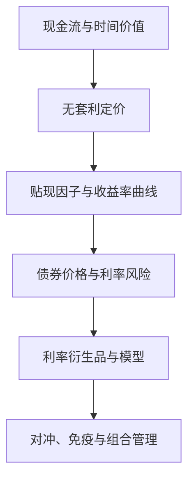

## 固定收益证券课程导论

> 核心关系：固定收益课程以无套利和时间价值为两条主线，从债券定价推进到利率模型与风险管理。

## 金融学的两大支柱

**金融**：稀缺资源在时间维度上的有效配置。一般经济学研究稀缺资源的有效配置，金融学在此之上加入时间维度，由此产生两个核心问题。

跨期配置使结果不确定，风险成为定价的核心变量。同样一笔资金今天拿到与明天拿到价值不同，折现成为金融学的基础操作。

**资产定价**：学术界对投资学的称呼，研究股票、债券、大宗商品、外汇与衍生品的定价。**公司金融**：从企业视角研究融资政策与经营政策对公司价值的影响。两者是同一枚硬币的两面。股票与债券既是投资者的投资标的，又是企业的股权与债权融资工具，切换视角即可看到两面的一致性。固定收益总体更偏投资、偏资产定价。

**固定收益证券**：按固定时间表提供固定金额的投资，更准确的说法是收入流相对固定。现代多数固收证券并不固定：TIPS 的票息随通胀浮动，互换、MBS 与期权没有固定收入。固定收益与股票并列为最重要的资产类别，2019 年第三季度全球债务市场规模 253 万亿美元，约为同期全球 GDP 的 322%。广义固定收益把大宗商品与外汇一并纳入，即 FCC（fixed income, commodity, currency），是投行与对冲基金常见的部门划分。

## 无套利原则

**套利**：零成本进场、利润确定、收益时间确定的交易策略，即免费午餐。**投机**由价格预期驱动，利润不确定、需投入资金，与套利本质不同。**无套利**：长期平均而言不存在免费午餐。套利活动立即消除任何价格偏离，市场平均维持无套利关系。无套利是金融学最基本的原则。

**组合复制定价**：为复杂衍生品定价时，用熟悉的基础资产构建投资组合，使其在每个市场状态下完美追踪目标资产的现金流。成本、风险相同时收益也应相同，复制组合的构建成本即目标资产的价格。无套利还推导出一价定律：相同现金流的资产价格相同。

无套利逻辑支撑公司金融的经典结论。1958 年 Modigliani-Miller 的资本结构无关论由无套利推出：无摩擦市场中，企业的融资结构不影响公司价值。

## 现代金融学发展简史

**1952 年 Markowitz 均值-方差组合选择**：首次用均值刻画预期回报、用方差量化风险。投资者平均风险厌恶，风险更高的资产须提供更高的预期回报。分散化降低部分风险，系统性风险无法分散。

**1958 年 MM 定理**：资本结构无关论，其逻辑见上节。

**1964 年 CAPM**：由 Sharpe、Lintner、Mossin 三人独立发现。Sharpe 从投资者均值-方差最优化出发，将个人投资者推广到整个市场，解均衡得到风险-收益关系；Lintner 从公司金融视角，以资产收益率作为企业融资成本，同样推出 CAPM。

**1970 年代**：Black-Scholes 期权定价等重大突破。Fama-French 三因子模型到 1990 年代才提出。

## 固定收益市场概览

**发行主体**：国库与主权证券由政府发行；政府机构证券由 FHLB、TVA、FNMA 等机构发行；公司证券分投资级与投机级；MBS 与 ABS 以贷款池或资产池为支撑；市政债由州与地方政府发行。2000 年前美国国债占市场最大份额，2000 年后房地产繁荣推动 MBS 份额超过国债，2008 年金融危机由 MBS 引发。利率互换是衍生品市场名义规模最大的品种。

LTCM 案例说明无套利交易与杠杆风险。长期资本管理公司以利差套利与流动性套利为主要策略：利差套利买入俄罗斯、日本国债并用美国国债对冲；流动性套利买入 off-the-run 国债、卖出 on-the-run 国债，赌流动性价差弥合。1994-1996 年回报 20%-47%，1998 年极端行情中高杠杆策略崩塌。
