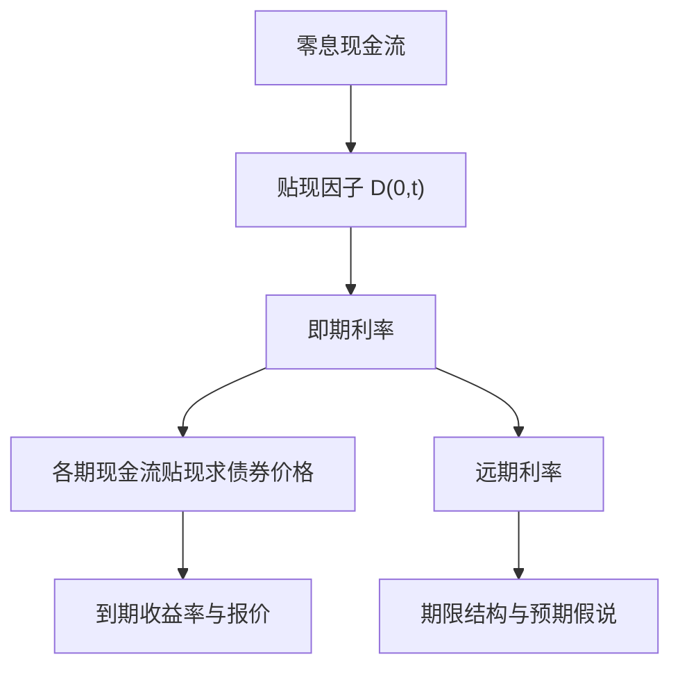

## 贴现因子、利率与期限结构

> 核心关系：贴现因子是定价的基础表示，即期利率、远期利率和收益率曲线是同一现金流贴现体系的不同读法。

## 贴现因子

**贴现因子**：记作 $Z(t,T)$，定义 t 日与 T 日之间资金交换的条款——t 日 1 美元交换 T 日的金额，即未来 1 美元在 t 日的价格。贴现因子记录 t 到 T 之间的货币时间价值。同一时点下，到期日越远贴现因子越低：$T_1 < T_2$ 时 $Z(t,T_1) \geq Z(t,T_2)$。预期通胀越高，未来的钱越不吸引人，贴现因子越低。

贴现因子是固定收益定价的统一中介。资产定价框架 $p = E[mx]$ 中，$m$ 为随机贴现因子。零息债券价格 $P_z(t,T) = 100 \times Z(t,T)$，观测到市场价格即可推得对应期限的贴现因子。

## 利率与复利频率

**复利频率**：一年内的计息次数，决定利率口径。给定利率，复利频率越高终值越高；给定支付，复利频率越高利率越低。

半年复利（债券市场惯例）：

$$r_n(t,T) = 2 \times \left[Z(t,T)^{-\frac{1}{2(T-t)}} - 1\right]$$

连续复利：

$$r(t,T) = -\frac{\ln Z(t,T)}{T-t}$$

换算恒等式：连续复利利率 $r = n\ln(1 + r_n/n)$，反向 $r_n = n(e^{r/n} - 1)$。同一贴现因子对应不同口径的利率数值，频率越高数值越低，收敛于连续复利。贴现因子本身与复利频率无关。

## 附息债券定价

**附息债券**：每期支付固定票息、到期还本付息的债券。设 t 时刻起息、到期 T、票息率 c、付息日 $T_1,\dots,T_n=T$，债券价值为各期票息与本金现值之和：

$$P_c(t,T_n)=\frac{c\times100}{2}\sum_{i=1}^{n}Z(t,T_i)+100\times Z(t,T_n)$$

等价地用零息债券价格表达：$P_c(t,T_n)=\frac{c}{2}\sum_{i=1}^{n}P_z(t,T_i)+P_z(t,T_n)$。

无套利关系保证定价正确。附息债券价格低于零息债券组合价格时，套利者买入附息债、卖空对应份数的零息债，现金流立刻为正、后续各期恰好抵消，利润瞬间锁定。

**Bootstrap**：有足够多附息债券时，可逐期反推各期限贴现因子。第 i 只债券的价格先剔除此前各期票息的现值，余下本金与最后一期票息，再除以 $100 \times (1 + c_i/2)$。

## 到期收益率与报价惯例

**到期收益率 YTM**：债券各期现金流对应即期利率的加权平均，某期现金流越大该期利率权重越高。YTM 须先知道价格才能计算，且只适用于单只债券。收益率曲线非水平时，不同票息或期限的债券 YTM 几乎总不相同。2008 年 2 月 15 日同日到期的两只 9.5 年期国债，票息 4.750% 者 YTM 3.7548%，票息 8.875% 者 YTM 3.6603%，高票息债 YTM 更低。

**国库券报价**：按贴现基础报价，交易商报贴现率 d 而非价格：

$$d=\frac{100-P_{bill}(t,T)}{100}\times\frac{360}{n}$$

**应计利息**：付息日之间利息持续累积。发票价格（脏价）= 报价（净价）+ 应计利息。

## 浮动利率债券定价

**浮动利率债券**：票息按短期市场利率加利差定期重设。半年付息债券第 i 期票息：

$$c(T_i)=100\times(r_2(T_i-0.5)+s)$$

**零利差时价格等于面值**。下一期票息按当前参考利率设定，$c = 100 \times r_2/2$；付息前价值 $100 + 100r_2/2$，折现后恰好为 100。利率上下变动同时改变票息与折现率，二者抵消，价格与未来利率路径无关。

**利差不为零**：利差构成固定支付，单独估值，价格 = 无利差债券价格 + $s \times \sum Z(0,t)$。**不在重置日**：先折到最近重置日再折回当前时刻。

## 期限结构与预期假说

**利率期限结构**：某一时点利率水平与到期期限的关系，即即期曲线或收益率曲线。期限利差 = 长期利率 − 短期利率，取决于预期通胀、预期经济增长与投资者风险态度。曲线形状随时点变化，有递增、递减、驼峰与倒驼峰四种典型形态。

**完全预见下的利率关系**：$r(0,1) = 3\%$、$r(1,2) = 5\%$ 时，$r(0,2) = 4\%$，恰为两者平均。长端收益率是当前短端利率与未来短端利率的加权平均。

**收益率分解**。未来收益率不确定时，长端收益率分解为三项：

$$r(t,T)=\frac{r(t,t+1)+E_t(r(t+1,T))(\tau-1)}{\tau}+\frac{\lambda}{\tau}-\frac{(\tau-1)^2V_t(r(t+1,T))}{2\tau}$$

三项分别是预期未来收益率、风险溢价与凸性项。凸性项来自收益率与价格的非线性关系，未来收益率波动越大债券价格越高。

**预期假说 EH**：令风险溢价恰好等于凸性项，预期收益率变化由期限结构斜率决定。实证检验中 EH 被拒绝，真实关系相反：对数风险溢价须依赖期限结构斜率。

**回报可预测性**。定义对数超额回报 $LER_t(\tau)$，Fama-Bliss（1987）回归：

$$LER_t(\tau)=\alpha+\beta[f(t,t+\tau-1,t+\tau)-r(t,t+1)]+\varepsilon$$

EH 成立则 $\alpha=\beta=0$；实际 $\beta$ 显著为正。远期价差为正时长期债券平均回报高于短期债券。Cochrane-Piazzesi（2005）把整条远期曲线线性加权合成帐篷形因子，预测能力更强；Ludvigson-Ng（2009）用主成分分析提取宏观共同因子。实证结论：正斜率期限结构对应更高的风险溢价，债券超额收益可预测性的根源在于风险溢价的变化，而非对未来收益率预期的变化。
