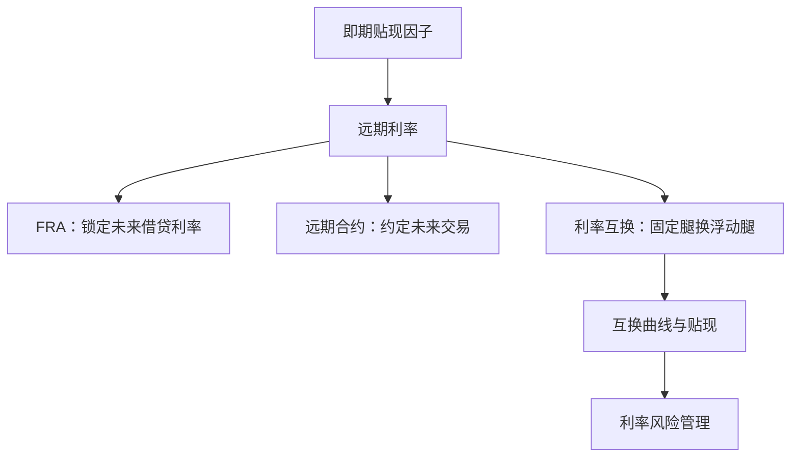

## 远期与利率互换

> 核心关系：远期利率由即期曲线隐含，FRA、远期和互换把未来利率风险转成可交易的现金流交换。

## 远期利率与远期贴现因子

**远期利率**：记作 $f(t,T_1,T_2)$，在现在时刻约定、适用于未来 $T_1$ 到 $T_2$ 期间的利率。远期利率由无套利原则与市场交易确定。远期利率让企业现在锁定未来期间的收益率，消除利率波动风险。

**远期贴现因子**：

$$F(t,T_1,T_2) = \frac{Z(t,T_2)}{Z(t,T_1)}$$

两个即期贴现因子之比，衡量两个未来日期间的时间价值。$T_1 = T_2$ 时 $F = 1$；随 $T_2$ 增大递减。

远期利率换算（复利频率 n、期限 $\Delta = T_2 - T_1$）：$f_n = n\left(F^{-1/[n\Delta]} - 1\right)$；连续复利 $f = -\frac{\ln F}{\Delta}$。

**迭代提取即期曲线**：首个远期利率（$T_1 = t$）即即期利率，此后 $Z(0,T_i) = Z(0,T_{i-1}) \times e^{-f(0,T_{i-1},T_i)\Delta}$ 逐期迭代。

2001 年 3 月 1 日案例：公司 6 个月后收到 1 亿美元设备款，计划 1 年后用于资本开支。市场 6 个月国库券价格 97.728、1 年期国库券价格 95.713（面值 100），银行报出半年复利年化远期利率 4.21%。银行构造：卖空 6 个月国库券得 97.728 百万，买入 $M = 97.728/95.713 = 1.02105$ 单位 1 年期国库券；T1 时企业付款平掉空头；T2 时 1.02105 单位长期债到期得 102.105 百万，年化收益 4.21%。等价算法：贴现因子 0.97728、0.95713，$F = 0.95713/0.97728$，换算成利率即 4.21%。

## 远期利率协议

**远期利率协议 FRA**：双方约定在未来 $T_1$ 到 $T_2$ 期间交换利率，一方按远期利率 $f_n(0,T_1,T_2)$、另一方按浮动市场利率 $r_n(T_1,T_2)$，名义本金 N。本金不换手，只交换利差。结算期在 T2：

$$\text{净支付} = N \times \Delta \times [f_n(0,T_1,T_2) - r_n(T_1,T_2)]$$

企业进入 FRA 后把浮动收益换给银行、只留固定部分，锁定确定收益。风险转移到银行端。

**FRA 价值**：把 FRA 看作做空 1 单位 T1 到期债券、做多 M 单位 T2 到期债券的组合：

$$V^{FRA}(t) = N \times [M \times Z(t,T_2) - Z(t,T_1)] = N \times Z(t,T_2) \times \Delta \times [f_n(0,T_1,T_2) - f_n(t,T_1,T_2)]$$

其中 $M = 1 + f_n(0,T_1,T_2)\Delta = Z(0,T_1)/Z(0,T_2)$。订立时刻价值为零；时间推移、远期利率变动后产生价值。中途退出可签反向 FRA，浮动部分相消，价值由两期远期利率之差决定。

**银行端对冲**：银行收到浮动利率后暴露于利率风险。银行在 T0 卖空 6 个月国库券、买入 M 单位 1 年期国库券；T1 按当时市场浮动利率借入资金平掉空头；T2 归还借款本息、收长期债本息并结算 FRA 净支付，三项现金流恒等于零，银行收益与利率路径无关。

## 远期合约

**远期合约**：约定在未来以远期价格买卖标的证券，标的是价格而非利率。零息债远期价格：

$$P_z^{fwd}(0,T,T^*) = F(0,T,T^*) \times 100$$

付息债券的远期价格是各笔票息与本金按远期贴现因子折到交割日的现值之和。多头到期损益 = 当前市场价格 − 锁定价。

远期价格由无套利决定。市场远期价格高于 $F \times 100$ 时：做空远期合约，卖空 F 单位 T 到期零息债、买入 1 单位 T* 到期零息债，到期交割净得 $P^{fwd} - F \times 100 > 0$，无风险获利。

远期合约价值：$V^{fwd}(t) = Z(t,T) \times [P_c^{fwd}(t,T,T^*) - K]$，交割日的盈亏贴现回当前时刻。签约日价值为零。

## 利率互换

**利率互换**：双方交换固定与浮动利率现金流的一系列交换，名义本金 N，每期净支付 = $N \times \Delta \times [r_n(T_{i-1}) - c]$，常数 c 称互换利率。互换与 FRA 的区别：互换是每半年一次的系列交换，FRA 是一次性交换。

**定价**：互换 = 做多浮动利率债 + 做空固定息票债：

$$V^{swap}(t;c,T) = P_{FR}(t,T) - P_c(t,T)$$

支付日浮动债价格恒为面值 100。订立时刻价值为零，令 $V^{swap}(0;c,T) = 0$ 解得互换利率：

$$c = n \times \frac{1 - Z(0,T_M)}{\sum_{j=1}^{M} Z(0,T_j)}$$

互换降低融资成本的经典构造：Firm A 想以固定利率融资 1000 万美元，Firm B 想以浮动利率融资。市场报价为 A 固定 15%、浮动 LIBOR + 3%，B 固定 12%、浮动 LIBOR + 2%。方案：A 发行浮动债、B 发行固定债并交换票息，swap rate 取 11%。A 净支付 $(LIBOR + 3\%) + (11\% - LIBOR) = 14\%$，低于直接发行固定债的 15%；B 净支付 $12\% - (11\% + LIBOR) = LIBOR + 1\%$，低于直接发行浮动债的 LIBOR + 2%。交易总收益 = 固定利差 3% − 浮动利差 1% = 2%，swap rate 取 11% 恰好均分收益。swap rate 不必然均分，收益分配可另行协商。

浮动端滞后一期：第 $T_i$ 期支付按 $T_{i-1}$ 时点确定的参考利率计算。5 年期、名义本金 2 亿美元、互换利率 5.46% 的例子中，LIBOR 从 4.951% 跌到 1.170% 附近时，付固定方净现金流持续为负，最深达 -4.290 百万美元，这是互换的利率风险敞口。

## 互换曲线与风险管理

**互换曲线与 bootstrap**：由各期限互换利率反推隐含贴现因子：$Z(t,T_1) = \frac{1}{1 + c(t,T_1)/n}$，$Z(t,T_i) = \frac{1 - (c(t,T_i)/n)\sum_{j=1}^{i-1}Z(t,T_j)}{1 + c(t,T_i)/n}$。互换浮动端挂钩 LIBOR，LIBOR 含银行信用风险溢价，互换贴现因子系统性低于国债贴现因子。同期限互换收益率与国债收益率之差称互换利差。

**风险管理应用**：互换美元久期 $D^{\$}_{\mathrm{swap}} = D^{\$}_{\mathrm{floating}} - D^{\$}_{\mathrm{fixed}}$。浮动债久期极短、固定债久期长，支付固定、收取浮动的互换久期为负。机构进入名义 N 的支付固定互换，使 $D^{\$}_{E} = D^{\$}_{A} + N \times D^{\$}_{\mathrm{swap}} - D^{\$}_{L} = 0$，权益对平移免疫。互换进入成本为零。

**远期互换**：约定未来某日进入互换并预先确定互换利率的合约，远期互换利率 $f_n^s(0,T,T^*) = n \times \frac{1 - F(0,T,T^*)}{\sum F(0,T,T_j)}$。再加期权成分即互换期权。
