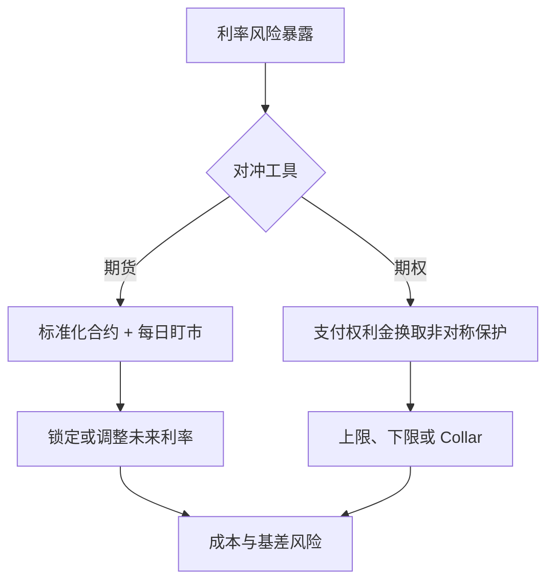

## 利率期货与期权

> 核心关系：利率期货提供标准化线性对冲，期权用权利金换取非线性保护，选择取决于风险形状与成本。

## 期货的标准化与盯市

**期货合约**：与远期合约同为约定未来按预定价格交割证券或现金的合约，但在受监管的交易所交易，交易所充当所有交易的对手方并保证履约。

**标准化**：交易所明确规定可交割证券类型、交割时间与方式。期限只有少数几档，不存在 1.25 年这类期限。为使不同票息的合格债券可比，到期结算价乘以转换因子，消除票息差异的定价影响。标准化提升流动性、降低交易成本。

**每日盯市与保证金**：开仓须存初始保证金。逐日按收盘价结算盈亏，保证金账户每日借记或贷记。账户余额低于维持保证金时收到追加保证金通知，须补回初始保证金水平，否则被强行平仓。远期到 T1 才结算，亏损可能在后半段扳回；期货每日结算，亏损当日兑现。

**收敛性质**：期货价格到期收敛于标的资产价格。该性质使期货与远期在对冲用途上原则等价。

## 欧洲美元期货

**欧洲美元期货**：标的为 3 个月 LIBOR，合约规模 100 万美元。报价形式为价格：$P^{fut}(t,T) = 100 - f_4^{fut}(t,T)$，报价 95.365 隐含利率 4.635%。

每份合约日盈亏：

$$\text{P\&L} = 1{,}000{,}000 \times 0.25 \times \frac{P^{fut}(t+dt,T) - P^{fut}(t,T)}{100}$$

0.25 对应 90 天 = 1/4 年，除以 100 把百分数报价换算为每 100 美元面值的金额。对冲 1 亿美元头寸需 100 份合约。逐日盈亏求和时中间项全部抵消，只剩首尾之差。

做多欧洲美元期货对冲利率下跌：利率下跌则报价上升、期货端盈利，补偿按较低利率再投资的损失。

## 期货与远期的比较

期货价格等于远期价格当且仅当：忽略现金流发生时间的差异（远期一次结算、期货每日结算），且两者 payoff 同日发生。第一条总被违背，第二条常错；期限短、利率波动小时远期价格是期货价格的良好近似。

**基差风险**：可用期货期限与待对冲头寸期限不匹配，只能组合近似。**尾部对冲调整**：每日盯市产生的现金流有时间价值，忽略会导致对冲权重偏差。

期货的优点：标准化带来流动性；清算所保证履约，不存在远期合约的对手方违约风险。

## 期权基础

**看涨期权**：到期收益 $\max[F(t) - K, 0]$；**看跌期权**：$\max[K - F(t), 0]$。买方有权无义务，为此在 0 时刻支付期权费。卖方只有义务没有权利。

**欧式期权**仅到期日可行权；**美式期权**到期前任意时点可行权。**实值**：行权有利；**虚值**：行权不利；**平值**：近似相等。

固定收益市场的期权类型：债券期权（标的为债券价格）、利率期权（标的为利率，现金结算）、期货期权（标的为期货价格）、互换期权（标的是互换，行权价为互换利率）。

## 期权作为保险

期权在金融意义上相当于保险合约：买方提前支付期权费，不利事件发生时获得支付。覆盖范围越大、免赔额越低，保费越高；期权中覆盖范围由行权价决定。行权价越高，利率上升时赔付越少，期权费越低。

风险越高保费越高。利率波动越大，触发不利状态的概率越高，期权费越贵。危机时深度虚值看跌期权价格飙升。

期权费在 t0 支付、payoff 在 T1 结算，比较毛收益与净收益时须把期权费折成未来值扣除。

期权对冲与远期对冲的根本差别：远期锁定利率，坏情形与好情形一起锁死；期权只保坏情形，好情形保留上行空间。代价是期权费。同一例子中期权对冲净收益率 3.64%，低于远期对冲的 4.21%，差额即保住上行空间的成本。

## Collar 与看涨看跌平价

**提高行权价**：只保护利率极端变化的尾部，覆盖范围收窄，期权费下降。

**领子策略**：买看涨 + 卖看跌，卖出 put 收到的期权费覆盖买入 call 的支出，构造期初零现金流的保险组合。收益曲线中间段 1:1 反映实际利率变化，两端水平锁定利率上下限。

**看涨看跌平价**：当 $K_C = K_P = K$ 时，long call + short put 的 payoff 恒等于 $P(T_1,T_2) - K$，即做多远期合约：

$$\text{Call} - \text{Put} = \text{Long Forward}$$

$$c - p = Z(0,T_1) \times (P^{fwd}(0,T_1,T_2) - K)$$

由无套利原则保证。两边不相等时构建套利组合：等式左边偏高时做空 call、做多 put、做多远期，期初净现金流为正，到期无论标的价高于还是低于行权价，三腿现金流恰好抵消为零。

期权与期货对冲的取舍：线性衍生品 t0 零成本但放弃好状态收益；期权支付期权费但保留上行空间。两种策略 NPV 相同。
