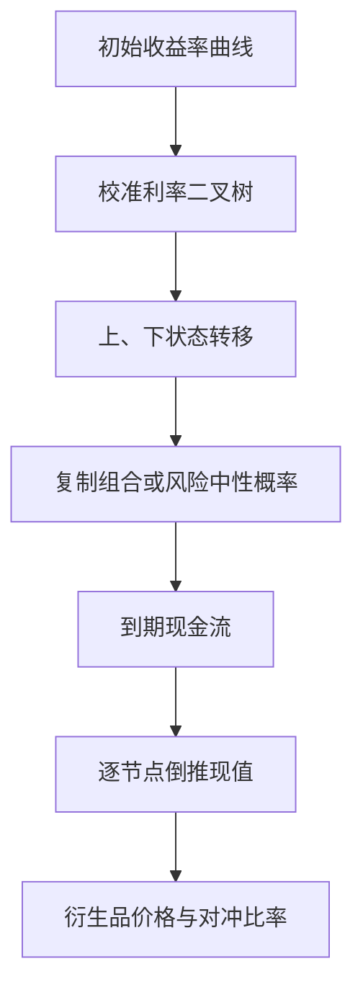

## 二叉树框架与风险中性定价

> 核心关系：利率树把未来不确定的短利率离散化，再通过复制或风险中性倒推完成定价与对冲。

## 一步利率二叉树

**利率树**：把短期利率当作外生变量，直接给定其动态。每期只取两个状态，上升或下降。典型设定：6 个月连续复利利率 $r_0 = 1.74\%$，半年后以概率 $p = 1/2$ 上升到 $r_{1,u} = 3.39\%$，或以 $1-p = 1/2$ 下降到 $r_{1,d} = 0.95\%$。市场观测价 $P_0(1) = 99.1338$、$P_0(2) = 97.8925$。

模型统一用连续复利，调节时间间隔或付息频率时只需改 $\Delta$。

## 投资组合复制

用 $N_1$ 份 1 年期零息债与 $N_2$ 份 2 年期零息债构造组合，要求其在每个状态与目标证券收益完全一致：

$$N_2 = \frac{V_{1,u} - V_{1,d}}{P_{1,u}(2) - P_{1,d}(2)}$$
$$N_1 = \frac{1}{100}[V_{1,u} - N_2 P_{1,u}(2)]$$

组合初始成本 $V_0 = N_1 P_0(1) + N_2 P_0(2)$ 即目标证券价格。依据无套利：收益完全相同的资产价格必相同。

利率期权算例：$V_1 = 100 \times \max(r_K - r_1, 0)$，执行利率 $r_K = 2\%$，上升态 $V_{1,u} = 0$、下降态 $V_{1,d} = 1.05$。解得 $N_2 = 0.8700$、$N_1 = -0.8554$（卖空 1 年期债），组合净成本即期权价 $V_0 = 0.3697$。互换定价同理：固定利率支付方视角下 $V_{1,u} = 0.695$、$V_{1,d} = -0.525$，解得 $N_2 = -1.011$、$N_1 = 1.001$，互换价值 $V_0 = 0.259$。

复制过程不需要概率 p。概率已反映在可观测的债券价格中，复制用的是相对定价；复制要求每个市场状态都匹配，状态概率不进入计算。

## 风险溢价调整

用无风险利率对 2 期零息债贴现：$e^{-r_0\Delta}E[P_1(2)] = 98.0658$，高于市场价 97.8925。价格偏高说明贴现率用错，未来现金流不确定。

**美元风险溢价**：$e^{-r_0\Delta}E[P_1(2)] - P_0(2) = 0.1733$。关键关系式：

$$\frac{e^{-r_0\Delta}E[P_1(2)] - P_0(2)}{P_{1,u}(2) - P_{1,d}(2)} = \frac{e^{-r_0\Delta}E[V_1] - V_0}{V_{1,u} - V_{1,d}}$$

分子是风险溢价，分母是风险量，比值 $\lambda_0$ 是每单位风险的风险溢价，即**风险的市场价格**。同类利率风险的所有证券 $\lambda_0$ 相同，所有证券落在同一条证券市场线上。

定价公式：$V_0 = e^{-r_0\Delta}E[V_1] - \lambda_0 \times (V_{1,u} - V_{1,d})$。从简单证券提取风险价格，再乘以目标证券的风险量。$\lambda_0$ 依赖 p，但 p 变化时贴现期望与风险调整项同方向变化、恰好抵消，目标价格不变。

## 风险中性定价

**风险中性概率**：使 $\lambda_0 = 0$ 的特殊概率 $p^*$：

$$p^* = \frac{e^{r_0\Delta}P_0(2) - P_{1,d}(2)}{P_{1,u}(2) - P_{1,d}(2)} = 0.6448$$

定价只剩风险中性期望加无风险利率贴现：$V_0 = e^{-r_0\Delta}E^*[V_1]$。因为简单，这是业界最主流的定价方法。

风险中性定价不假设投资者风险中性。投资者平均风险厌恶，风险中性定价只是把风险溢价塞进概率，构造扭曲的人工概率分布。$p^*$ 不描述真实事件发生概率。

**概率敏感性**：p 从 0.1 取到 0.9，贴现期望与风险调整项同幅反向变化，目标价格恒为 0.3697；$p^* = 0.6448$ 时 $\lambda_0 = 0$、风险调整项消失。p 不必是真实概率，只需在模型内一致。

**风险中性预期与远期利率**：$E^*[r_1] = 2.5234\%$，高于真实概率下的期望 2.17%。远期利率 $f(0,1,2) = 2.52\%$ 不等于市场对未来利率的预期，也不等于风险中性预期利率，差异来自凸性调整。

## 多步二叉树

**重合树**：先升后降与先降后升合并到同一节点，节点数从指数级降到多项式级。

**逆向归纳**：从树末端向 t = 0 逐期递推。终端状态确定（零息债到期为面值 100，期权按节点利率算 payoff），确定后逐期用风险中性期望贴现。3 期零息债算例：终端 $P_{2,uu} = 97.5310$、$P_{2,ud} = 98.7282$、$P_{2,dd} = 99.9450$；倒推 $P_{1,u}(3) = 96.3098$、$P_{1,d}(3) = 98.6904$；再贴现得 $P_0(3) = 96.3137$。

**动态复制**：静态复制一次后，树向前走一步价格变化，原仓位不再匹配目标收益。每期在新节点重新计算仓位，满足自融资：上一期组合收益恰好等于本期构建新组合的成本，全程无需注入资金。跨式组合验证：t = 0 调仓 $\Delta_0^L = -0.1381$、$\Delta_0^S = 0.1406$，组合成本 0.6366 即期权价；走到 i = 1 上升节点，原仓位收益 0.7590，重新调仓 $\Delta_{1,u}^L = -1$、$\Delta_{1,u}^S = 0.9873$，新组合成本 0.7590 恰好等于旧组合滚动收益；t = 2 全部兑现 $\Pi_{2,uu} = 1.1972$、$\Pi_{2,ud} = 0$。

**期限结构匹配**：单一常数 $p^*$ 递推时树价与市场价不一致（3 年期零息债树价 96.3137 vs 市场价 96.1462）。风险中性概率随时间序列可变，逐期校准 $p^*$（如 $p_1^* = 0.7869$）使树价等于市场价。

**跨式组合**：同执行价看涨加看跌，payoff 为 V 型、与方向无关，赌未来波动。风险中性逆向归纳给出 $V_0 = 0.6366$。
