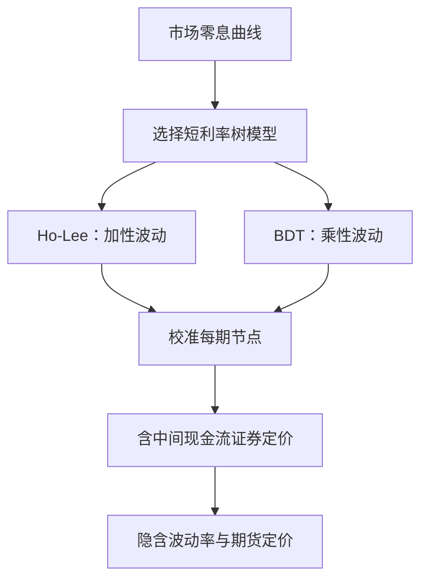

## 利率树模型：Ho-Lee 与 BDT

> 核心关系：Ho-Lee 与 BDT 通过不同波动结构拟合初始曲线，再将节点树用于含现金流利率产品定价。

## Ho-Lee 模型

**Ho-Lee 模型**：在利率随机游走上生成的风险中性利率树：

$$r_{i+1,j} = r_{i,j} + \theta_i \cdot \Delta + \sigma\sqrt{\Delta}, \qquad r_{i+1,j+1} = r_{i,j} + \theta_i \cdot \Delta - \sigma\sqrt{\Delta}, \qquad p^* = \tfrac12$$

下一期利率 = 上一期利率 + 平均变化 + 随机扰动。扰动用 $\sqrt{\Delta}$：方差随时间线性增长，标准差与 $\sqrt{\Delta}$ 成比例。

**参数拟合**：漂移项 $\theta_i$ 逐期选择，使树生成的各期零息债券价格与市场完全一致；波动率 $\sigma$ 从历史利率变化估计，不需搜索。示例：2002-01-08 数据，$r_0 = 1.74\%$，2 年期零息债市场价 97.8925，解得 $\theta_0 = 1.5674\%$，$r_{1,0} = 3.75\%$、$r_{1,1} = 1.30\%$。

**模型缺陷**：模型对利率无任何限制，步数足够多时利率会碰到 0 甚至负值。名义利率有零下限，负利率节点获得权重会系统性错价产品。

## Simple BDT 模型

**Simple BDT 模型**：对利率取自然对数建模，保证利率恒为正：

$$z_{i,j} = \ln(r_{i,j}), \qquad z_{i+1,j} = z_{i,j} + \theta_i\Delta + \sigma\sqrt{\Delta}$$

$z_{i,j}$ 可以为负，$r_{i,j} = e^{z_{i,j}}$ 恒正。$\sigma$ 是对数利率的波动率，从 log 利率序列估计。拟合流程与 Ho-Lee 相同：逐期选 $\theta_i$ 匹配零息债券价格。

## 两模型比较

两模型都通过逐期选漂移项拟合利率期限结构，定价零息债券给出相同结果。隐含的风险中性利率分布形状不同：

- Ho-Lee：近似对称（正态）分布，给负利率非零概率质量，低利率区间分到可观权重。
- Simple BDT：对数正态、右偏分布，利率低于 1% 基本零概率质量，高利率区间概率质量更高。

对债券定价无影响；对非对称支付结构的证券（如期权）影响显著。

结构性债券案例：payoff $V_T = \max(11 \times 100 \times r_T, 94)$，利率低于 8.55% 时只支付本金 94%。Ho-Lee 树价 80.0645，Simple BDT 树价 78.9135。BDT 给高利率更多概率权重、payoff 随利率上升，理应价格更高；但高利率同时意味着更高贴现率，贴现效应超过预期收益效应。

**风险评估须用真实概率**。风险中性树只用于无套利定价，度量 VaR、预期损失须用真实概率。

## 含中间现金流的证券

**中间现金流**：附息债券、互换等每期支付。已知现金流直接加入递推式：

$$P_{i,j} = e^{-r_{i,j}\Delta}\left[\tfrac12 P_{i+1,j} + \tfrac12 P_{i+1,j+1} + CF(i+1)\right]$$

$CF(i+1)$ 确定支付、与节点无关，不加概率权重。

**Caps 与 Floors**：普通欧式 cap 在各支付日支付 $CF(T_i) = \Delta \cdot N \cdot \max(r_n(T_i - \Delta) - r_K, 0)$；floor 方向相反。cap 像每期支付的互换加看涨期权，每个单期现金流称 caplet。

定价 cap 需要两棵树。$T_i$ 的现金流由前一节点 $T_i - \Delta$ 的利率决定、到 $T_i$ 才支付，须先建现金流树确定现金流何时确定、何时支付，再建价值树递推折现。树上利率是连续复利，$r_n(i,j) = n(e^{r_{i,j}\Delta} - 1)$ 先折算再算 caplet。算例：1.5 年期 cap，执行利率 2.5%、名义本金 100，现金流树逐节点计算 caplet 后倒推价值树，得 $V_0 = 0.647$；5 年期 cap 为 9.44。

**互换定价**：固定换浮动互换在 $T_i$ 的现金流 $CF(T_i) = \Delta \cdot N \cdot (r_n(T_i - \Delta) - c)$。互换利率由零息债券价格算出，$c = \frac{1}{2}\cdot\frac{1-Z(0,10)}{\sum_{i=1}^{10}Z(0,i)}$。互换起始日价值为 0，可作为树定价正确性的检验。

**互换期权**：买方有权在指定时间进入互换。receiver swaption 行权后收取固定利率；payer swaption 行权后支付固定利率。定价：先算底层互换在树上各节点的价值，行权时刻 payoff = $\max(V_{T,j}(k,r_K), 0)$，再沿树贴现。

## 隐含波动率

**已实现波动率**：用历史利率变化序列算的标准差，事后指标。Ho-Lee 用 $\sigma = \mathrm{std.dev}(r_{t+\Delta} - r_t)$，Simple BDT 用 $\sigma = \mathrm{std.dev}(\ln r_{t+\Delta} - \ln r_t)$。

**隐含波动率**：选择波动率水平使模型价格等于市场观测价格，是事前、前瞻指标。隐含波动率依赖模型：用不同模型反推的结果不同，模型设定错了隐含波动率就错了。模型无关的替代是 VIX 指数。

单一常数 $\sigma$ 无法匹配所有期限的 cap 价格。对每只 cap 单独匹配 $\sigma$ 得到隐含平值波动率曲线；更细的构造给出远期波动率。

**完整版 BDT**：允许 $\sigma_i$ 随时间变化，可同时精确拟合所有零息债券与所有期限的 cap。$\sigma_i \neq \sigma_j$ 时树不再重合。解法：直接估计每期顶部节点利率 $z_{i+1,0}$，再由 $z_{i,j+1} = z_{i,j} - 2\sigma_i\sqrt{\Delta}$ 恢复该期所有节点，树自动重合。

## 期货的风险中性定价

期货每日盯市，每期利润 = $N \times (F_{i+1}(k) - F_i(k))$。风险中性下预期利润必须为 0，否则投资者买卖期货推高或压低价格直至利润归零：

$$F_{i,j} = \tfrac12 F_{i+1,j} + \tfrac12 F_{i+1,j+1}$$

期货递推不含折现，与债券递推不同。到期时收敛于标的。欧洲美元期货报价 $F_{i,j}(k) = 100 - f_{i,j}(k)$。

国债期货空头隐含三种交割期权：**质量期权**（多种债券可交割，空头选最便宜的 CTD）、**野卡期权**（交割月内 2pm 停盘后至 8pm 仍可交割，每天一个约 6 小时的期权）、**月末期权**（最后 7 个工作日停止交易但仍可交割至最后交易日）。
