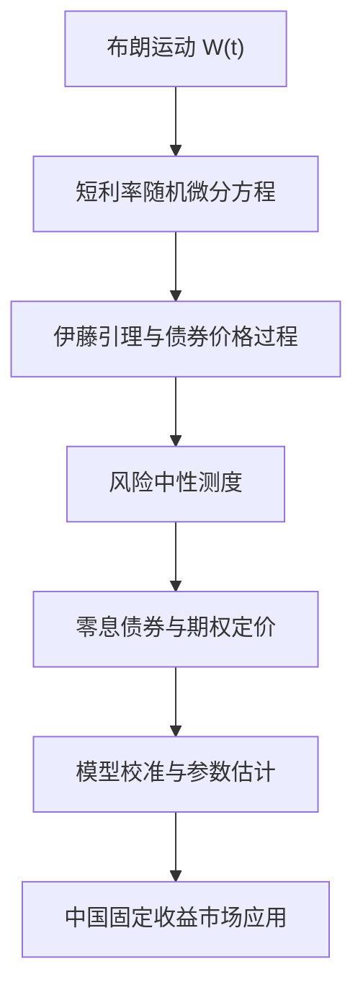

## 连续时间利率模型与中国市场

> 核心关系：连续时间利率模型以随机微分方程描述短利率，经伊藤引理和风险中性定价连接到债券产品与市场应用。

## 布朗运动

**布朗运动**：离散 Ho-Lee 二叉树取 $\Delta \to 0$ 的极限。二元随机变量 $Z_i$ 以 1/2 概率取 $+\sqrt{\Delta}$ 或 $-\sqrt{\Delta}$，均值为 0、方差为 $\Delta$。累加得 $X_t = \sum_{i=1}^{n} Z_i$，当 $n \to \infty$、$\Delta = t/n \to 0$ 时即为连续时间布朗运动。

两大性质：

1. **正态分布**：$(X_{t_2} - X_{t_1}) \sim N(0, t_2 - t_1)$。
2. **鞅性质**：$E[X_t \mid X_0] = X_0$，对未来值的最佳预测是当前值。

用利率语言：今天的信息无法预测明天利率的变化，最优预测就是今天的利率。

无漂移 Ho-Lee 模型：$dr_t = \sigma dX_t$，即 $r_t = r_0 + \sigma X_t$。

## 微分方程与随机过程

**常微分方程**：把时间依赖变量与其变化率联系起来的函数。银行账户例：$dB(t)/dt = rB(t)$，初始条件 $B(0) = 100$，解为 $B(t) = 100e^{rt}$。

利率政策例：短期利率 $r(0) = 2\%$，目标 5.4%。政策逐步微调，每期调整量与差距成正比：$r(t+\Delta) - r(t) = \gamma(\bar{r} - r(t))\Delta$。取 $\Delta \to 0$ 得 $dr = \gamma(\bar{r} - r)dt$，均值回复思想由此进入利率建模。

**连续时间随机过程**的一般形式：

$$dr_t = m(r_t,t)dt + s(r_t,t)dX_t$$

**漂移项** $m(r_t,t)dt$：可预测成分，期望变化 $E[dr_t] = m(r_t,t)dt$。**扩散项** $s(r_t,t)dX_t$：不可预测成分，源于布朗运动增量的不可预测性。

**Vasicek 模型**：$m(r_t,t) = \gamma(\bar{r} - r_t)$（均值回复），$s(r_t,t) = \sigma$。利率偏离长期均值越远，回复力越强。Vasicek 与 Ho-Lee 都有负利率缺陷。

## 伊藤引理

**伊藤引理**：连接底层随机变量变动与依赖它的证券价格变动的微积分法则。对布朗运动展开到二阶，对时间只展开到一阶：$(dX_t)^2 \approx dt$，与 $dt$ 同阶，不能忽略；三阶及更高阶太小。

一般形式：设 $dr_t = m(r_t,t)dt + s(r_t,t)dX_t$、$P_t = F(r,t)$：

$$dP_t = \left(\frac{\partial F}{\partial t} + \frac{\partial F}{\partial r}m(r_t,t) + \frac{1}{2}\frac{\partial^2F}{\partial r^2}s(r_t,t)^2\right)dt + \frac{\partial F}{\partial r}s(r_t,t)dX_t$$

漂移项含三部分：时间流逝带来的资本利得；利率预期变化带来的资本利得；凸性效应（二阶导乘利率过程的方差）。

## 无漂移 Ho-Lee 的债券定价

无漂移 Ho-Lee 下期限 T 的零息债券价格 $P_t = e^{\frac{\sigma^2}{6}(T-t)^3 - (T-t)r_t}$。代入伊藤引理，凸性项相消，得：

$$\frac{dP_t}{P_t} = r_t dt - (T-t)\sigma dX_t$$

三个结论：

1. 预期长期回报等于瞬时无风险利率 $E[dP_t/P_t] = r_t dt$。
2. 债券波动率正比于剩余期限：$\sqrt{E[(dP_t/P_t)^2]} = (T-t)\sigma$。
3. 利率变动与债券回报的协方差为负：$E[(dP_t/P_t) \cdot dr_t] = -(T-t)\sigma^2 dt$。

**期限结构只能平行移动**。连续复利长期利率 $r_t(\tau) = -\frac{\sigma^2}{6}\tau^2 + r_t$，代入伊藤引理得 $dr_t(\tau) = \sigma dX_t$，与剩余期限 $\tau$ 无关。短端利率变化与 10 年期长端利率变化完全相同，模型无法产生扭转或曲率变化。原因：无漂移 Ho-Lee 把用于拟合期限结构的参数 $\theta_t$ 设为零，去掉漂移即失去校准能力。

## 中国固定收益市场

中国固定收益市场总规模约 13.2 万亿美元，分三个市场：在岸人民币市场占总规模 90% 以上，人民币离岸市场约 520 亿美元，外币市场约 1260 亿美元。横向对比：美国债券市场 27.7 万亿美元居首，中国 13.5 万亿第二，日本 12.3 万亿。债务与债券需区分：债务包含企业向银行的借款，债券是证券化的债务。中国债务/GDP 约 249%，债券/GDP 约 99%，债务证券化比例低；日本两项都高。最大借款人是非金融企业，债券市场最大发行人是政府，在岸余额中地方政府债居首。主权评级从 1992 年前后的 BBB 逐步上调至 A+/AA 附近；中国 10 年期国债收益率约 1.80%，高于德国、美国、韩国等同等或相近评级国家。

**国际投资者视角的十个考量**：市场太大不可忽视；中国已纳入主要股债基准；配置中国资产提供人民币汇率分散；债券通改善可进入性；国际评级机构扩大在岸覆盖；财政部从 3 个月到 50 年活跃管理收益率曲线；主权债务可持续性等风险可识别；近 10 年中国国债波动率低于同期限美债、收益相近；中国与全球政府债券相关性低；主动管理超额收益潜力。

**两个分割的市场**。银行间市场（CIBM，1997 年建立）是主导市场，2018 年末未偿余额 76 万亿人民币，参与者为合格机构投资者（商业银行占 57%），人民银行监管，交易系统为外汇交易中心，托管于中债登与上清所。交易所市场（上交所、深交所）未偿余额 9.2 万亿，机构与散户均可参与，只有现券与回购两种交易方式，证监会监管，中证登结算。银行间占约 89%，交易所占 11%。交易所交易次数多但单笔金额小，银行间交易次数少但金额大。

**债券类型**。政府债包括国债（财政部发行）、地方政府债（含城投债，用于债务置换）、政策性银行债（国开行、进出口行、农发行）。金融债包括同业存单（货币市场工具、利率紧跟 SHIBOR）与各级资本债。信用债即非金融机构发行的固定收益证券，含企业债（非上市国企为主，发改委监管）、公司债（上市公司发行、交易所交易、证监会监管）、中期票据（3-5 年、银行间）、短融与超短融、资产支持证券与定向工具。
