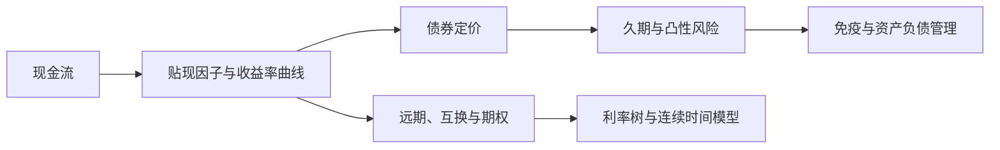

## 固定收益证券分析和模型

> 从无套利原理与贴现因子出发，覆盖债券定价、久期与凸性、远期与互换、期货与期权、二叉树与风险中性定价、连续时间利率模型，并落到中国固定收益市场

> 核心关系：固定收益分析以现金流贴现为基础，把曲线、风险度量和利率衍生品连接到定价与风险管理。

## 文章清单

- [00-intro.md](00-intro.md) — 固定收益在金融学中的定位、无套利原则与现代金融学发展简史。
- [01-discount-factors-and-term-structure.md](01-discount-factors-and-term-structure.md) — 贴现因子与复利频率、附息债与浮动利率债定价、报价惯例、预期假说与债券回报可预测性。
- [02-duration-and-immunization.md](02-duration-and-immunization.md) — 久期定义与计算、美元久期、久期与 VaR、现金流匹配与免疫策略、资产负债管理。
- [03-convexity.md](03-convexity.md) — 凸性定义与计算、正凸性、久期与凸性对冲、凸性交易、斜率曲率与利率因子模型。
- [04-forward-rates-and-interest-rate-swaps.md](04-forward-rates-and-interest-rate-swaps.md) — 远期利率与远期贴现因子、远期利率协议、远期合约、利率互换的定价与风险管理应用。
- [05-interest-rate-futures-and-options.md](05-interest-rate-futures-and-options.md) — 期货标准化与每日盯市、欧洲美元期货、期货与远期比较、期权作为保险、collar 与看涨看跌平价。
- [06-binomial-tree-and-risk-neutral-pricing.md](06-binomial-tree-and-risk-neutral-pricing.md) — 投资组合复制、风险溢价调整、风险中性定价三种等价方法，多步二叉树与动态复制。
- [07-rate-tree-models-ho-lee-and-bdt.md](07-rate-tree-models-ho-lee-and-bdt.md) — Ho-Lee 与 BDT 模型构造与比较、结构性债券、caps/floors、互换与互换期权、隐含波动率与期货定价。
- [08-continuous-time-rate-models-and-china.md](08-continuous-time-rate-models-and-china.md) — 布朗运动、微分方程与随机过程、伊藤引理、无漂移 Ho-Lee 债券定价、中国固定收益市场专题。
