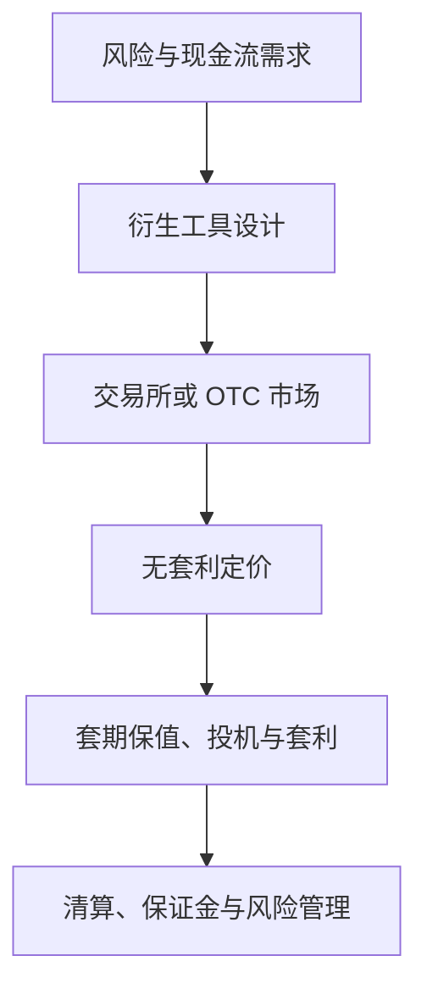

## 金融工程学课程导论

金融工程将工程思维引入金融领域，综合采用数学建模、数值计算、网络图解、仿真模拟等工程技术方法，设计、开发和实施新型金融产品，创造性解决现实中的金融问题。金融工程处于金融学、信息技术、工程方法三个领域的交汇处。金融学本身包含资产定价与公司金融两大领域；公司金融中上市公司管理层报酬的股权激励如何度量，就是金融工程的应用例。

> 核心关系：金融工程把未来现金流和风险重新组合，通过市场交易与定价机制服务不同的风险目标。

## 学科形成

最早提出金融工程定义的是约翰·芬尼迪（John D. Finnerty），见于其 1988 年论文《Financial Engineering in Corporate Finance: An Overview》。1992 年约翰·马歇尔（John Marshall）《金融工程》出版，标志标准学科成型。加上《期权、期货及其他衍生产品》作者约翰·赫尔（John Hull），三人并称"三位 Johns"。

## 衍生产品的本质与三大功能

**衍生产品**：价值取决于或衍生自另一项资产价值的金融合约，英文定义为 A derivative is an instrument whose value depends on, or is derived from, the value of another asset。标的资产常是可交易证券的价格，如股票价格、大豆价格；也存在不可交易的标的，如滑雪胜地的降雪量。衍生产品的主要用途之一，是使价格的不确定性最小化。

衍生产品的四个本质特征：

- **零和博弈**：一方盈利以另一方亏损为代价。衍生品具备风险管理等社会经济功能，这使它区别于赌博。
- **契约性、虚拟性与未来性**：衍生产品是面向未来的合约；与其他金融产品的主要差异是未来性。
- **高杠杆性**：只需缴纳一定比例的保证金即可持有较大头寸。高杠杆意味着较高的资金使用效率，不必然意味着高风险。
- **衍生性**：衍生品价格紧随标的资产价格；占用资金少、交易费用低、多空皆可，广泛用于替代现货交易。

衍生产品的三大功能：

- **风险管理功能**：运用衍生工具对冲价格、利率、信用等风险。
- **价格发现功能**：发现的是当前价格，而非未来价格。
- **信息功能**：衍生品交易价格与持仓量向市场传递信息。

金融工程的主要内容有三项：产品设计，本质上是风险收益的匹配与组合；准确定价，定价偏差产生套利机会，套利力量推动价格回归公平；风险管理，这是金融工程的核心功能，例如运用股指期货对冲股价下跌风险。

## 基本工具与两大市场

**金融工程的基本工具**：远期（forward）、期货（futures）、互换（swap）、期权（options）四类衍生产品。

**标的资产**：股票、债券、外汇、贵金属、大宗商品、农产品、信用等基础性产品。

**交易所市场**：在有组织的交易所内进行的标准化衍生品交易。1848 年芝加哥期货交易所（CBOT）成立；1973 年芝加哥期权交易所（CBOE）推出第一个标准化期权产品。

**场外市场（OTC）**：银行、基金公司和公司司库的交易员直接相互联系达成交易，合约条款由双方协商。按 BIS 统计的未平仓名义本金，场外市场规模远大于交易所市场；2008 年金融危机前后达到峰值，此后有所回落但仍数倍于交易所市场。

## 国际衍生品市场发展史

古希腊罗马已有远期合约思想；泰勒斯预判橄榄丰收、提前锁定榨油机使用权的故事被视为期权思想雏形。20 世纪 70 年代是"革命"期：1972 年外汇期货，1975 年抵押贷款利率期货，1976 年和 1977 年国债期货，1982 年股指期货；1973 年 CBOE 推出第一个标准化期权。70 年代末、80 年代初货币互换与利率互换出现，80 年代股指期权、互换期权、奇异期权与结构性产品相继出现。90 年代信用衍生产品出现并快速发展，在险价值（VaR）等信用风险度量方法发展。前 20 年主要是基础性金融衍生品和风险管理技术的发展；90 年代后信用衍生品与场外产品扩张，伴随巴林银行倒闭、LTCM 危机、2007-08 年次贷危机等巨大风险事件。

## 中国衍生品市场发展史

中国期货市场发端于 20 世纪 90 年代。1995 年"327 国债期货事件"后大幅整顿，仅保留郑州、大连、上海三家交易所。2018 年是"国际化元年"：3 月 26 日原油期货上市，5 月 4 日铁矿石期货引入境外交易者。2019 年沪深 300 股指期权收官，股指期货恢复常态化交易。2021 年中国期货市场成交额占全球 12%。《期货和衍生品法》于 2022 年 8 月 1 日施行；监管构建"五位一体"体系（证监会、派出机构、期货交易所、保证金监控中心、期货业协会）。

2025 年中国期货市场全年累计成交量 90.74 亿手、累计成交额 766.25 万亿元，同比分别增长 17.4% 和 23.74%；上市期货期权品种达 157 个。2025 年 6 月陆家嘴论坛上，央行与证监会宣布共同研究推出人民币外汇期货。目前中国有上期所及其上海国际能源交易中心、大商所、郑商所、中金所、广期所五家期货交易所；中国没有场内人民币外汇期货，外汇衍生品以场外为主。
