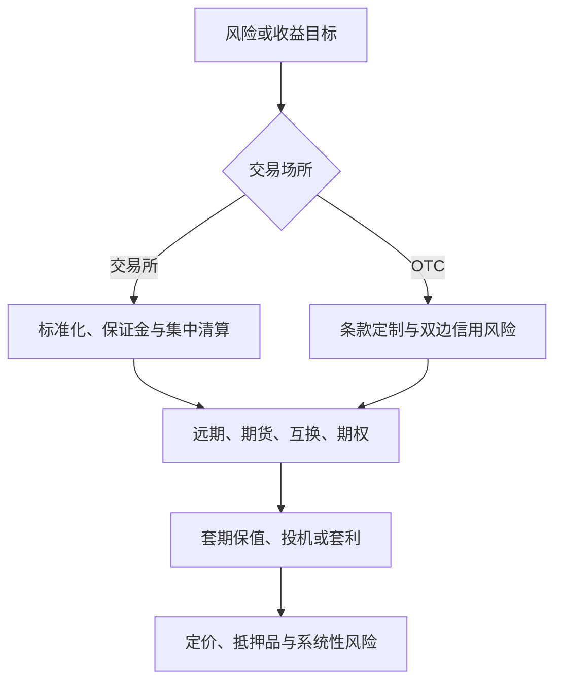

## 衍生品基础与市场结构

> 核心关系：市场结构决定标准化程度、信用风险和清算方式，工具选择则取决于风险目标与现金流形状。

## 交易场所：交易所与场外市场

**交易所交易**：在有组织的交易所内进行的标准化衍生品交易。1848 年芝加哥期货交易所（CBOT）成立；1973 年芝加哥期权交易所（CBOE）开业，起初交易 16 只股票的期权。交易方式由公开喊价转向电子交易，伴随高频交易与碎股交易增长。

**场外交易（OTC）**：银行、基金管理公司与公司财务主管的交易员相互直接联系的市场。无集中交易所，合约条款由双方协商。

按 BIS 统计的未平仓名义本金，场外市场规模远大于交易所市场。2019 年最近时点读图：OTC 曲线约在 600 至 700 万亿美元区间，交易所曲线约 100 万亿美元。读图先看最近的时点，再报具体数字，单位是万亿美元。

## 四大工具类别

**远期合约**：在确定的将来时刻按确定的价格购买或出售某项资产的协议，在两个金融机构之间或金融机构与其公司客户之间签署，不在规范的交易所交易。多头损益 $S_T - K$，空头损益 $K - S_T$。缺点是信息不灵、市场效率较低，转手不易、流动性差，履约没有保证、违约风险高。

**期货合约**：在交易所内交易的标准化合约，交易所详细规定条款。到期日前可以平仓；需预先支付保证金并每日盯市；并不总是指定确切的交割日期。

**期权**：看涨期权持有者有权在某一确定时间以确定价格购买标的资产，看跌期权持有者有权在某一确定时间以确定价格出售标的资产。期权赋予持有者权利，远期和期货合约中持有者有义务购买或出售标的资产；签署远期、期货合约时成本为零，购买期权合约必须支付期权费。

**互换**：交易双方通过场外市场协商，在事先确定的将来一系列日期交换现金流的协议。

## 场外监管与系统性金融风险

**2008 年之前的 OTC 市场**基本不受监管，银行作为做市商报出买价与卖价，部分交易通过中央对手方（CCP）清算。

**2008 年之后**OTC 市场转为受监管，目的是降低系统性金融风险、提高透明度：标准化的 OTC 产品必须在互换执行设施（SEF）上交易；大多数国家要求金融机构之间的标准化交易通过 CCP 清算；所有交易必须向中央仓库报告。

**系统性金融风险（systemic risk）**：一家金融机构违约将产生"连锁反应"、导致其他金融机构违约并威胁金融体系稳定的风险。系统风险（systematic risk）指整体市场的风险，两者不同。系统性风险的传导分两条路径：直接业务关联，金融机构通过银行间市场同业往来、衍生品市场交易和支付系统彼此发生债权债务关系；间接业务关联，拥有同样性质的业务或资产组合，即共同的风险暴露，偶发性冲击后被迫抛售资产，若抛售规模足够大，资产价格持续下跌，在盯市计价下持有同类资产的其他金融机构被迫减计、不得不抛售，导致新一轮价格下跌。金融系统曾挺过 1990 年德崇证券与 2008 年雷曼兄弟的违约；2007-08 年市场动荡中许多大型金融机构被救助而非倒闭，正是因为政府担心系统性风险。

## 投资者类型

**套期保值者（hedger）**：对冲者，目的在于减少已经面临的风险。

**投机者（speculator）**：希望在市场中持有头寸，打赌价格上升或下降。期货投机提供杠杆，小额初始保证金即可建立大额头寸；期权投机无论情况多坏，损失限于所支付的期权费。

**套利者（arbitrageur）**：同时进入两个或多个市场，锁定无风险的收益。

投资者的成败关键在于预测。交易者可能从套期保值者、套利者转为投机者，须设置风险限额与每日监控控制风险；法国兴业银行事件是前车之鉴。

**对冲基金**：衍生品三类用途（对冲、投机、套利）的大用户。它不受共同基金规则约束，不能公开募售证券；共同基金必须披露投资政策、随时可赎回、限制杠杆使用。对冲基金使用复杂交易策略，类型包括多空股票、可转债套利、困境证券、新兴市场、全球宏观、并购套利。

## 金融风险与衍生品定价基础

**金融风险**：由资产的价格或收益率产生的不确定性；风险指结果的任何变化，用标准方差衡量。

**金融工程的风险管理思路**：一是转移风险，二是分散风险。目的用确定性代替风险，仅替换掉与己不利的风险，将对己有利的风险留下。

**衍生金融产品定价的基本假设**：

- 市场不存在摩擦；
- 市场参与者不承担对手风险；
- 市场完全竞争；
- 市场不存在无风险套利机会。

**计复利频率**：单利 $FV = 1 + N \cdot r_{\text{单}}$，$PV = \frac{1}{1 + N \cdot r_{\text{单}}}$；普通复利 $FV = (1 + r_{\text{复}})^N$，$PV = \frac{1}{(1 + r_{\text{复}})^N}$；连续复利 $FV = e^{rn}$，$PV = e^{-rn}$。换算关系：$r = m \ln\left(1 + \frac{r_m}{m}\right)$，$r_m = m\left(e^{\frac{r}{m}} - 1\right)$。连续复利使用简便、便于结算多期收益率、符合正态分布假设，不存在汇率收益率的悖论问题。

**主要定价方法**：绝对定价法用现金流贴现 $V = \sum_{i=1}^{\infty}\frac{E(X_i)}{(1+g)^i}$；相对定价法包括复制定价法、状态价格定价法、风险中性定价法、积木分析法。
