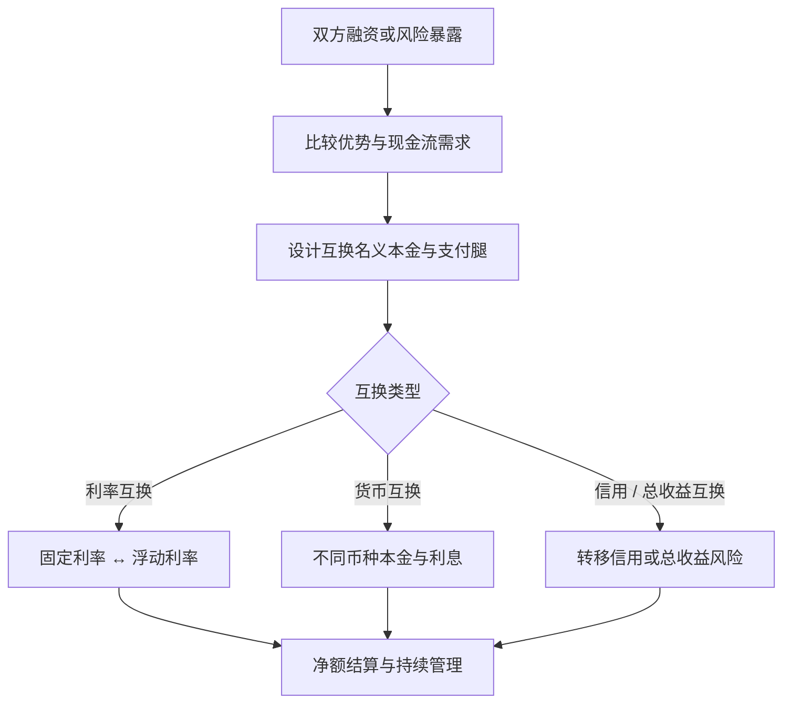

## 互换

> 核心关系：互换通过交换现金流形态实现融资成本或风险暴露转换，核心是比较优势、信用和持续管理。

## 定义与种类

**互换（swap）**：两个或两个以上当事人按照商定条件，在约定的时间内交换一系列现金流的合约。远期合约可以看作只交换一次现金流的互换；互换约定未来多次交换现金流，因此互换可以看作一系列远期的组合。互换市场是场外市场，诞生可追溯到 1981 年 IBM 与世界银行之间的第一笔货币互换。最重要、最常见的两类互换是利率互换（IRS）与货币互换。无风险利率的选择：2008 年金融危机前用 LIBOR，危机后改用 OIS 利率。

## 利率互换的机制与浮动利率基准

**利率互换（IRS）**：一方同意在若干年内，按名义本金以预定固定利率支付利息现金流，同时按同一名义本金以浮动利率收取利息，或方向相反。名义本金本身不交换，仅用于计算利息。常见期限 1、2、3、4、5、7、10 年。

浮动利率基准：美元用 SOFR、联邦基金利率、CMT、CS、CMS；欧元用 EONIA、EURIBOR；人民币用 FR007、FDR007、SHIBOR、LPR。CS 的期限随互换剩余期限缩短而变短，CMS 永远不缩期，两者在估值与对冲性质上不同。SHIBOR 由 18 家报价行报价的算术平均形成。中国利率互换市场以 FR007 为最主要基准，SHIBOR 在 3M-1Y 期限应用较多。支付习惯：美国标准 IRS 按季支付浮动利率、按半年支付固定利率；中国固定与浮动端均按季支付。

## 利率互换的三大作用

**转换债务属性**：公司发行 LIBOR+0.5% 浮动利率债券，同时做互换（支付 6% 固定、收取 LIBOR），净支付 6.5% 固定；公司发行 6.2% 固定利率债券，互换中收 6% 固定、付 LIBOR，净支付 0.2% + LIBOR。

**转换资产属性**：持有 LIBOR-0.5% 浮动利率债券，互换中付 LIBOR、收 6% 固定，净收入 5.5% 固定；持有 5.7% 固定利率债券，互换中付 6% 固定、收 LIBOR，净收入 LIBOR - 0.3%。

**降低金融机构的利率风险**：金融中介收取 12% 固定、支付 LIBOR-1%，LIBOR 超过 13% 时发生损失。互换后中介支付 11% 固定、收取 LIBOR，净收入固定为 2%，利率风险被完全消除。

## 货币互换与比较优势

**货币互换**：在未来约定期限内，将一种货币的本金和固定利息与另一种货币的等价本金和固定利息进行交换。与利率互换的区别：利率互换通常无需交换本金，只定期交换利息差额；货币互换在期初和期末须按约定的汇率交换不同货币的本金，期间还需定期交换不同货币的利息。另一种流行的形态是"固定换固定"。

**比较优势（comparative advantage）**：AAACorp 固定利率 4.0%、浮动利率 6 个月 LIBOR-0.1%；BBBCorp 固定利率 5.2%、浮动利率 LIBOR+0.6%。AA 在固定市场便宜 1.2%、在浮动市场只便宜 0.7%，故 AA 在固定利率借款、BBB 在浮动利率借款各有比较优势，总节省 = 1.2% - 0.7% = 0.5%。无金融中介时：AA 借 4% 固定，BBB 借 LIBOR+0.6%；互换中 AA 付 BBB 4.35%、收 BBB 的 LIBOR，AA 净成本 LIBOR - 0.35%（节省 25bp），BBB 净成本 4.95%（节省 25bp）。有金融中介时各节省 23bp，中介赚 4bp。

## 总收益互换与信用违约互换

**总收益互换（TRS）**：在未来约定期限内，将一种或一揽子资产的总收益与等值浮动利率债券的利息差进行互换。结构上由总收益端与融资端组成：融券客户支付浮动利率、获得股票等资产的总收益。优点是节省交易费用、减少税收、提高杠杆、规避监管。

**信用违约互换（CDS）**：最广泛运用的信用衍生品。买方定期向卖方支付费用（相当于保险费），一旦出现事先约定的信用事件，买方有权从卖方获得补偿。信用事件包括还款违约、破产、资不抵债、拖欠，以及企业重组或信用评级下调。标的分为企业类与主权类，按实体分为单一实体与多实体。

**中国信用风险缓释工具（CRM）**：2010 年 11 月推出，含 CRMA 合约与 CRMW 凭证；2016 年推出 CDS 与 CRN；2019 年推出指数产品；2025 年扩容标的并完善信用事件定义。CRM 最重要的作用是增信，帮助民营企业债券顺利发行。

## 互换的运用

**套利**：信用套利基于比较优势，成立条件有二，一是双方对对方的资产或负债均有需求，二是双方在两种资产或负债上存在比较优势。税收与监管套利利用税收待遇差异（如预扣税）、人为的市场分割与投资限制（如日本机构外币投资不得超过 10%）、出口信贷与融资租赁的补贴优惠融资。市场价格套利把利率互换拆分为债券组合或 FRA 组合，相对价格不合理时套利。

**投机**：合理程度的投机为市场提供流动性。FR007 互换的多头（支付固定、收取浮动）在 FR007 上行时获利；货币互换可对汇率升跌投机，CDS 可对信用风险变化投机。

**风险管理**：利率互换管理利率风险，货币互换管理汇率风险，股票互换针对股票价格风险，总收益互换与 CDS 针对信用风险。互换的久期与固定附息债券相当接近，可提供类似的久期对冲功能而成本低得多；互换期限最长可达 30 年，是长期利率风险管理的重要工具。

**创造新产品**：固定利率英国国债加上支付英镑固定利息、收入瑞士法郎固定利息的货币互换，构造近似瑞士国债的投资头寸；浮动利率资产加上名义本金为 2 倍的利率互换空头，构造合成的逆向浮动利率债券。

**降低交易成本与增强借债能力**：互换可降低资本金要求。麦当劳在国内发行 2 亿美元 40 年期债券拆成浮动利率负债，利息成本降低 200 个基点以上；曾用 30 种互换把 9.5 亿美元债务换成 9 种外币。恰当地使用互换降低企业风险后，企业承担更多负债。

## 市场发展与主协议

全球互换在场外衍生品名义本金中占比最大。中国：2006 年 1 月人民币利率互换业务试点；2009 年 NAFMII 发布主协议；2014 年建立集中清算机制并推出 X-Swap 平台。人民币外汇货币掉期会员从 2010 年 7 月的 24 家增至 2026 年 3 月的 307 家。

**主协议**：国际为 ISDA 主协议，中国为 NAFMII 主协议，配合履约保障文件与术语定义文件。履约保障分质押式与转让式。其他交易规则：名义本金与净额结算、营业日准则（遇节假日顺延）、按实际天数计息。头寸了结三种方式：转让（由第三方承接）、对冲（签订反向"镜子互换"）、解除（双方协商提前终止）。互换的参与者包括政府、出口信贷机构、超国家机构（世界银行等）、金融机构与公司；场外交易的对手方信用风险可由集中清算部分缓释。
