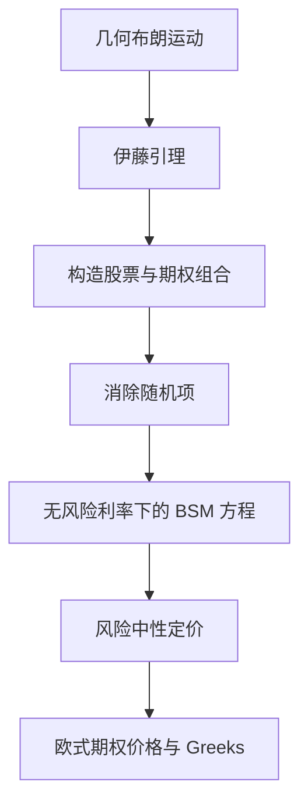

## 期权定价：布莱克-舒尔斯-默顿模型

> 核心关系：BSM 通过动态复制消除价格随机项，把期权定价转化为风险中性下的预期现金流贴现。

## 随机过程

**随机过程（stochastic process）**：变量随时间变化的不确定过程，金融用它描述价格如何随时间演变。**随机游走**指价格每一步变化独立同分布，历史价格不携带可预测信息。**马尔可夫性质**：价格未来走势只与当前价格有关，与过去的历史无关，与弱式有效市场一致。

## 标准布朗运动

**标准布朗运动** $z(t)$ 满足四个条件：

1. $z(0) = 0$ 几乎必然；
2. 增量服从正态分布：对 $t > s$，$z(t) - z(s) \sim N(0, t-s)$；
3. 增量独立：不同时间段的 $z(t) - z(s)$ 相互独立；
4. 样本路径连续。

离散化写法：$\Delta z = \varepsilon \sqrt{\Delta t}$，$\varepsilon \sim N(0,1)$，均值 $E[\Delta z] = 0$、方差 $V[\Delta z] = \Delta t$。当 $\Delta t \to 0$ 时写成微分形式 $dz = \varepsilon \sqrt{dt}$。

## 伊藤引理

**普通布朗运动**：$dx = a\,dt + b\,dz$，其中 $a$ 为漂移率（单位时间的期望变化），$b^2$ 为方差率。

**伊藤扩散**：$dX_t = a(X_t, t)\,dt + b(X_t, t)\,dz$，漂移系数与扩散系数允许依赖当前状态与时间。

**伊藤引理**：设 $X$ 服从 $dX = a\,dt + b\,dz$，$G(X,t)$ 是 $X$ 与 $t$ 的二次可微函数，则

$$dG = \left(\frac{\partial G}{\partial t} + \frac{\partial G}{\partial x}\,a + \frac{1}{2}\frac{\partial^2 G}{\partial x^2}\,b^2\right)dt + \frac{\partial G}{\partial x}\,b\,dz$$

随机微积分多出一项 $\frac{1}{2}G_{xx}b^2$（来自 $dz^2 \to dt$ 的二次变差），这是与普通微积分最大的区别。

## 几何布朗运动

**几何布朗运动（GBM）**：股票价格的标准模型

$$dS = \mu S\,dt + \sigma S\,dz$$

离散化 $\frac{\Delta S}{S} = \mu\,\Delta t + \sigma\,\varepsilon\sqrt{\Delta t}$；$\mu$ 为期望收益率，$\sigma$ 为波动率（年波动率的常见范围 0.2 至 0.4）。GBM 下收益率为正态、价格永远为正；普通布朗运动下价格可能为负，与股票有限责任矛盾，因此漂移与方差应与价格水平成比例。

**例：股票对数价格**。令 $G = \ln S$，由伊藤引理得

$$d\ln S = \left(\mu - \frac{\sigma^2}{2}\right)dt + \sigma\,dz,\qquad \ln S_T = \ln S_0 + \left(\mu - \frac{\sigma^2}{2}\right)T + \sigma z_T$$

即对数价格是漂移为 $\mu - \sigma^2/2$ 的普通布朗运动，价格本身服从对数正态分布。$\mu$ 是短期的算术期望收益，$\mu - \sigma^2/2$ 是连续复利下的年化期望收益；波动率越高，二者差距越大。

## BSM 微分方程

设 $f$ 是依赖于 $S$ 的衍生证券价格。为消除随机项，构造 1 单位衍生证券空头加 $\frac{\partial f}{\partial S}$ 单位标的证券多头的组合 $\Pi = -f + \frac{\partial f}{\partial S}S$；随机项恰好抵消后，无套利条件要求 $\Delta\Pi = r\Pi\,\Delta t$，整理得到 BSM 微分方程：

$$\frac{\partial f}{\partial t} + rS\frac{\partial f}{\partial S} + \frac{1}{2}\sigma^2 S^2\frac{\partial^2 f}{\partial S^2} = rf$$

边界条件 $f(T) = \max(S(T) - K, 0)$。该方程适用于价格只依赖 $S$ 的所有衍生证券，不同衍生证券只差边界条件。美式期权涉及停止时间，只能数值求解。

## 风险中性定价

由 BSM 微分方程，衍生证券价值与投资者的风险偏好无关，可假装所有投资者风险中性。风险中性定价三步法：

1. 假设标的股票价格的期望收益率等于无风险利率 $r$；
2. 计算期权的期望回报 $\hat{E}[\max(S_T - K, 0)]$；
3. 按无风险利率贴现：$c = e^{-r(T-t)}\hat{E}\left[\max(S_T - K, 0)\right]$。

自洽性检验：远期合约到期价值 $S_T - K$，风险中性定价给出 $f = S - Ke^{-r(T-t)}$，与无套利定价结果一致。

**BSM 定价公式**：

$$c = S_0 N(d_1) - Ke^{-rT}N(d_2),\qquad p = Ke^{-rT}N(-d_2) - S_0 N(-d_1)$$

$$d_1 = \frac{\ln(S_0/K) + (r + \sigma^2/2)T}{\sigma\sqrt{T}},\qquad d_2 = d_1 - \sigma\sqrt{T}$$

$N(x)$ 为标准正态分布累积概率。$N(d_1)$ 是风险中性测度下 $S_T > K$ 的概率；看涨期权等价于股票加负债的组合，$SN(d_1)$ 是股票市值，$-e^{-r(T-t)}KN(d_2)$ 是负债价值。标的已知收益现值 $I$ 时，用 $S - I$ 替换 $S$；标的按连续复利固定收益率 $q$ 分红时，用 $Se^{-q(T-t)}$ 替换 $S$。欧式期货期权用远期价格 $F$ 替换 $S$，与 Black 公式同构。

**算例**：$S_t = 50$ 元、$r = 12\%$、$\sigma = 10\%$、$K = 50$、$T = 1$ 年。$d_1 = \frac{\ln(50/50) + (0.12 + 0.005)}{0.1} = 1.25$，$d_2 = 1.15$；$N(1.25) = 0.8944$，$N(1.15) = 0.8749$。$c = 50 \times 0.8944 - 50 \times 0.8749e^{-0.12} = 5.92$ 元，$p = 50 \times (1-0.8749)e^{-0.12} - 50 \times (1-0.8944) = 0.27$ 元。平价状态看涨明显贵于看跌，因为无风险利率高、期限长，持有现金的利息成本使看涨更有价值。

## BSM 模型的假设与适用

BSM 的八个基本假设：不存在无风险套利机会；允许卖空标的证券；没有交易费用和税收；证券交易连续、价格变动连续；所有证券完全可分；股票价格遵循几何布朗运动（$\mu$ 和 $\sigma$ 为常数）；无风险利率为常数；标的股票无红利。

**中国市场用 Black 公式**：中国场内欧式期权市场用 BSM 时常出现负的隐含波动率，因现货卖空受限、现货交易费较高，BSM 的"无套利、可复制"假设不成立。Black 公式以远期价格 $F$ 代替现货 $S$：

$$c_t = e^{-r(T-t)}\left[F_t N(d_1) - KN(d_2)\right],\qquad p_t = e^{-r(T-t)}\left[KN(-d_2) - F_t N(-d_1)\right]$$

Black 公式的隐含波动率曲线呈微笑形状，BSM 的隐含波动率不呈微笑。

## 波动率与 VIX

**波动率**：1 年连续复利收益率的标准差，时间 $\Delta t$ 内收益标准差为 $\sigma\sqrt{\Delta t}$。股价 50 美元、年波动率 25%，一周价格变化的标准差 $50 \times 0.25 \times \sqrt{1/52} \approx 1.73$ 美元。

**历史波动率估计**：取间隔 $\tau$ 年的观测，计算连续复利收益率 $u_i = \ln(S_i/S_{i-1})$，求标准差 $s = \sqrt{\frac{1}{n-1}\sum(u_i - \bar{u})^2}$，年化 $\hat{\sigma} = s/\sqrt{\tau}$（日数据 $\tau = 1/252$，年化乘 $\sqrt{252}$）。波动率不恒定，需动态建模：GARCH(1,1) 把当前方差回归到滞后平方收益与滞后方差，EWMA 是其特例。

**隐含波动率（IV）**：使 Black-Scholes 理论价格等于市场价格的波动率，与价格一一对应。交易员与经纪商习惯报 IV 而不报美元价格，因为报价更稳定、跨期限可比。

**VIX**：CBOE 发布的隐含波动率指数，最流行的是标普 500 的 30 天隐含波动率，由 SPX 期权价格反推。VIX 是前瞻性指标，水平反映市场不确定程度；1990-2020 年收盘区间介于 9.14 与 82.69（82.69 为 2020 年疫情冲击时的高点）。VIX 与标普 500 大致反向，但并非总成立；指数本身不可直接交易，CBOE 上市 VIX 期货与期权供投资者获得波动率敞口。
