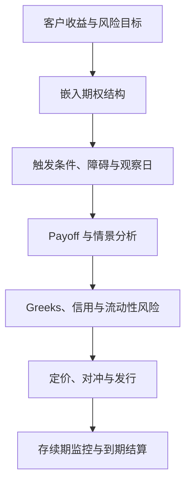

## 奇异期权与结构性产品

> 核心关系：结构性产品把客户目标编码为条件 payoff，发行前后都必须同时管理定价、对冲、信用和流动性风险。

## 期权希腊字母风险管理

**希腊字母（Greeks）**把期权价格变化按影响因素做泰勒展开分解：

$$\Delta C = \text{Delta}\cdot\Delta S + \frac{1}{2}\text{Gamma}\cdot(\Delta S)^2 + \text{Theta}\cdot\Delta t + \text{Vega}\cdot\Delta\sigma + \cdots$$

期货价格变化几乎只受标的价格影响，Delta 接近 1；期权价格受四类因素影响。期权具有非线性，希腊字母自身随行情动态变化。

- **Delta**：从对冲角度看，一份期权等同于多少相应标的物；从概率角度看，近似期权到期成为实值的概率。行权价越大，看涨 Delta 越小且趋近 0，看跌 Delta 越小且趋近 −1。
- **Gamma**：Delta 的变化率，衡量头寸为保持 Delta 中性而再次对冲的规模与频率。行权价越接近标的价格，Gamma 越大。
- **Theta**：期权价格对剩余期限的敏感度，被称为 Gamma 的死对头。
- **Vega**：期权价格对隐含波动率变化的敏感度，常与 Gamma 同向。

**动态对冲（Gamma Scalping）**：把标的价格涨跌的方向性敞口（Delta）对冲掉，从波动敞口中获利。Long Gamma（期权买方）的对冲操作是低买高卖，Short Gamma（期权卖方）的对冲操作是高买低卖。

**2018 年 2 月 9 日上证 50ETF 案例**：当日上证 50ETF 跌幅达 4.63%，部分看涨期权不降反升。以二月 3.50 看涨期权为例：标的价格下跌 0.154，Delta 贡献 −0.00097；标的价格波动 0.0237，Gamma 贡献 +0.00083；隐含波动率上涨 16%，Vega 贡献 +0.00186。Vega 的向上贡献超过 Delta 的向下贡献，期权价格净涨。波动率风险在极端行情下可压倒方向性风险。

## 无风险套利

期权合约之间、期权与标的期货价格之间的规律性特征由套利关系约束，相互价格明显违背套利关系时作无风险套利交易。检验套利机会须考虑买卖价差、手续费、交割费、融资融券成本。

**边界套利**：期权价格必须介于内在价值与标的价格之间：

$$\max(S - Ke^{-rt}, 0) < C < S,\qquad \max(Ke^{-rt} - S, 0) < P < K$$

**垂直价差套利**：同月份、不同行权价合约之间的价格约束 $0 < C_1 - C_2 < (K_2 - K_1)e^{-rt}$。

**凸性套利**：期权价格关于行权价必须凸，$C_1 + \lambda C_3 > (1+\lambda)C_2$。

**看涨看跌平价（Put-Call Parity）**：$C + Ke^{-rt} = P + S$。变形 $C - P = (F - K)e^{-rt}$，左边相当于用看涨和看跌期权合成一份持有成本为 $K$ 的期货多头，右边相当于期货头寸的价值。

**箱式套利**：$C_1 - C_2 + P_2 - P_1 = (K_2 - K_1)e^{-rt}$。

境内股指期权合成期货与对应股指期货的相关性高达 99.9% 以上；股指期货才是股指期权对应的现货与定价根基，而非股票指数本身。2025 年 4 月 7 日中证 1000 股指期货触及跌停，期权合成的期货继续下跌达 13.8%——极端行情下期货跌停失去价格发现功能时，期权继续履行价格发现功能。

## 场内权益期权市场

**全球市场**：据 FIA 统计，2025 年股指期货与股指期权分别成交 62 亿张、634 亿张，分别占所有期货、期权成交量的 22% 与 79%，股指产品已成主流。美国有 17 家期权交易所；CME 通过自家清算公司清算，其余经 OCC 清算。股票期权成交量高于股指期权，但股指期权权利金成交额高于股票期权。

**境内市场**：3 家交易所上市场内权益类期权，共 12 个品种，覆盖 7 个股票指数，均为欧式香草期权。中金所上市沪深 300 股指期权（IO）、上证 50 股指期权（HO）、中证 1000 股指期权（MO）；上交所上市 ETF 期权（沪深 300、上证 50、中证 500、科创 50 等）。发展时间轴：2010 年 4 月 16 日沪深 300 股指期货（IF）；2015 年 4 月 16 日上证 50（IH）与中证 500（IC）股指期货；2019 年 12 月 23 日沪深 300 股指期权（IO）；2022 年 7 月 22 日中证 1000 股指期货（IM）与股指期权（MO）；2022 年 12 月 19 日上证 50 股指期权（HO）。中证 1000 股指期权上市后已成为最活跃的股指期权品种。

**备兑策略（covered call）**：指数多头加卖出平值或浅虚值看涨期权，属高胜率低收益策略。**现金担保看跌策略（cash-secured put）**：卖出看跌期权加投资相同额度的固定收益产品。由平价公式变形 $S - C = Ke^{-rt} - P$，两者到期损益结构等价。

**尾部风险对冲**：场内香草期权承担尾部风险保护功能；Universa 尾部风险策略在 2020 年 3 月获得约 30 倍回报。

## 场外结构性产品

境内场外衍生品在 NAFMII、SAC 与 ISDA 框架下运行，2013 年以来市场发行规模持续扩张。市场直觉：平值、一个月后到期的沪深 300 期权，当平值隐含波动率约 16% 时价格约 72 元，占行权价 4000 的 1.8%；历史上场内沪深 300 平值期权价格约为面值的 1.2% 至 3.5%。

### 稳健投资类产品

**欧式香草看涨（备兑型）**：收益 = 参与率 × max(标的表现, 0)；下行无保护、上行收益封顶在参与率水平。

**欧式价差（bullish spread）**：温和看涨、锁定下跌风险参与看涨行情。示例：3 个月，低行权价 100%、高行权价 104%、参与率 105%，期末价格不低于高行权价得 4.3%。

**鲨鱼鳍（shark fin）**：含敲出障碍与参与率的看涨结构。美式鲨鱼鳍行权价 101%、障碍价 112%，敲出事件为敲出观察目标收盘价不低于障碍价（自起始日每日观察）；欧式鲨鱼鳍仅到期日进行敲出与行权价判断。**双向鲨鱼鳍**提供区间保护，收益形态类似 condor/butterfly。

**二元期权（binary/digital）**：到期支付固定金额或零。欧式二元看涨期末不低于行权价得 2.75%，否则得 0.50%。

**自动赎回二元（小雪球）**：存续期内多个观察日，一旦某观察日敲出，提前终止实现获利。自动敲出赎回结构（Autocall）是以时间换空间的结构，多个观察日多次触发机会，具有保本特点。

**区间累积（accrual）**：收益取决于观察期内标的价格落入不同价格区间的天数，适合震荡或横盘行情。

### 进取投资类产品

**经典雪球**：境内市场近年热度最高的 Autocall 家族代表，适合温和看涨、区间震荡且不会大幅下跌的行情。要素：期限 24 个月（锁定期 3 个月），敲出价格 = 期初价格 × 101%，敲入价格 = 期初价格 × 75%，敲出票息 12.7%（年化），最大亏损比例 −100%。收益规则：敲出时（无论是否曾敲入）获得敲出票息；未敲出且未敲入获得红利票息；未敲出且曾敲入，到期收益率 = Min(标的涨跌幅, 0)，承担与标的相同的损失。四种情景：从未敲入敲出（盈利）、未敲入提前敲出（盈利）、敲入未敲出且到期下跌（亏损，承担与标的相同损失）、敲入后敲出（盈利）。

**雪球变种**四类方向：优化票息收益（增强型雪球、早利雪球、凤凰）；缓释敲入风险（折价建仓雪球、限亏型雪球）；调节敲出概率（降敲型雪球、双降雪球）；保证金模式。**限亏型雪球**设置最大亏损限制（如 −25%），曾敲入且未敲出时到期收益率 = Min(Max(标的涨跌幅, −25%), 0)。**早利雪球**票息分段降低，第一年敲出票息高于经典雪球、第二年低于。**降敲型雪球**逐月下调敲出价格，提高提前敲出可能性。

**Autocall 家族演进**：2003 年法国巴黎银行在美国推出首个自动赎回产品；2013 年韩国 Autocall 产品规模超 250 亿美元，后转向港股；2015 年港股恒生国企指数大跌近 50%，雪球产品大规模敲入。演进路线：卖出看跌期权 → 引入自动敲出赎回概念的 FCN 定息票据 → 分化为欧式雪球与 DCN 二元票据 → 再引入多个敲入观察日形成标准雪球与凤凰。

- **FCN（固定票息看涨自动敲赎回结构）**：每月无条件派息，敲入观察只在期末观察一次（欧式），防守性明显强于凤凰、雪球，票息更低。
- **DCN（二元票息看涨自动敲赎回结构）**：每月观察，观察价格不低于派息价格即立即获得当月派息；敲入观察只在期末观察一次。
- **凤凰结构（Phoenix）**：每月观察，观察价格不低于派息价格立即获得当月派息；曾敲入未敲出时仍获得部分派息。

**Autocall 家族不可能三角**：高敲出票息、高敲出概率、低敲入概率三者难以兼得——高票息对应高亏损风险，高敲出概率的产品盈利空间小，低敲入概率的产品敲出机会小。共同本质是正 delta、负 gamma——卖出凸性获取期权费。

**安全气囊（airbag）**：期间未曾敲入（跌破安全垫）则保本；若敲入，到期收益与标的股票表现一致。适用于对未来看涨但担心短期回调，也可用于左侧建仓。示例：期限 12 个月，敲入界限为 80% × 期初价格，期权费率 0%，期间未敲入为看涨期权、上涨参与率 100%、上涨收益封顶。

**累购期权（accumulator）**：高于行权价格按正常速度便宜买，低于行权价格按加倍速度高价买，一旦加速下跌即套牢。Accumulator 谐音 I Kill You Later，2007-2008 年香港金融危机期间相关产品大崩盘。

**固收+策略**：用固收底仓的利息收入作为期权费购入衍生品增厚收益，常见渠道为银行结构化理财与券商收益凭证。常见保本型结构包括二值、三值、单向鲨鱼鳍、双向鲨鱼鳍、香草看涨、牛市价差。

**交易商对冲实践**：场外衍生品是交易商风险中性的资本中介业务，交易商保持中性敞口。交易商卖出香草看涨后 Delta 小于 0、Gamma 小于 0；为达到 Delta 中性须在二级市场买入对应股票对冲。负 Gamma 下对冲行为为高买低卖，这是期权卖方的对冲成本来源。
