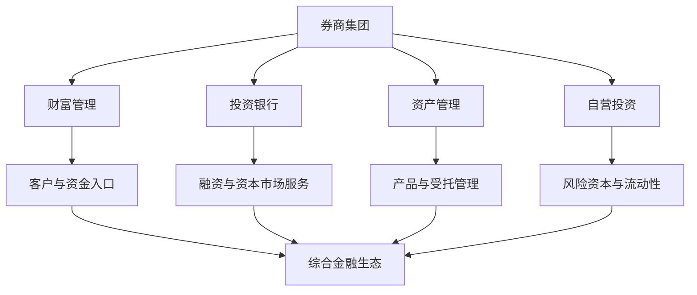

## 券商业务全景

证券公司是连接企业与资本市场的持牌金融机构。本讲以一家省属上市券商为样本，拆解证券公司的业务版图与行业趋势。

> 核心关系：券商通过财富管理、投行、资管和自营形成业务协同，但各板块的客户、资本和风险约束不同。

## 一、全牌照券商与集团架构

**全牌照上市券商**：同时持有经纪、投行、资管、自营等全业务牌照的证券公司。财通证券是国内唯一"证券 + 期货"双 A 股上市平台，实控人为浙江省财政厅，是 24 家省属国企中唯一的券商；财通证券与子公司永安期货分别于 2017 年、2021 年登陆上交所。

集团总部设杭州，另在上海设双总部；全国 136 家营业部、29 家分公司，长三角营业部 116 家，浙江全域覆盖。券商总部直接做业务，主营集中在总部，不同于省属国企"管理型总部"。

**子公司布局**围绕企业全生命周期服务：

- **永安期货**：期货行业龙头。
- **财通证券资管**：主动管理能力业内前列。
- **财通资本**与**财通创新**：监管要求一级市场投资与券商总部剥离后单独设平台；财通资本用募集资金做 PE/VC（募、投、管、退），财通创新用公司自有资金直投。
- **财通基金**：以定增业务闻名，受证监会"一参一控"规定（券商对基金/资管参股一家、控股一家）约束。
- **财通（香港）**：国际业务桥头堡，多数券商借香港发展国际业务。

## 二、四大主营业务

**财富管理**：最传统板块，覆盖证券经纪、期货经纪、境外经纪、融资融券、股票质押融资、证券研究、投资顾问。佣金收入曾是券商现金流基本盘，呈长期下行趋势。

**投资银行**：为企业融资的中介业务，属直接融资，对比银行吸收存款再放贷的间接融资。国内投行专指企业融资业务，子项包括股权融资（IPO）、债权融资（发债）、财务顾问、新三板、并购重组（M&A）、海外业务。

**资产管理**：证券资管、期货资管、证券投资基金、跨境资管、私募股权基金，是基金经理与资产管理从业者所在条线。

**投资管理（自营）**：公司用自有资金投资，范围最大，包括权益投资、固定收益投资、股权直接投资（一级市场 PE/VC）、做市业务、另类投资（房地产、红酒、艺术品等）。

**三类金融机构资金属性对比**：银行吸收的存款不可投二级市场，风险偏好最低；保险的险资资金便宜，追求长期稳定收益；券商投资范围最大、风险容忍度最高。差别源于资金来源性质。

## 三、行业趋势

**从业人员结构（2024 年底）**：证券从业者总计 33.20 万人，较上年末减少 1.89 万人，降幅 5.28%；34 家券商减员超 200 人，仅 15 家逆势增长。减员集中在一般从业人员（20.85 万人）与证券经纪人（2.88 万人）。分析师、投资顾问、保荐代表人三大专业条线逆势增长。

**数字化时代**：AI、区块链、云计算、大数据改造展业、风控、合规，催生智能投顾、智能投研、金融云。数字化会成为与 Office 同级的默认基本技能，不会数字化将被淘汰。

**五大业务板块趋势**：投行业务（基于产业链并购重组，国九条提出大力扶持）、机构业务（养老金、险资、银行理财等机构权益投资需求增加）、投顾业务（以投资者为本的财富管理）、REITs 业务（立法提速与市场规范化）、私募创投业务（支持科技创新的重要金融抓手）。

**IPO 与债券政策**：2023 年 8 月 27 日证监会发布《统筹一二级市场平衡优化 IPO、再融资监管安排》，阶段性收紧 IPO 与再融资；2024 年 IPO 融资总量 673.53 亿元，较 2023 年 3565.39 亿元下滑 81.1%。2025 年回暖，港股 IPO 前 5 个月募资规模同比增长超 700%，中资券商承销家数显著领先外资大行。2023 年政府融资平台发债融资 4.6 万亿元，其中 3.5 万亿元用于借新还旧，平台只能借新还旧且不包含利息。

## 四、投行转型：从通道型到产业投行

传统投行拉项目、做保荐、收承销费，与银行客户经理无异。新模式为**"投行 + 投资"**：向产业链前端延伸，"投早、投小"，陪伴企业过 A/B/C 轮再承接上市。科创板跟投制度将投行盈利从单纯承销保荐费延伸到资本利得。

**模式谱系**：投行驱动型（广发证券、国信证券、中信证券、海通证券等）；产业资本型（中金公司）；投行 + 投资（华泰证券，并购重组与中概股回归中做过过桥贷款、并购基金）；区域性券商打法（国元证券、西南证券、财通证券，深耕本地项目并借助地方政府资源）。

头部券商组织：股权业务"行业化"（医疗组、电子组、TMT 组），债券业务"区域化"（人员派驻区域，承诺 1.5 小时内到达客户现场）。投行业务内部难度排序：并购最难，其次 IPO，再次债券。

**公募 REITs**被视为"十年百倍"新赛道：市场规模近千亿元，10 年内规模有望超 10 万亿元；展业难度与专业门槛显著高于其他投行项目，形成规模即构成护城河。承揽靠存量转化、地方协同、银证合作三条路径。

## 五、研究所与财富管理转型

**卖方研究**是主流：研究产品对外销售给基金、保险资管、银行理财、同业券商乃至 QFII 等机构客户，以研究报告、电话会议、路演、委托课题、数据资源共享、投资策略会等形式交付。合规底线：卖方研究产出禁止直接供公司内部使用，需对外发布一定时间后方可内部使用。明星分析师年薪百万来自卖方业务。

**财富管理从卖方向买方转变**：佣金从"万几"一路下行，将趋近零佣金。2015 年互联网化浪潮的三种模式：华泰证券把 APP 做好、产品代销；平安证券集团客户免费导流（2015 年高峰期一天新开户 30 万户）；东方财富天然流量。流量红利终结：引进一个有效户的成本从 2015 年的 15 元涨到近 200 元。公募基金投顾试点有望突破"代客理财"束缚，转向以客户资产增长收取管理费的买方模式。
