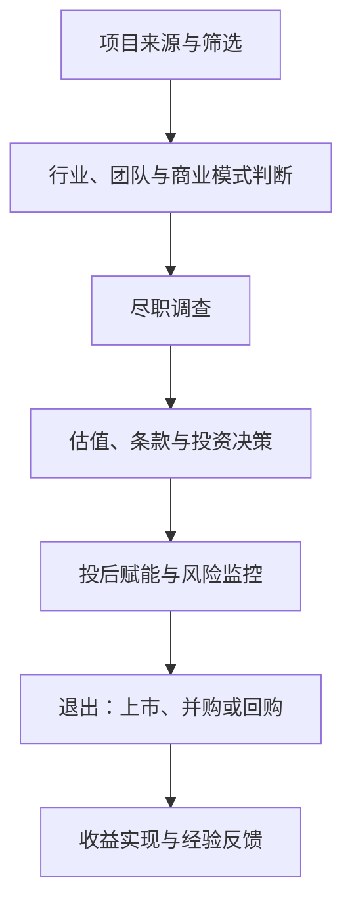

## 一级市场股权投资

> 核心关系：一级市场投资以项目筛选和尽调为入口，通过估值、投后管理和退出实现风险收益闭环。

## 一、核心概念与行业历史

**一级市场**：也称发行市场，是证券首次出售给公众时形成的市场，即 IPO 之前的市场。相对二级市场而言，信息更不透明、信息不对称更多。**私募**指以非公开方式向特定投资者募集资金，基金的钱来自有限合伙人（LP）。**股权投资**代表对公司的所有权，包含分红收益权、人事任免权并参与经营决策，是永久期限的权利。一级市场投资风险不可避免且很大，要害在于通过投资工具、研究尽调控制风险。

**国际市场沿革**：1946 年成立的美国研究与开发公司（ARD）是公认第一家 PE 企业；20 世纪 70 年代有限合伙制出现并成为行业主要组织形式；80 年代末至 90 年代中期全球杠杆收购兴起；2000 年后逐步成熟。除黑石、KKR、凯雷等传统 PE，投行、商业银行甚至保险公司也开展 PE 业务。

**中国市场五阶段**：

- **萌芽阶段（1986-2004）**：1986 年中国创业风险投资公司成立，1992 年 IDG 成为最早进入中国的外资 PE；2004 年中小板设立。
- **发展阶段（2005-2009）**：2006 年颁布《合伙企业法》，2007 年试点券商直投，市场化投资机构崛起，静态估值 PE 约 10 倍。
- **第一个高峰（2009-2011）**：2009 年创业板设立提供畅通退出渠道，叠加"四万亿"资金溢出，动态估值 PE 约 15 倍。
- **超级繁荣（2014-2017）**：2014 年私募备案办法发布、新三板全面扩容；2015 年"大众创业、万众创新"，银行系资金开闸，政府引导基金扩张，互联网企业赴美上市潮，"市梦率"估值，独角兽涌现。
- **大浪淘沙（2018 至今）**：2018 年资管新规使资金来源枯竭；2019 年科创板、2023 年全面注册制给利润两三千万的科技企业打开上市通道；2024 年 IPO 放缓、退出端收紧，机构转向硬科技，国资主导，项目估值回归理性。

**2024 年现状**：讲课人所在机构投 100 个项目、50 个申报 IPO、最终撤回 48 个，行业进入"勒紧裤腰带"阶段。

## 二、2025 年市场数据

**宏观经济**：2025 上半年国内生产总值 66.05 万亿元，同比增长 5.3%，全球主要经济体中领先；信息传输、软件和信息技术服务业增速最显著（11.1%）。对美贸易顺差下降，对 14 个非美贸易伙伴顺差走高，主要靠转口贸易维持。

**股权投资市场（清科）**：2025 上半年投资 5612 起、同比上升 21.9%，披露金额约 3389.24 亿元、同比上升 1.6%，自 2021 年顶点以来持续下降后回暖；硬科技仍是热点。退出 935 笔、同比下降 43.3%，其中 IPO 583 笔、同比上升 38.2%、占比 62.4%；并购类 132 笔、同比上升 17.5%，并购退出渠道开始活跃。

**中企上市**：境内外上市 109 家（A 股 51 家、境外 58 家），同比上升 32.9%；首发融资额约 1213.60 亿元，同比上升 158.7%。A 股新增受理 IPO 177 家，其中北交所 115 家、占比 65%，北交所成为中小企业上市首选。

## 三、投资机构类型与投资逻辑

**天使投资**：金额几十万元至几百万元，项目数多、成功率低，成功项目回报可达百倍千倍；逻辑是"看感觉"，认可创意、市场空间与创始人背景与品行。

**VC**：金额几百万元至上千万元，博"可能性"：创新想法、颠覆性技术、从 0 到 1 的商业模式，关注市场天花板与想象空间。

**PE**：单笔上千万元至数亿元，投商业模式已被验证、主营稳定、现金流正常的成熟公司，关注经营质量、现金流、营收真实性，追求大概率的确定性。

**并购资本**：控股型为主，资金需求量大，把握高才做，回报相对低，可加杠杆。

**产业投资方 CVC**：看协同。BAT、上汽投资、中芯聚源、哈勃投资等，2019 年以来增多；被 CVC 投资不等于进入其供应链。

**政府引导基金**：看落地贡献：产生营收税收、解决就业、落研发中心、本地上市。"投 5000 万元、要求落地 1 亿元固定资产投资"相当于变相回购条款。

**PE 投资逻辑四个关注点**：商业价值是投资的基石，看行业所处阶段与公司竞争力；不确定性是投资的环境，要了解全部不确定性、控制风险后再决策；持续成长是投资的依托，企业要成长到更大规模；基本回报之上的超额收益是投资的追求，以合理价格买优质资产。

**项目生命周期（顺利 IPO 退出约 5 年）**：完成投资（交割 1-3 个月）→ 下一轮融资 → IPO 申报 → 发行上市（注册制下审核发行周期约 1 年）→ 锁定期（12-36 个月）→ 解除限售 → 减持（竞价交易每 3 个月不超过 1%）→ 全部退出。需要足够耐心与综合能力。

## 四、项目开发与尽职调查

**项目渠道**：公开信息挖掘（新三板、证监局）、政府信息（凤凰计划名单、纳税信息）、行业专家、上市公司与大公司上下游、金融同业、FA。

**开发技巧三步：找得到、切得进、跟得牢**。找得到——凤凰计划、新三板公司、专精特新、隐形冠军；切得进——政府部门、重点园区、投资及中介机构、上市公司上下游；跟得牢——企业十几二十年生命周期中适合本机构投资的时点可能只有一个，大量时间是跟踪与评估。

**机构投资偏好**：80% 成熟期项目（上年度扣非净利润不低于 1000 万元，单笔 2000 万-1 亿元，3 年内有申报 IPO 潜力，预期 IRR 20% 以上）+ 20% 成长期项目（主营收入 7000 万元以上，投前估值 20 亿元以内，预期 IRR 30% 以上）。

**尽职调查三大重点**：业务尽调（行业、产品、生产、销售、技术研发、团队）、财务尽调（收入确认、成本归集、盈利水平、现金流、内控）、法务尽调（历史沿革、知识产权、资质、诉讼、社保、税务）。

**业务分析框架（好行业、好公司、好交易）**：从产品出发看生产过程（技术难点、价值量与壁垒）、用途、分类定位；引入产业链，上游看原材料依赖与议价能力（警惕卡脖子），下游看需求、市场规模、市场容量、竞争与发展趋势；最后叠加未来 3-5 年盈利预测与退出估值水平，测算预期收益与潜在风险的平衡。

**尽量避免的项目特征**：财务造假；估值过高；现金流与净利润匹配度严重背离（利润 1 亿元、现金流 -3 亿元）；不允许尽调或尽调范围、时间大幅受限；缺乏退出路径（利润稳定在 4000 万元天花板，靠分红 30-50 年才回本）；多个股东持股比例接近且无实际控制人；同一实控人下关联交易与资金往来密集；周期性行业在高点过度扩张。
