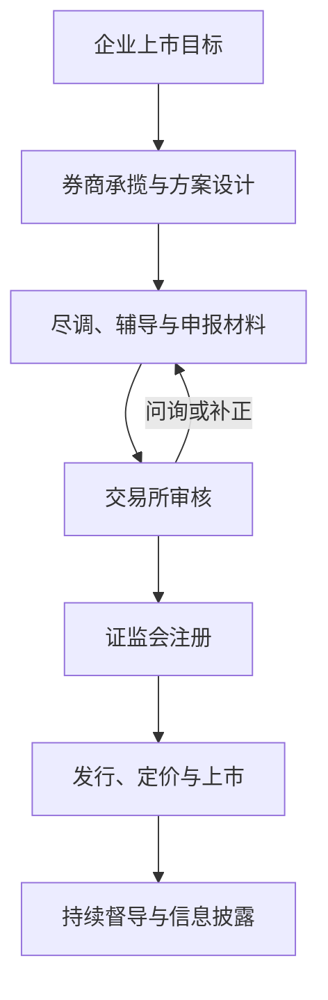

## 投资银行业务流程

> 核心关系：IPO 是由承揽、尽调、辅导、审核、注册到发行上市组成的监管流程，问询会推动材料反复完善。

## 一、投行的角色与业务体系

**投资银行**：大投行覆盖股票与债券两翼；狭义投行以股权融资为核心，即首次公开发行（IPO）加并购重组（M&A），延伸出固定收益债券融资与偏股型的可转债。

投行扮演衔接实体企业与资本市场的桥梁角色，是直接融资落地的核心执行机构。2004 年起 A 股实行**保荐制**，替代此前的配额制，投行责任由此强化，执业需保荐代表人签字担责。

投行提供企业全生命周期服务：

1. 初创期做顶层股权结构设计，明确创始人股权分配。
2. 成长期引入战略投资者、设计员工股权激励。
3. 成熟期辅导规范、申报 IPO。
4. 上市后再融资、并购重组、分拆孵化。

这一上下游延伸是投行区别于单一中介服务的核心。

## 二、多层次资本市场结构与发行制度演进

**时间轴**：1990 年沪深交易所成立 → 2004 年中小板开板（第一股深市 002001）→ 2006 年新三板启动 → 2009 年创业板开板 → 2013-2015 年新三板大改革扩容 → 2019 年科创板开板并试点注册制 → 2021 年北交所开市 → 2023 年全面注册制落地 → 2025 年科创板推出"1+6"改革。

**多层次市场金字塔（自下而上）**：区域性股权市场（四板）→ 新三板（含基础层/创新层/精选层）→ 科创板、创业板、北交所 → 主板（大盘蓝筹）。不同层级对应不同发展阶段、规模与风险特征的企业，企业按自身条件选择登陆层级。

**发行制度演进**：从配额制到保荐制，再经科创板试点走向全面注册制，核心是发行审核重心前移至交易所，发行条件与信息披露并重。

**亏损企业上市**：注册制下允许尚未盈利企业在科创板、创业板上市，采用多套指标；上交所每年仅 5 个亏损企业名额，属稀缺通道。

## 三、各板块定位与上市标准

**主板**：大盘蓝筹。上市标准为最近 3 年净利润均为正、累计不低于 2 亿元，最近 1 年净利润不低于 1 亿元；且最近 3 年经营活动现金流净额累计不低于 2 亿元，或营业收入累计不低于 15 亿元。设置禁止类与限制类行业清单。

**科创板**：硬科技，面向世界科技前沿、经济主战场、国家重大需求，聚焦生物医药、新一代信息技术、节能环保、高端装备、新能源、新材料六大行业。科创属性 4 项常规指标：研发投入占营收比重不低于 5%（或累计不低于 8000 万元）、研发人员占比不低于 10%、发明专利不少于 7 项、近 3 年营收复合增长率不低于 25%（或营收不低于 3 亿元）。

**创业板**：三创四新。上市标准为最近 2 年净利润均为正、累计不低于 1 亿元，最近 1 年净利润不低于 6000 万元；设 12 类负面清单行业（农林牧渔、采矿、酒饮料和精制茶、纺织、金融、房地产等），与互联网、大数据、云计算、自动化、人工智能、新能源深度融合的企业可豁免。

**北交所**：专精特新。上市标准为市值不低于 2 亿元，最近 2 年净利润均不低于 1500 万元，且加权平均净资产收益率（ROE）不低于 8%；不支持金融业、房地产业、产能过剩行业及淘汰类行业。

## 四、IPO 业务流程与审核流程

**业务五阶段**：

1. 准备阶段：判断是否启动上市，约 1 周至数月。
2. 启动上市：开展尽职调查，约 3 个月至 3 年。
3. 辅导申报：券商辅导并向证监局报备，约 6 个月至 1 年。
4. 审核过程：交易所审核，约 8 至 13 个月，创业板平均约 21 个月。
5. 发行上市：证监会注册后发行，约 2 至 6 个月。

综合而言，A 股 IPO 从项目启动到成功发行一般需要 2 年以上。

**沪深交易所审核流程**：预沟通 → 提交申请 → 受理申请（5 个工作日，补正不超过 30 个工作日）→ 保荐人报送工作底稿 → 首次问询 → 多轮问询 → 上市委会议审议 → 证监会注册 → 启动发行。自受理之日起 3 个月内出具审核决定，回复问询时间不计算在内。

**北交所差异**：挂牌企业需先在新三板挂牌并运行满 12 个月，方可申报北交所上市。

## 五、IPO 市场周期与企业上市权衡

**近 5 年 A 股 IPO 数据**：2020 年 432 家、募资 4779 亿元；2021 年 524 家、5426 亿元；2022 年 428 家、5869 亿元；2023 年 313 家、3565 亿元；2024 年 100 家、674 亿元（2015 年以来新低）；2025 年至今 87 家、902 亿元，市场回暖。

2023 年起二级市场表现低迷，IPO 审核开启逆周期调节，随"827 新政"、新"国九条"等政策推出，审核、发行大幅收紧。主讲人以"养猪"类比 IPO 市场周期：高峰期大量企业涌入，低谷期在审企业锐减、审核从严。

**企业是否上市的权衡**：上市益处包括拓宽融资渠道、提升品牌与公信力、规范公司治理、实施股权激励、开展并购整合、为股东提供退出通道；不愿上市原因包括股权稀释、信息透明度要求高、规范成本与合规成本上升、审批周期长、受市场周期约束、创始人对控制权与决策效率的顾虑。
