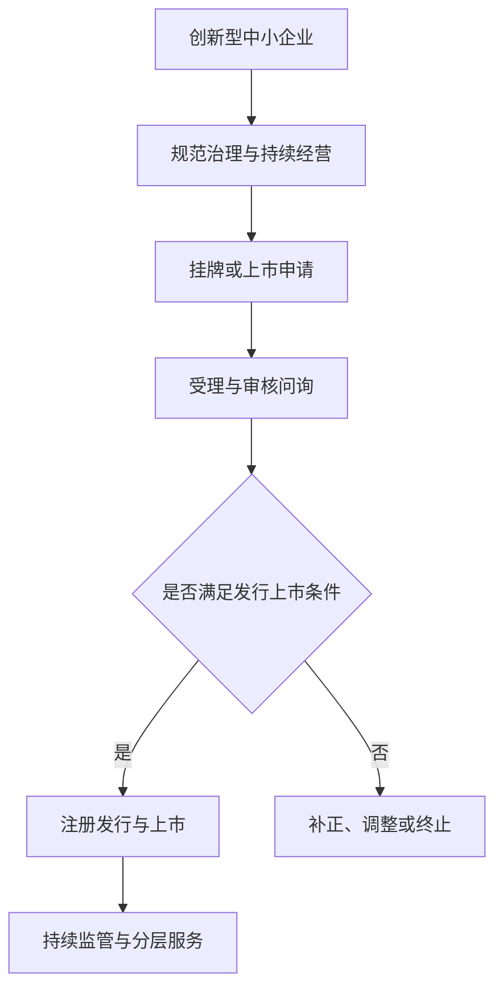

## 北京证券交易所业务

> 核心关系：北交所上市路径围绕企业规范性、创新性和持续经营能力展开，并以审核问询连接申请与注册发行。

## 一、监管新政：新国九条与 3·15 新政

**新"国九条"**（2024 年 4 月 12 日）核心是严把发行上市准入关、严格持续监管、加大退市监管。上市利润指标大幅提高：主板最近 1 年净利润 1 亿元；创业板 6000 万元；科创板两年累计 5000 万元；北交所 2500 万元（实务中 4000 万元起步）。退市数量从以前每年约 10 家提高到约 50 家，应退尽退。

**"3·15 新政"**（2024 年 3 月 15 日四项"两强两严"文件）：

- **轻投资（融资端）**：募投项目从严审核，募资额常从申报的 10 亿元压到 7-8 亿元，超募已罕见；补充流动资金后再融资，5 年内受限。
- **提升上市公司质量**：防止财务造假与业绩大幅下滑。
- **从严监管全链条**：现场检查比例不低于 1/3，检查组约 15 人、驻场 2-4 星期；被抽中的 20 家中约 18-19 家撤回材料。
- **从严管理监管队伍**：审核人员终身追责。

**"两符合四重大"**：符合国家产业政策 + 符合板块定位；重大舆情、重大违法违规线索、重大无先例事项、重大敏感信息。

## 二、北交所深改 19 条

**政策时间线**：2023 年 8 月 27 日 IPO 阶段性收紧 → 2023 年 9 月 1 日深改意见发布 → 2024 年 2 月 6 日北交所推出 85 项措施 → 2024 年 10 月设立专精特新专板。

**双通道机制**：通道一为直接申报北交所 IPO，法规设有但从未实施（市场传闻门槛为国家级专精特新"小巨人" + 净利润 6000 万元）；通道二为先在新三板挂牌满 12 个月，是唯一实际路径，口径为挂牌公开转让日至上市委会议召开日。

**投资端建设**：已开通科创板交易权限的投资者可免核验开通北交所权限，投资者从 557 万向千万级科创板投资人群体打开。

**发行机制**：取消最低发行底价；全部股票适用融资融券；启用独立代码段 920；可转债、ETF、LOF、REITs 等产品逐步覆盖。转板机制已落地但仅 3 家成功。

## 三、四大板块对比

**开户门槛**：主板无门槛；创业板 10 万元；科创板 50 万元；北交所 50 万元；全市场资产超 50 万元的投资者仅约 10%。

**流动性**：北交所日均换手率从 2022 年 1.24% 升至 2025 年 6 月 8.40%，由板块垫底升至第一。公司家数：沪市 2284 家、深市 2868 家、北交所 268 家、新三板 6060 家。

**估值**：A 股首发市盈率整体回落，科创板从 71.89 降至 26.44，北交所从 29.08 降至 11.78（实务中首发区间约 10-14 倍，受窗口指导影响）；北交所二级市盈率从 2021 年末约 47 倍回升至约 51 倍，居各板块之首。

**通过率**：2024 年 A 股名义通过率 98.15%、真实通过率仅 11.62%（通过 53 家、撤回 402 家），其中北交所真实通过率 25%；2025 年上半年名义 100%、真实 28.85%，北交所 31.58%。多数失败项目在安排上会前即主动撤回。

**审核周期**：北交所最短（中位数 6-12 个月，2025 年上半年中位 368 天）；科创板 10-18 个月；创业板最长（中位 880 天），主因排队企业数量多。全市场 332 家排队，北交所 191 家最多。

**选择建议**：净利润稳定在 7000 万元以上、成长性高且符合行业要求 → 申报创业板或科创板；净利润 3000-6000 万元 → 选择北交所，利用上市融资扩大规模后再谋转板；实务上可先在新三板挂牌，视业绩实现情况选择板块。

## 四、上市全流程

**IPO 六步**：增效规范（合法合规前提下增厚业绩、规范经营）→ 重组改制（有限公司整体变更为股份有限公司，业绩可连续计算）→ 辅导（证监局验收，最短 3 个月，董监高需通过考试、80 分合格）→ 材料制作（申报文件可达几百 GB、三四百册）→ 发行审核（多轮问询）→ 发行上市（承销商销售股票，交易所核准后挂牌交易）。

**上市委会议**：5 名委员参会；发行人 2 人（通常为董事长、财务总监）+ 2 名保荐代表人陈述答辩，全程 30-40 分钟；北交所无固定问题提纲。

**北交所流程**：股份制改造 → 申请挂牌新三板（进入创新层）→ 挂牌满 12 个月 → 北交所审核（法规时限 2+3=5 个月，实际常超 1 年）→ 证监会注册（20 个工作日）→ 上市。

## 五、审核核心关注事项

**十大关注事项**：板块定位与产业政策、资金流水核查、资金占用、财务核算、研发投入、持续经营能力、同业竞争、关联交易、社保公积金缴纳、募投资金及项目必要性。

**资金流水核查**：范围覆盖发行人银行账户，以及控股股东、实际控制人及其控制企业、董监高、关键岗位人员（采购、销售、出纳、主办会计）和异常往来关联方与员工账户；新三板仅要求实控人。报不了 IPO 的两大原因：资金流水不干净 + 成本核算不清。

**资金占用**：关注占用金额、占用时间、资金用途、控制人经营能力；报告期最后一年必须彻底规范，警惕变相资金占用中虚开增值税专用发票带来的刑事责任风险。

**财务核算**：核心是做好进、销、存管理——核算方法符合企业会计准则，采购、供应链、销售合同与原始单据保存完整，存货分型号管理、出入库信息数字化、每月对账、定期盘点。
