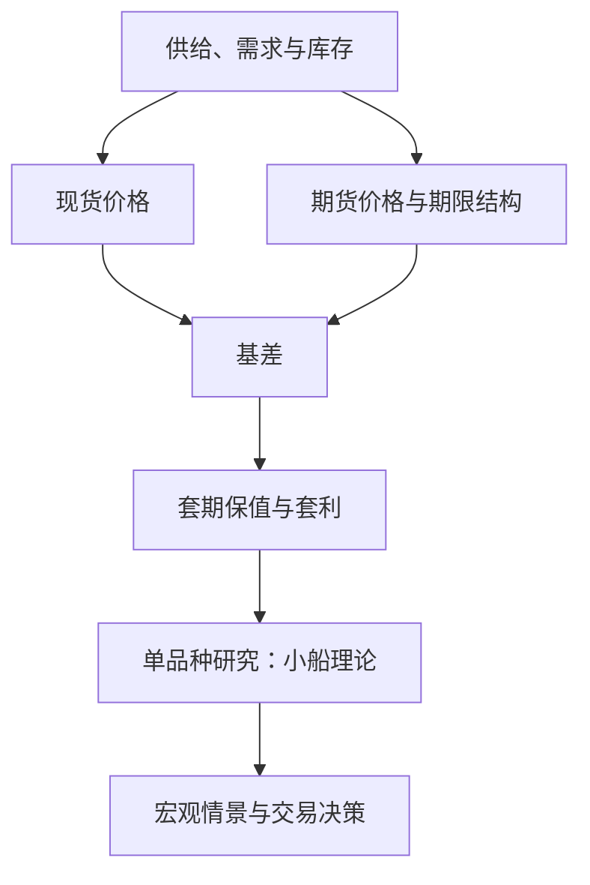

## 大宗商品期货实务

> 核心关系：商品期货研究把供需库存映射到现货、期货和基差，再用期限结构与宏观情景形成交易判断。

## 一、商品交易行业生态

**大宗商品交易商**：垄断上游资源品流通环节的机构。高盛、摩根士丹利等投行有大宗商品团队；托克、摩科瑞、嘉能可本身就是全球贸易商。高盛曾长期垄断全球有色金属仓库，掌握仓库就知道有色品种宽松还是紧张；嘉能可收购铜矿、打通物流与销售，清楚知道全球铜哪里紧、哪里松、该搬去哪里。

**商品的内在逻辑是物流**：大宗交易天然靠近需求地或港口集散地。油品在沿海港口装卸，大船换小船再向内陆发散。仓储成本与物流成本下降会打开新市场，这是"统一大市场"的产业背景。

**产能格局转变带来定价权漂移**：炼厂先集中在山东，后国家形成大型炼化园区、产能置换到沿海，沥青从北方定价转为南方定价；煤炭成本中枢从山西、陕西（约 300 元）移到新疆（约 50 元），铁路修通、物流成本下降后，山西陕西煤矿不赚钱甚至停产。

**市场参与者**：产业客户做套期保值，盘面价格高于现货售价就卖出锁定利润；贸易商看涨就囤库存、看跌就降库存；盘面交易者做多空组合；配置资金与散户各有需求。交易所想让每个品种活跃，并把形成的价格输送到全球。

**交易所与定价权**：上期所原油合约挂到日本交易所吸引外资交易，橡胶挂到大阪，纸浆挂到挪威。铁矿定价权是典型困局：中国有全球最大钢厂产能，但资源在澳洲、巴西，过去"钢铁涨 1000、铁矿也涨 1000"，利润被资源国拿走；对策是成立中国铁矿石集团统一谈判 + 大商所铁矿期货价格影响长协定价。

## 二、期货基础概念

**合约命名**：PTA2310 表示 2023 年 10 月交割的 PTA（精对苯二甲酸）合约。**主力合约**是持仓量最大的合约，市场日常报价都指主力合约。中国工业品主力合约集中在 1、5、9 月：历史习惯（金九银十、上半年备货）叠加羊群效应，资金向 1/5/9 月聚集，其他月份合约成交稀少。

**升贴水**：现货价格高于盘面价格叫现货升水，低于盘面叫现货贴水。**基差**是现货与期货的价差，**月差**是不同月份合约的价差，二者都是相对价格，表示人们对未来的价格预期。看品种先判断现货在产业链中的位置，再判断期货与它的关系。

**交割**：中国期货市场本质上是最终与现货交割的。生猪交割是车板交割：卖方把猪拉到指定库、检验合格盖章、办卖交割凭证；买方提货时配对，不是现场交收。

## 三、期限结构与库存

**期限结构**是各月份合约价格连成的曲线，每个合约每天交易、每天变动，收盘结算后当天曲线定格。

**近低远高 = Contango（期货升水结构）**：高库存品种近月便宜、远月贵，远月价格里含了时间成本——买家直接买远月不用自己囤货，仓储费由卖家承担。高库存商品没人愿意帮忙囤货，价格要一路跌到有人愿意囤为止。

**近高远低 = Back 结构（现货升水结构）**：低库存品种近端供需紧。下游工厂必须每天开工，原料紧张时会追涨杀跌把近月价格推高；远月不需要跟涨，因为装置复产、供应恢复后价格会回落。

供需基本面形成库存及库存预期，库存及库存预期对应期限结构。

## 四、单品种研究框架：小船理论

**资产本质的视角**：债券的本质是信用，交易员做信用评估；股票的本质是企业成长与分红；商品的本质是周期。

**小船理论**：影响期货价格的三要素 = 宏观（水流）+ 产业（船）+ 基差（弹簧）。权重排序宏观 > 产业 > 基差；确定性排序宏观 < 产业 < 基差——宏观变量大而模糊，基差最确定、最容易跟踪。

**商品周期实例（原油）**：2012-2014 年阿拉伯之春、中东紧张，油价 120 美元；页岩油投产增加竞争者、中东控价能力下降，2014 年暴跌至五六十美元、最低 20 多美元；2016 年 OPEC 减产回升；2018 年制裁伊朗冲高；2020 年疫情跌到 20 多美元；2021-2022 年俄乌冲突涨到 120-140 美元；此后回落至约 60 美元。

## 五、宏观对商品的影响

**总需求**拆为三条线：固定资产投资（房地产投资 → 黑色、玻璃、PVC；基建投资 → 沥青、有色；制造业投资 → 通用工业品）、消费（居民消费 → 纺织、家电；政府消费 → 政策市品种）、净出口（出口 → 聚酯、卷板、尿素、PVC）。

**供应与政策**：2021 年能耗双控下，高耗能品种（电解铝、烧碱、硅铁、硅锰、乙二醇、锌等）被限产——硅铁开工率从 50 多压到 20 多，价格从 8000 多元涨到 18000 元，翻倍后一路跌回。2025 年反内卷从口号到落地：多晶硅严重过剩，行业会议提出差产能停产 → 价格反弹 → 剩余企业盈利后收购停产产能但保持不开 → 市场缺货时一次性复产。

**流动性**：货币周期影响定价，降息年份钱便宜、钱多，商品有向上飘的动力。2020-2021 年美国五轮财政刺激合计近 6 万亿美元，远超金融危机时的 1.65 万亿美元；放水、疫情阻挠供应、回补需求共同推升商品价格。

**资产轮动**：资产间有比价关系，黄金大涨的一部分逻辑是"不知道买什么只能买黄金"。2015 年商品市场以产业为主，需懂产业交货接货成本；2020 年后美国放水带来资产人工牛市，热钱把商品当资产配置，出现"差基本面 + 好预期 + 大 Contango"组合。

## 六、全球宏观主线

**全球**：生产效率提升到达瓶颈 → 地缘与贸易摩擦加剧 → 东升西落、全球站队；AI 被当作下一次工业革命的第二增长曲线，但仍处孵化期。

**美国**："MAGA"本质是被超越的焦虑叠加两党纷争；特朗普想用关税逼制造业回流并增加财政收入，但要压住通胀，否则利息高、财政开支过不了。2025 年 11 月判断：明年美国大概率货币财政双宽松，需注意"政府关门"尾部风险，市场担忧滞涨。

**中国**：外部压制背景下内部转型，措施排序为出口与企业出海、拉消费、资本市场（信心与财富回流）、反内卷 + 大项目（统一大市场、雅江水电）、化债；大逻辑是发展科技抢全球经济主要增长点，过程缓慢，其余都是"打补丁"。

**海外**：欧洲被俄乌拖累，被迫增加军费、财政吃紧、只能发债，通胀走高、降息不顺，欧债问题再现；日本整体右倾，增加军备、延缓加息、亲美外交，宽松政策可能推动物价上涨。大方向：地缘不一定平息、降息、去美元化都支撑黄金上涨。
