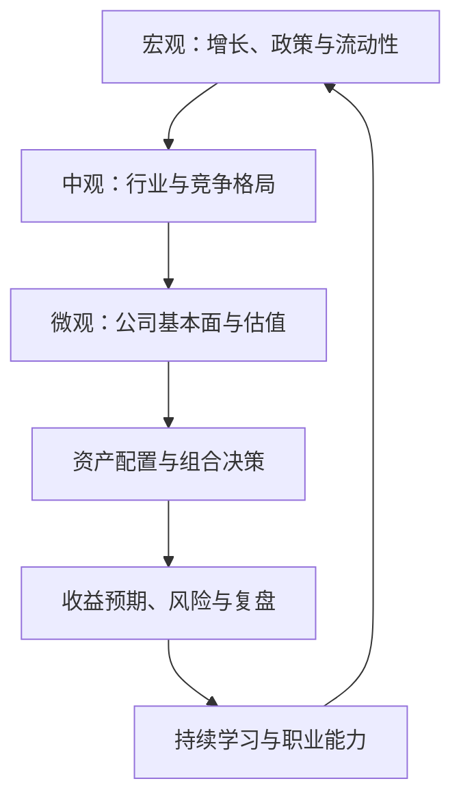

## 投资入门与职业发展

> 核心关系：投资分析由宏观、中观和微观逐层收敛到配置决策，并通过收益风险复盘推动能力积累。

## 一、炒作与诈骗案例

**炒作与博弈**：2021 年新能源行情中容百科技从 70 元附近跌到十几块。散户喜欢波段操作，某燃气公司股票 2.65 元的案例里，散户常常低点割肉、高点追入。市场存在羊群效应与大户"抬轿子"现象——有人想拉，有人接盘。

**必须警惕的诈骗套路**：

- **期权"192 倍"骗局**：网络平台宣传某期权一天涨 192 倍，1 万元进去、192 万元出来；实际该品种成交量只有几百万，博主晒的账户都是假的。所有"一天百倍""稳赚"的宣传都是骗子。
- **50 元荐股群**：群里全是"托"。
- **假冒网站**：骗子网站自称"上交所某某老师"，用近似官方域名混淆。
- **盗用讲课视频**：骗子盗用老师讲课视频做节目，四川某地级市公安专程到上海核实；涉案最大个案为长沙一位女士损失 3000 万元，全案案值约 2 亿元。

应对口诀：**不出钱、不参与、赶紧报警**。

## 二、合理收益预期

**"年化 20% 难不难"**：巴菲特三期年化收益率——1957-1972 年约 21.7%、1976-1998 年约 31.0%、1999-2018 年约 9.4%，大师晚年也达不到 20%。美国学者 Powell 2002 年统计：约 5% 的企业能连续 10 年以上保持增长，约 5‰ 的企业能连续 20 年，约万分之 4 的企业能连续 50 年。中国改革开放以来经济年化增速约 10%。

**合理收益预期三把尺子**：跟自己比——成熟投资者实盘 7% 以上已属优秀；跟其他品种比——跑赢无风险利率（3%-4%）；跟经济市场比——跟上实体增长（5%-10%）。不要给自己设硬性年化目标，波动要小。

**市场行为数据**：2021 年、2022 年投资者调查显示平均期望收益分别高达 23.5%、22.3%，普遍高于现实。2014-2015 年牛市散户频繁交易合计亏损约 2500 亿元；2016-2019 年熊市里 10 万元以下账户平均亏损超 20%；"924 行情"警示牛市走太快同样会亏。

**天赋与复利**：老师同学（数学奥数国家队出身、清华读研）炒股 4 年账户做到约 4 亿元，生日会上当众"表演拉涨停板"；按现在的标准会被约谈"为什么拉涨停"。结论：大学四年炒股还没炒出来，基本说明没有炒股天赋，不要幻想靠炒股成为亿万富翁，只能正儿八经投资、靠复利，目标一年赚 5%-8% 或 10% 出头。钱到一定程度后炒股难度反而上升，进出会暴露需求、被市场盯上。

## 三、遛狗理论

**遛狗理论**：价格围绕价值波动——人在遛狗，狗跑前跑后，但始终被绳子拴着。做投资盯的是"值不值"，看基本面：毛利率、每股盈利、成长性、行业分析、市场占有率、内部治理。

投资像谈恋爱，但股票对你没有感情——不要一厢情愿。

## 四、宏观中观微观分析框架

**宏观**：政治、经济、历史、军事。

**中观**：行业格局演变、产业技术进步、上下游产业链变迁。

**微观**：发展战略、公司治理、管理层素质、财务状况、产品创新、营销策略。

## 五、资产配置观

**配置而非赌一把**：M2 已约 300 万亿元，钱"总有地方去"，关键在于配置而非赌一把。降低预期、相信配置、用时间换空间，让复利发挥作用。

**标准普尔家庭资产象限图**：家庭资产按用途分四份——必须花的钱（现金/日常开销）约 10%，保命的钱（保险杠杆）约 20%，生钱的钱（股票、基金等权益类资产）约 30%，保本升值的钱（债券、信托、养老金等稳健资产）约 40%。象限的思想比具体比例更重要：把钱按用途分开管理、各司其职，具体比例随家庭情况调整。

**可投资品种**：A 股账户还可买海外 ETF、商品 ETF，起点一两百元，可做全球配置；可转债底部横盘后可能爆发，但高溢价风险不可忽视。

## 六、求职建议

**证书是投行敲门砖**：注会（CPA）、CFA、司法考试、保代考试，超强学习能力与坚韧风格是基础。一名学生考出注会、保代、律师资格证三者，在无领导小组讨论中全程未发言后凭此逆袭——大学阶段能考出这三证者极少，有其一即对投行求职非常加分。

**实习与社会实践**：走出校园做实习，在实践中了解自己、团队、企业、社会，提前布局下一阶段。

**底线意识**：金融行业常被中纪委点名，只赚应该赚的钱。浙江巡视后四大行在任/前任行长、杭州银行行长、浙商银行行长、浙商证券原高管等先后被带走。

**数字化能力与研究能力**：数字化会成为与 Office 同级的默认基本技能，AI 工具已普遍用于日常办公与报告撰写。提升研究分析能力，建议学一门与金融不同的"副业"。

**职级体系**：MD/ED/D/SVP/VP/SA/A/An/AS 阶梯，源自外资投行。MD（董事总经理）属最高职级头衔，接近高管或部门负责人；应届本科入职为倒数第二级，博士生为 A 级，3-5 年可至 SA，VP 可带小团队、独当一面。

**校招结构**：总部管理培训生（18 个月培养期，在业务条线内轮岗后定方向）、财富条线财富培训生、投行条线投行培训生（上海、杭州）、研究所总量/行业研究助理岗、自营投资总部（债券、股票研究及交易岗位）、金融科技研发部等。
