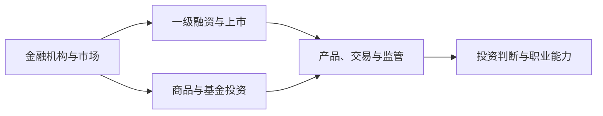

## 前沿金融实务专题

> 业界嘉宾讲座课，由财通证券、上海证券交易所、浙江证监局等合作支持，每讲由从业者主讲，主题相对独立。按"制度—机构—实务—方法—入门"的顺序组织

> 核心关系：前沿金融实务把机构、市场、融资、交易和投资连接起来，强调制度流程与实际决策。

## 课程简介

- [前沿金融实务专题课程导论](00-intro.md)：系列主题概览与文章体系

## 市场与机构

- [公募基金行业的改革与发展](01-mutual-fund-industry-reform.md)：公募行业定义与商业模式、规模从 0.9 万亿到 32.3 万亿的演进、固收与货币基金增长逻辑、权益类产品谱系与主动权益业绩实证
- [券商业务全景](02-securities-firm-business-overview.md)：全牌照券商集团架构、四大主营业务、从业人员与 IPO 政策趋势、投行向产业投行转型、研究所与财富管理转型
- [交易所与交易机制](03-exchanges-and-trading-mechanisms.md)：上交所沿革与发行制度演进、四大板块定位、集中撮合与集合竞价等交易机制、价格笼子与异常交易监管

## 一级市场与上市实务

- [一级市场股权投资](04-primary-market-equity-investing.md)：行业历史与 2025 年市场数据、机构投资逻辑与 PE 四个关注点、项目开发与尽职调查框架
- [投资银行业务流程](05-investment-banking-process.md)：投行角色与全生命周期服务、板块上市标准、IPO 业务五阶段与审核流程、市场周期
- [北京证券交易所业务](06-beijing-stock-exchange.md)：新国九条与 3·15 新政、深改 19 条、四大板块对比、上市流程与审核关注事项

## 商品与基金实务

- [大宗商品期货实务](07-commodity-futures-practice.md)：商品交易行业生态、主力合约/基差/期限结构、小船理论、全球宏观主线
- [公募基金投资方法](08-mutual-fund-investing.md)：巴菲特赌局与胜率思维、指数编制方法、按含权量的基金分类、ETF 套利、量化与基金评价

## 投资入门与职业

- [投资入门与职业发展](09-investment-career-guide.md)：炒作与诈骗案例、合理收益预期、遛狗理论、宏观中观微观框架、资产配置观、券商求职建议
