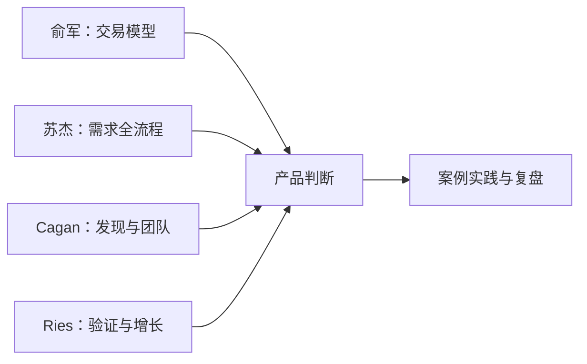

## 读书笔记

本站的原创读书笔记系列。与 [信息源索引](../info-sources.md) 互补：那页是渠道索引，本页是**已完整阅读原书全文后**沉淀的精读笔记，可放心引用。

### 阅读原则

- 每篇笔记都基于**原书全文**的阅读（原文已获取并逐章读完），参考他人笔记仅为辅助，内容以原文为准。
- 笔记结构统一：定位句 → 核心框架 → 关键概念与观点 → 与 AI 产品经理的结合点 → 局限与批判（个人阅读判断）→ 可引用原文（外文原版注明原文与中文译文，出处标到章节）。
- 书单以产品方法经典为主，逐步扩充；欢迎按「如何参与」流程补充新书笔记。

### 书单

| 书 | 作者 | 笔记 | 一句话定位 |
| --- | --- | --- | --- |
| 《俞军产品方法论》 | 俞军 等著（中信出版集团，2020） | [笔记](yujun-product-methodology.md) | 把经济学（交易）与心理学系统性引入产品工作，"产品即交易" |
| 《人人都是产品经理 2.0》 | 苏杰 著（电子工业出版社，2017） | [笔记](pm-2-0.md) | 中国互联网产品经理的入行第一书，从需求出发串起全生命周期 |
| 《启示录》INSPIRED | Marty Cagan（Wiley，2018 第二版） | [笔记](inspired.md) | 硅谷产品经理的"圣经"：赋权团队 + 产品发现与交付的连续循环 |
| 《精益创业》The Lean Startup | Eric Ries（Crown Business，2011） | [笔记](lean-startup.md) | 把科学方法引入创业管理：构建-测量-学习反馈循环 |

### 阅读建议

- 四本对照阅读效果最佳：俞军给"交易"的底层语言，苏杰给"需求"的全流程地图，Cagan 给"发现与团队"，Ries 给"验证与增长"。

核心关系是：四本书分别补足交易、需求、发现和验证四个视角，汇合为产品判断并回到案例实践。

- 与 [信息源索引](../info-sources.md) 中对应作者的博客/订阅（苏杰、Marty Cagan 等）搭配使用：书是体系的骨架，博客是持续更新的动态内容。
