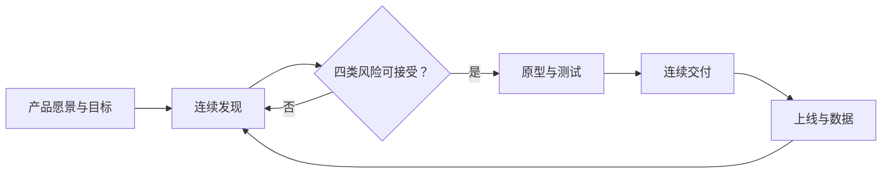

## 启示录（INSPIRED）

> Marty Cagan 著，Wiley 2018 年第二版（英文原版；中文版《启示录：打造用户喜爱的产品》，七印部落译）。
> 本文是基于**原书全文**的原创精读笔记（本站读书笔记系列之一，见 [索引](index.md)）。

硅谷产品经理的"圣经"——核心不是流程技巧，而是**赋权的产品团队**（missionaries，而非 mercenaries）+ **产品发现（discovery）与交付（delivery）的连续循环**。作者是 Silicon Valley Product Group 创始人，曾任 HP 工程师、Netscape 副总裁、eBay 产品与设计高级副总裁。

## 核心框架

| 维度 | 内容 |
| --- | --- |
| 四类风险 | 价值风险（用户会不会买/用）、可用性风险（会不会用）、可行性风险（工程师能否做出来）、商业可行性风险（业务是否可行）——**必须在动工前解决**，另加伦理风险（"应不应该做"） |
| 两大活动 | 连续发现（验证想法）+ 连续交付（产品化上线），并行进行；发现用原型、交付出产品 |
| 全书结构 | 人（Right People）→ 产品（Right Product）→ 流程（Right Process）→ 文化（Right Culture） |
| 两个不愉快真相 | 至少一半的想法不会成功（好团队按 3/4 假设）；即使成功的想法也要多次迭代才产生商业价值（time to money） |

核心关系是：发现先降低价值、可用性、可行性与商业风险，交付上线后再用数据驱动下一轮发现。

大多数公司还在走"想法 → 路线图 → 商业论证 → 需求文档 → 设计 → 工程 → QA → 上线"的**伪敏捷瀑布**：销售与利益相关者驱动的想法、写文档的 PM、晚到场的工程师、风险全部堆在末尾、客户验证发生在最后。这就是多数产品失败的根源。

## 关键概念与观点

### 1. 产品团队（Right People）

- **"We need teams of missionaries, not teams of mercenaries"**（John Doerr 引语）：传教士为愿景与客户问题而战，雇佣兵只执行指派。
- 团队构成：1 产品经理 + 1 产品设计师 + 2～12 名工程师；**同地办公、长期稳定**、对结果赋权并问责；产品经理不是任何人的老板（唯一例外：PM 是"CEO of the product"，但没有下属）。
- 工程师是**最好的创新来源**：如果只用他们写代码，只拿到了一半价值——必须让他们参与发现。
- 好团队每周测试 10～20 个产品想法（用原型，数量级地便宜于做产品）。

### 2. 产品经理的职责

- 四项深度知识：**客户、数据、业务（含利益相关者约束）、市场与行业**。加"聪明、有创造力、坚韧"的素质。
- "产品成功是团队的功劳；产品失败是产品经理的责任。"这也解释了为何 PM 是未来 CEO 的训练场。
- product owner 只是产品经理职责的一小部分；Split 两者会损失团队创新能力。
- 建议每个 PM 学两门课：编程入门（"不是 HTML"，要有真正的编程课）与商业会计/财务。
- PM 必须亲临每一次定性价值测试——"不要委托给别人，你的月薪取决于此"。

### 3. 路线图与目标（Right Product）

- **路线图是浪费与失败的根源**：一旦把想法写进名为 roadmap 的文档，全公司就会把它当作承诺。而此刻既不知道能赚多少钱，也不知道成本——商业论证的输入是"无法知道的东西"。
- 替代方案 = **产品愿景 + 产品战略 + 业务目标（OKR）**，配合"高诚信承诺"（high-integrity commitment：先做发现、再对日期和结果做承诺）。
- 产品愿景描述 2～10 年后想创造的未来（storyboard / visiontype 形式，用于激励而非规格）；产品战略是**一系列产品/市场契合（product/market fit）的序列，一次只聚焦一个目标市场**。
- 愿景原则："爱上问题，而不是解决方案"、"在愿景上固执、在细节上灵活"（Bezos）、"痴迷于客户而非竞争对手"。
- OKR 的关键：Key Results 度量**业务结果**而非输出；OKR 放在**产品团队**层面，而不是职能部门层面；每个团队 1～3 个目标。

### 4. 产品发现（Right Process）

- 发现的前提：**"客户不知道什么是可能的——技术产品中，我们都要亲眼看到才知道自己要什么"**。不能指望客户、高管告诉我们做什么。
- 价值最重要——"只要客户能用，不等于客户会用"；必须**显著优于**现有方案，用户才愿意迁移（feature parity 不够）。
- 发现技术全家桶：framing（机会评估四问：业务目标/关键结果/客户问题/目标市场；客户信；创业画布）、planning（故事地图；**客户发现计划**——在目标市场培养 6 位参考客户，这是"未来成功最好的领先指标"，产品/市场契合的实用定义）、ideation（客户访谈、**门童测试**、客户"不当行为"、黑客日）、原型（可行性/用户/实时数据/混合"绿野仙踪"四类；**MVP 应该是原型而不是产品**）、测试（可用性、定性质、定量 A/B、需求测试的假门/落地页、可行性、商业可行性）、转型（发现冲刺、试点团队、戒掉路线图）。
- 定性测试是"最重要的发现活动"：每周 2～3 次；定量告诉"发生了什么"，定性解释"为什么"。
- 面向风险规避的大公司：用 ≤1% 流量 A/B、邀请制、NDA 下的参考客户来"负责任地创新"；"对科技公司而言，停止创新就是死亡"。

### 5. 规模化与文化（Right Culture）

- 规模化三支柱：**整体视角（holistic view）** 三角色（产品负责人/设计负责人/技术负责人）、GPM（player-coach，一半独立贡献一半带人）、平台产品团队；自治（autonomy）与基础杠杆（leverage）的权衡。
- 好团队 vs 坏团队对照表（第 64 章）：好团队从愿景、客户挣扎、数据、新技术获得灵感；坏团队从销售和利益相关者收集需求。
- 创新丧失的十个原因（缺客户中心文化、愿景、聚焦战略、强 PM、稳定团队、工程师参与发现、**企业勇气**、赋权团队、产品思维、创新时间）；速度丧失的十个原因（技术债、弱 PM、缺交付管理、发布频率低、缺愿景战略、分散团队、工程师参与晚、设计未进发现、优先级剧变、**共识文化**）。
- 产品文化 = **创新文化**（实验、开放、赋权、技术、业务与客户通达、多样、发现技术）+ **执行文化**（紧迫、高诚信承诺、问责、协作、结果、认可）两个维度；两强兼备的公司（如 Amazon）很少。

## 与 AI 产品经理的结合点

- **AI 放大了"价值风险"**：模型 demo 惊艳但无真实需求是 AI 产品最常见的死法——"客户不知道什么是可能的"对生成式 AI 加倍成立（客户想不到也不信任未见过的新能力），更需要用发现流程去找问题，而不是堆"AI 功能"。
- **四类风险在 AI 场景的映射**：价值风险（愿不愿意付费）、可用性（提示词交互与输出格式的设计）、可行性（模型选型、幻觉率、延迟与 token 成本——AI 的可行性风险远高于传统软件，**可行性原型**（小样本跑通 RAG/Agent 链路）必须先做）、商业可行性（推理成本结构、数据合规）。
- **门童测试与绿野仙踪原型是 AI 产品天然起手式**：人工冒充 AI（"AI 已读回执"、人肉客服）验证需求与价值，再谈自动化——与《精益创业》最小化浪费同源，苏杰的"假退款按钮"也是同一手法。
- **假门/落地页需求测试**用于 AI 功能立项：管理层"给产品接个大模型"的想法，先用一个假按钮测点击率，避免产品级工程投入。
- **MVP 误区在 AI 时代更严重**：为 AI 功能做产品级工程（评测、合规、全链路）却未验证价值。牢记"MVP 是原型，不是产品"。
- **定性测试不可委托** + "数据解释不了为什么"——正好补上 AI 评测的盲区：指标（幻觉率、通过率）之外，PM 必须亲自看用户与 AI 交互的过程。
- **工程师参与发现**对 AI 产品尤其关键：模型能力边界与提示词工程只有工程师/科学家最清楚，"技术驱动的创新"是 AI 产品的主流形态。
- **"痴迷客户而非竞争对手"**：模型能力趋同、套壳同质化的市场里，差异化只能来自对客户的深度理解。
- **伦理风险**（"Should we build it?"）：深度伪造、隐私、偏见、成瘾设计——AI 产品经理必须把伦理纳入发现流程。
- OKR 的 Key Results 可写 AI 特有指标（成本/token、延迟、幻觉率、采纳率），但记住要度量**业务结果**而非"接入了几个模型"。

## 局限与批判（个人阅读判断）

- 经验来源集中于硅谷 to C / 平台型公司（HP、Netscape、eBay、Adobe、Netflix、Apple、BBC），对国内环境、强运营驱动的公司、组织内部产品（IT 系统）适配度需要自行转换。
- 对大企业的建议偏原则性，"你需要强的产品领导"是前提而非结果——书中也承认大多数企业做不到；对组织政治与权力斗争的讨论偏少。
- 作者明确拒绝"配方"（"no silver bullet"）：原则持久、技术迭代快，2018 年版的案例与技术背景（如机器学习初入产品领域）需要按当下语境更新。
- 对 MVP 的"原型化"批判与《精益创业》的原型精神一脉相承，但两书对"先做最小产品上线验证"的态度存在张力，建议对照阅读（本站另有《精益创业》笔记）。
- 全书重产品组织与流程，对商业模式设计、定价、增长引擎着墨相对少（这些在作者后续《转型》等书与 OKR 实践中补足）。

## 可引用原文

- "We need teams of missionaries, not teams of mercenaries."（我们需要传教士团队，而非雇佣兵团队。——John Doerr 引语，第 9 章）
- "When a product succeeds, it's because everyone on the team did what they needed to do. But when a product fails, it's the product manager's fault."（产品成功是团队的功劳；产品失败是产品经理的责任。——第 10 章）
- "The first truth is that at least half of our ideas are just not going to work."（第一个不愉快真相：至少一半的想法不会成功。——第 6 章）
- "Customers don't know what's possible, and with technology products, none of us know what we really want until we actually see it."（客户不知道什么是可能的；技术产品中，我们要亲眼看到才知道自己要什么。——第 33 章）
- "Fall in love with the problem, not with the solution."（爱上问题，而不是解决方案。——第 25 章）
- "Be stubborn on vision but flexible on the details."（在愿景上固执，在细节上灵活。——第 25 章，引 Jeff Bezos）
- "Obsess over customers, not over competitors."（痴迷于客户，而非竞争对手。——第 26 章）
- "It's all about outcome, not output."（一切在于成果，而非产出。——第 23 章）
- "The MVP should be a prototype, not a product."（MVP 应该是原型，而不是产品。——第 8 章）
- "If you stop innovating, you will die."（如果停止创新，你就会死。——第 52 章）
- "The most important thing is to know what you can't know."（最重要的事情是知道什么是你无法知道的。——第 33 章，引 Marc Andreessen）
