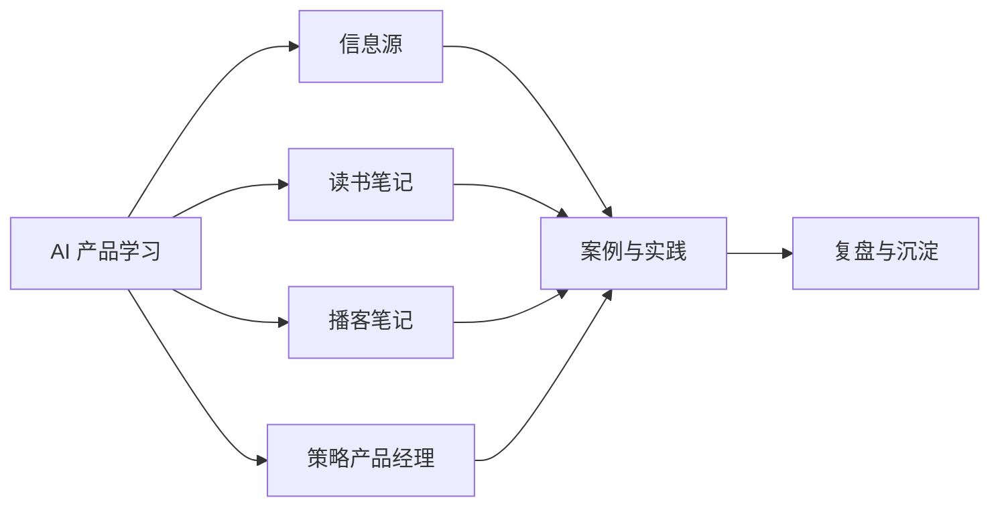

## 学习资源简介

本栏目收录**信息源**、**读书笔记**、**播客笔记**与**策略产品经理**专题，把方法论落到实践中。

核心关系是：信息源、书籍、播客与策略专题共同输入案例实践，再通过复盘沉淀为可复用的方法。

## 内容列表

-   信息源
    -   [资源清单](resources.md)：书、课程、网站、社区清单
    -   [信息源索引](info-sources.md)：高质量信息渠道索引
-   [读书笔记](books/index.md)：原创精读笔记（《俞军产品方法论》《人人都是产品经理 2.0》《启示录》《精益创业》）
-   [播客笔记](podcasts/index.md)：基于播客节目整理的产品与求职经验
-   [策略产品经理](strategy-pm/index.md)：把公开课程整理为概念、发现问题、需求验证与四类业务应用

## 怎么用本栏目

-   练拆解：产品拆解框架与真实案例见 [AI 产品实战 · 案例分析](../practice/case-analysis/index.md)
-   学习资源优先实践类内容，以能落地为准
-   欢迎分享学习资源与信息渠道（见[如何参与](../intro/htc.md)）
