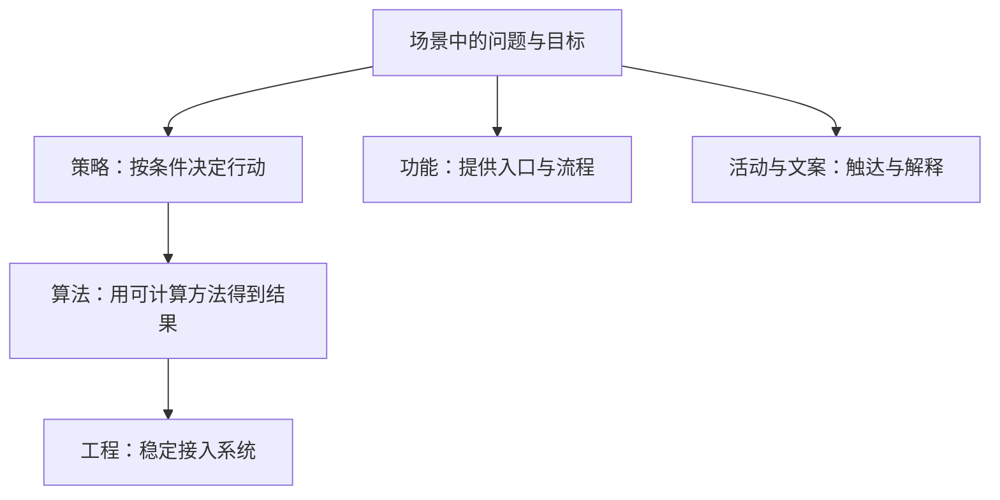
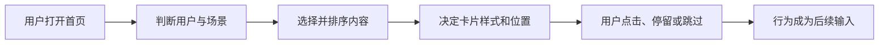

## 策略是什么

策略是一种解决问题的手段：在某个场景里存在一个问题，为了达到某个目标，设计一套规则、逻辑或决策方法，决定接下来采取什么行动。

营销策略、投资策略、新闻推荐策略、催收策略、定价策略名字不同，都可以还原成同一个句式：在某个场景里，针对某个问题，为了某个目标，根据条件决定采取什么行动。

「这个环节转化率低，我们设计一个策略提高转化率」这句话里，「策略」也可以替换成「功能」「活动」或「文案」。它们是并列的解决问题手段。

核心关系是：策略回答「要解决什么、在什么情况下做什么」；算法回答「如何算出来」；工程回答「如何接进去」。

一个满减门槛可能主要由人工配置和条件判断组成；一个推荐策略可能由多个模型、排序规则和人工约束共同实现。产品经理首先要把问题和决策目标说清楚。

### 策略通常是隐性的

用户直接感知到的是新闻列表、货架商品、地图道路、汽车是否平顺。用户不一定能看到：为什么这条内容排在第一条、为什么某款商品被选进货架、为什么当前比例尺隐藏了某些地标、为什么车辆此刻升挡。

这些看不见的决定，就是策略发挥作用的地方。策略可以嵌在内容分发、排序、定价、调度、预警或展现形式中。

隐性描述的是策略不一定直接出现在界面上。推荐、广告、定价和风控仍要能回答：

-   用户看到的结果由哪些大类因素影响
-   哪些因素是用户主动行为，哪些是系统推断
-   结果不理想时，用户是否有反馈、纠正或退出的方式
-   策略失效或数据缺失时，系统如何降级

### 命名与识别

「新闻」「电商」「社交」「汽车」是行业或产品领域；「推荐」「定价」「调度」「预警」更接近策略所服务的动作或目标。任何行业都可能有策略。

更准确的说法是：具体产品形态中包含了策略。新闻 App、实体货架、汽车控制系统，都可能由策略支撑。

把抽象的「策略」落到具体问题上，可以用：`[行业/场景] + [目的/动作] + 策略`。例如：新闻推荐策略、反欺诈策略、价格策略、配送策略。看到「后台策略」这种模糊说法时，继续追问：后台哪个环节、服务谁、要改善什么指标、根据哪些输入做决定。

识别策略的关键方法是：从「产品展示了什么」反推「系统做了什么选择」。只要存在选择，就可以问选择依据是什么；只要选择依据会随用户、内容或场景变化，就很可能需要策略。

### 从现象反推选择

今日头条是同一条用户路径上的多层决策：

| 用户看到的现象 | 背后的策略 | 它在解决什么问题 |
| --- | --- | --- |
| 不同用户看到的新闻不完全相同 | 个性化推荐策略 | 从大量内容中找到更可能被某个用户感兴趣的内容 |
| 内容来自不同来源 | 抓取策略 | 持续获得内容，并处理来源差异 |
| 卡片有的纯文字、有的图文混排 | 展现策略 | 在有限空间中选择更合适的表现形式 |
| 输入关键词后返回结果 | 搜索策略 | 找到与查询更相关的结果 |
| 新闻被归入推荐、热点、本地、视频等栏目 | 页面识别策略 | 自动判断类别，减少人工逐条标注 |

便利店货架可以用三个问题拆开：

1.  **为什么是这些商品？** 空间有限，需要选品策略，在销量、毛利、偏好之间取舍。
2.  **为什么这款做促销？** 「两瓶十元」而不是三瓶或八元，是促销策略对购买人数、客单价和利润的权衡。
3.  **为什么放在这一层？** 货架摆放策略影响被看见的概率和购买路径。

同一件商品可能同时被多套策略影响：选品决定「有没有」，促销决定「卖多少钱」，摆放决定「是否容易被看见」。策略围着业务目标分布在完整链路中。

跨形态只需记住同一结构：采集状态，判断条件，输出动作。

-   **地图**：搜索按钮是功能；如何从候选路线中选择、排序、渲染、预估到达时间，是策略。
-   **美团**：同一张商家列表可能同时经过召回、排序、广告、补贴和履约调度。
-   **汽车控制**：自动换挡、车身稳定、下坡车速控制、安全预警，用户感知的是平顺或安全。
-   **线下便利店**：选址、选品、定价、促销、补货，只要决策面对不同条件、需要在目标之间取舍，就可以用策略视角分析。

同一个业务目标往往需要多种手段共同完成。以提高课程购买转化率为例：功能提供试听和购买入口；策略根据兴趣、价格和学习进度推荐；文案解释价值和规则；活动提供时段优惠；监控观察曝光到退款。先明确哪个环节的问题由哪种手段解决，再设计接口和评估指标。

### 判断一个问题适不适合用策略

先过六个问题：

1.  **问题是什么？** 找不到内容、转化不足、配送效率低，还是安全风险高？不要只说「体验不好」。
2.  **目标是什么？** 点击率、销量、利润、准时率，还是降低风险？多个目标冲突时要明确优先级。
3.  **决策对象是谁或什么？** 用户、内容、商品、订单、路线、车辆，还是后台任务？
4.  **决策是否需要因人、因时、因地变化？** 所有情况都执行同一个动作时，固定功能可能更简单。
5.  **系统有哪些可用输入？** 行为、特征、库存、时间、位置、路况等是否可获得且足够可靠？
6.  **输出能否执行和评估？** 必须产生可执行结果，并能用指标或用户反馈判断是否有效。

「给所有用户首页展示同一个公告」更接近固定功能；「根据用户是否已读决定是否展示公告」更接近策略，因为它开始按条件做不同处理。

### 沿用户路径找决策点

观察产品时，沿「用户提出需求 → 系统处理 → 用户得到结果」记录，避免把整个 App 简化成一个策略，也避免只看到按钮：

核心关系是：「打开首页」是功能入口，「选择并排序」「决定样式」是策略决策，「点击和停留」是效果反馈。

便利店可以套同一条链：进店 → 按位置、库存、历史销量安排商品 → 货架决定展示 → 促销决定价格 → 购买结果影响下次选品和补货。

不要笼统地说「这里有策略」，而要拆成具体决策点。以内容产品为例：

| 决策点 | 系统在选择什么 | 可能的依据 | 可能的输出 |
| --- | --- | --- | --- |
| 内容获取 | 从哪里拿内容 | 来源质量、更新频率、版权状态 | 候选内容集合 |
| 内容匹配 | 给谁看什么 | 用户兴趣、内容主题、时间 | 候选分数或集合 |
| 内容排序 | 先展示什么 | 相关性、时效性、质量 | 排序结果 |
| 形式选择 | 用什么样式呈现 | 内容类型、设备、位置 | 卡片样式 |
| 反馈处理 | 如何利用用户行为 | 点击、停留、跳过、投诉 | 下一次决策的输入 |

「推荐策略」可能包含召回、匹配、排序、去重和展现。拆分之后，问题更容易定位，也更容易确定由哪个团队负责。

写完对某个策略的理解后，用这一句自检是否完整：在什么场景下，系统根据哪些输入，通过什么逻辑，输出什么结果，以改善什么指标？说不清其中任何一段，就还停留在感觉。要把感觉落到可填写的要素，见[策略四要素](02-four-elements.md)。

### 误区与边界

-   **把「复杂」当成策略的必要条件。** 自动调节亮度的线性规则是简单策略；推荐系统可能非常复杂。关键在于是否根据问题相关因素做出条件化决策。
-   **以为策略只能由算法工程师负责。** 研发负责实现计算逻辑，产品经理仍要负责问题、目标、输入、输出、约束和评估方式。
-   **看到任何规则都叫策略。** 固定文案、单一页面流程、一次性活动，只有当成决策问题、存在条件变化或目标权衡时，策略视角才有价值。
-   **只看用户体验不看商业目标，或只看商业目标不看用户代价。** 促销、广告、推荐都可能提升商业指标，也可能带来打扰、误导或信任损失。
-   **把观察案例当成完整技术方案。** 今日头条、货架、地图、汽车的例子用来建立感觉。真正落地还要补数据质量、异常处理、权限、安全、实验和监控。

所有场景都只需执行同一个固定动作时，用功能或固定规则通常更简单；决策会随人、时、地变化，且输入可获得、结果可评估时，才值得进入策略设计。固定方案何时不够用，见[策略如何诞生](03-how-strategy-emerges.md)。

### 延伸阅读

-   [概念基础](index.md)：本模块四篇文章的阅读顺序
-   [策略四要素](02-four-elements.md)：把策略拆成待解决问题、输入因素、计算逻辑、方案输出
-   [策略如何诞生](03-how-strategy-emerges.md)：固定方案无法满足差异化时，策略如何从硬件和功能中长出来
-   [策略产品经理的工作循环](04-workflow.md)：把决策问题做成可迭代项目
-   [策略产品经理专题](../index.md)：七个模块总图

## 来源说明

???+ note "来源说明"
    本文根据公开课程《策略产品经理》（B 站 [BV1YE411g717](https://www.bilibili.com/video/BV1YE411g717/)）整理为知识点，不是逐课笔记。

    课程中的数字、阈值和公式是教学示意，不能直接当作可上线参数。

    对应原课第 1 集。整理日期：2026-09-04。
