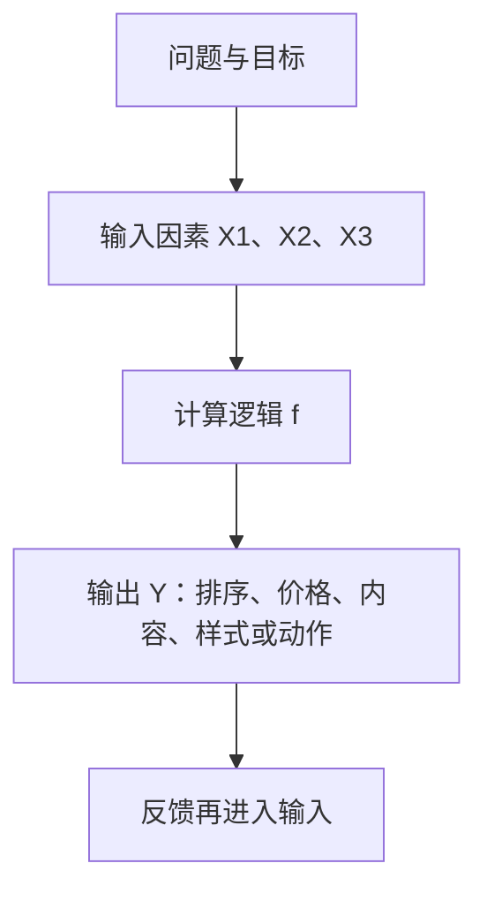

## 策略四要素

策略是针对某个问题设计的手段。把它拆开，只有四个核心要素：

1.  **待解决问题（Problem）**：为什么要做这套策略，想改善什么现象或指标。
2.  **输入因素（Inputs）**：影响决策的变量，包括用户、内容、环境、时间、行为等信息。
3.  **计算逻辑（Logic / Algorithm）**：如何把输入转成判断、分数、规则或优先级。
4.  **方案输出（Output）**：系统最终采取或呈现的决策结果。



核心关系是：四要素必须连成闭环。只有输入没有问题，容易变成收集一堆数据；只有问题没有逻辑，仍然停留在愿望；只有逻辑没有输出，研发无法实现；只有输出没有评估目标，则无法知道策略是否有效。

遇到任何策略，连续追问四句：要解决什么问题？依据什么输入？通过什么逻辑？最后输出什么动作或结果？产品经理必须能定义问题、目标、输入、输出和评估方式；策略研发通常负责具体算法实现。

### 从功能到策略：亮度为什么会变成多元函数

同一问题可以先用功能解决，再演进成策略。电子书阅读器的屏幕亮度是最清楚的对照。下列公式是教学示意，不能直接当作可上线参数。

**版本一：手动开关，是功能性方案。** 光线暗时看不清，最直接的方案是加背光灯，让用户手动打开或关闭。输出可以粗略写成：

$$
Brightness = \begin{cases}
0, & 用户关闭背光\\
1, & 用户打开背光
\end{cases}
$$

它解决了「能不能补光」，但没有替用户判断什么时候该补多少光，用户必须承担操作成本。

**版本二：按环境光自动调节，是简单策略。** 输出不再只由用户开关决定，而受环境亮度影响：

$$Brightness = f(环境光)$$

课程将其类比为一次函数，重点不在数学形式，而在于：系统开始根据外部条件自动选择输出。这已经是策略的雏形。

**版本三：多因素共同决策，是复杂策略。** 环境光解释不了全部需求：游戏可能希望更亮，阅读可能希望柔和；户外、室内、白天、夜间也可能不同。用户仍然主动调亮或调暗，说明原有策略遗漏了影响因素。于是：

$$Brightness = f(环境光, 应用类型, 时间, 场景, 用户习惯, \ldots)$$

策略是根据多个变化因素，在不同情况下给出不同结果。公式用于帮助理解输入-逻辑-输出关系，不代表完整工程算法。

| 维度 | 功能方案 | 策略方案 |
| --- | --- | --- |
| 决策路径 | 预先规定、相对固定 | 根据输入动态变化 |
| 用户责任 | 用户完成更多选择 | 系统代替用户做部分选择 |
| 典型表达 | 点击按钮后打开背光 | 在当前场景输出合适亮度 |
| 复杂度来源 | 主要是流程和交互 | 用户、场景、数据和目标的组合 |
| 迭代方式 | 验收功能是否按预期工作 | 持续评估并调整输入、逻辑和权重 |

亮度调节入口是功能，自动决定亮度的规则是策略。一个完整产品往往由功能提供操作界面，由策略决定具体内容或数值。功能何时不够，见[策略如何诞生](03-how-strategy-emerges.md)。

### 要素一：待解决问题

起点不应写成「做一个推荐」「加一个模型」或「优化一下体验」，而应描述当前现象、目标对象和希望改善的结果。

按顺序追问：

1.  **哪里出了问题？** 例如用户看不到感兴趣的内容、促销效果不稳定。
2.  **谁受到影响？** 所有用户、某一类用户，还是某些时段的用户？
3.  **问题的结果是什么？** 点击率低、销售额低、操作成本高，还是体验不一致？
4.  **成功如何判断？** 需要一个可观察的指标或明确的行为变化。

「推荐不好」可以改写为：「首页候选内容很多，但用户点击和有效阅读不足，希望在不明显增加打扰的前提下，提高用户对前几条内容的兴趣。」这仍不是完整需求，却比「优化推荐」更接近可分析的问题。

问题是当前状态与理想状态之间的差距；目标是希望把差距缩小到什么程度。策略常常有多个目标，例如促销既要提高销售额，又不能让利润过低。需要说明主目标、次目标和不能突破的约束。

### 要素二：输入因素

输入是影响最终决策的变量。它是与问题和目标有因果或决策关联的信息，系统里所有能拿到的数据并不自动成为输入。

常见类型：

-   **用户因素**：基础属性、历史行为、当前意图、偏好与厌恶
-   **对象因素**：内容的类别、主题、质量、价格、库存
-   **场景因素**：时间、地点、设备、天气、应用类型、流量状态
-   **系统因素**：库存、供给、服务能力、历史质量、风险状态
-   **反馈因素**：点击、停留、购买、取消、投诉等结果数据

纳入一个输入前，用三个问题筛选：它是否可能影响用户需求或业务结果？系统是否能稳定、合法、及时地获得它？加入它后，是否能让输出更准确或更可控？

无法获得、质量不稳定、或与目标没有关系的输入，强行加入只会增加逻辑复杂度和错误来源。还要注意时间窗口：最近一次点击和三年前的点击，对当前兴趣的解释力可能不同。

### 要素三：计算逻辑

计算逻辑回答：给定这些输入，系统如何做决定？它可以是条件规则、公式、排序、打分模型或多种方法的组合。简单条件规则也可以是策略，复杂模型也可能解决错问题。

产品经理不一定要编写算法，但应能说清：

-   输入分别影响什么判断
-   不同因素冲突时如何取舍
-   输出是分类、分数、排序，还是具体数值
-   哪些边界和异常需要人工兜底
-   逻辑上线后用什么实验或指标验证

推荐算法把用户特征、内容特征转化为「某个用户对某篇内容的相对喜欢度」，而不是把一篇文章永久标成「好内容」。同一内容对不同用户的分数可能不同，同一用户在不同时间或场景下的分数也可能不同。

### 要素四：方案输出

输出是系统最后真正执行的结果。常见输出包括：展示什么内容、排序位置、卡片样式、价格或折扣、是否触发提醒或拦截、对设备施加什么控制量。

「给用户更好的内容」不是输出；「将候选内容按预测兴趣度排序，取前 N 条展现」才是可执行输出。输出也不一定只有一个值，可能包括结果、原因、置信度和兜底动作，但需求中至少要先明确核心决策。输出必须可执行、可解释、可评估。

### 四要素互相校验

四要素是一组相互约束的关系：

-   问题变了，目标和输出可能要跟着变
-   输入变了，逻辑是否仍然成立要重新检查
-   逻辑变了，输出的含义和风险可能发生变化
-   输出上线后，反馈又会暴露问题定义或输入的遗漏

例如把推荐目标从「提高点击」改为「提高有效阅读」，原有的点击排序逻辑就可能不够，需要补充停留、阅读完成或负反馈等输入，并重新定义输出和评估方式。

| 缺什么 | 常见症状 | 先补什么 |
| --- | --- | --- |
| 缺问题 | 「做一个模型」「优化一下」 | 现象、对象、可观察结果 |
| 缺输入 | 逻辑很完整，但不知道依据什么 | 与目标相关、可获得的变量 |
| 缺逻辑 | 列了一堆数据，不知道怎么决定 | 判断、打分、排序或触发规则 |
| 缺输出 | 「更精准」「更好」 | 可执行的内容、数值、顺序或动作 |
| 缺评估 | 上线后无法说清好坏 | 指标、对照方式和观察周期 |

一个理论上得分最高的输出，未必适合直接上线。实际策略往往还要受到安全、库存、内容质量、用户体验和系统性能等约束。需求中应把「必须满足的目标」和「不能突破的边界」分开写。低置信度或输入缺失时，还要准备默认规则或人工兜底。

### 策略卡片

```text
策略名称：
1. 待解决问题：当前什么现象不好？服务谁？
2. 目标与约束：主指标、辅助指标、不可突破的边界是什么？
3. 输入因素：用户、对象、场景、系统、反馈分别有哪些？
4. 计算逻辑：如何判断、打分、排序、分层或触发？冲突怎么处理？
5. 方案输出：最终给什么内容、数值、顺序或动作？
6. 评估方式：上线后看哪些指标？如何做对照或分群比较？
7. 兜底方案：输入缺失、异常或低置信度时怎么办？
```

卡片填不满，说明还停留在「感觉有策略」，没有进入可开发状态。把这张卡片写进项目，才进入[工作循环](04-workflow.md)里的需求与评估环节。

### 短拆解

**推荐策略**

-   **待解决问题**：从大量候选内容中，找到某个用户更可能喜欢、愿意阅读的内容，并组织成最终 Feed 流。「喜欢」可通过点击、停留、阅读完成、分享或负反馈等行为近似衡量。
-   **输入因素**：用户特征与内容特征。只看用户不看内容，无法完成匹配。
-   **计算逻辑**：为每个用户-内容组合计算相对兴趣度或优先级，再加入内容质量、时效性和多样性等约束。
-   **方案输出**：把候选内容按喜欢度从高到低排序，形成用户最终看到的 Feed 流。真实产品还会涉及召回、去重、内容安全和展现形式。

**便利店促销策略**

-   **待解决问题**：为某个商品制定促销规则，使当期销售额最大。目标也可以改成销量最大、利润最大或清库存，必须先定清楚。
-   **输入因素**：不同时段人流量、原价与折扣价下的转化率、原价与促销价、促销起止时间。促销价格同时是输出决策和影响转化率的因素。
-   **计算逻辑**：将全天分为原价时段和促销时段，用简化公式比较方案（教学示意）：

$$
Total\_Sales = (Traffic_{normal} \times CR_{normal} \times Price_{normal}) + (Traffic_{promo} \times CR_{promo} \times Price_{promo})
$$

其中 \(Traffic\) 是人流量，\(CR\) 是转化率，\(Price\) 是对应价格。可以枚举不同的促销起止时间和折扣力度，选择目标值最大的方案。

-   **方案输出**：从什么时候开始、什么时候结束、促销价格或折扣是多少，必要时采用哪种组合方案。

若销量最大但利润过低，或促销导致库存和履约无法承受，就要在目标中加入约束，重新定义「最优」。

### 误区与边界

-   **把输入当成数据清单**：输入必须服务于问题和目标。
-   **把逻辑等同于复杂模型**：简单条件规则也可以是策略。
-   **只写输出，不写目标**：只说「排序」「推荐」「打折」，无法判断为什么这样做。
-   **只追一个指标**：销售额、利润、用户体验、风险可能互相牵制，要写明优先级和约束。
-   **忽略输入质量和缺失情况**：数据迟到、错误或缺失时，必须有默认规则或降级方案。
-   **认为四要素一次写完不变**：上线后的反馈可能证明某个输入无效、逻辑不合理或输出不可执行。

如果一个问题在所有场景下都只需要执行同一个固定动作，使用功能或固定规则通常更简单；如果决策会随用户、内容、环境或时间变化，且相关输入可以获得并验证，才值得设计策略。先确认这是不是策略问题，见[策略是什么](01-what-is-strategy.md)。

### 延伸阅读

-   [策略是什么](01-what-is-strategy.md)：策略是解决问题的手段
-   [策略如何诞生](03-how-strategy-emerges.md)：固定方案无法满足差异化时，才从功能演进到策略
-   [策略产品经理的工作循环](04-workflow.md)：用四要素写需求、做评估、做回归
-   [简单策略需求文档](../03-spec-and-validation/01-simple-prd.md)：把策略卡片落成可评审的简单需求
-   [复杂策略需求文档](../03-spec-and-validation/02-complex-prd.md)：四要素齐全后，如何写目标空间与 Case

## 来源说明

???+ note "来源说明"
    本文根据公开课程《策略产品经理》（B 站 [BV1YE411g717](https://www.bilibili.com/video/BV1YE411g717/)）整理为知识点，不是逐课笔记。

    课程中的数字、阈值和公式是教学示意，不能直接当作可上线参数。

    对应原课第 2 集。整理日期：2026-09-04。
