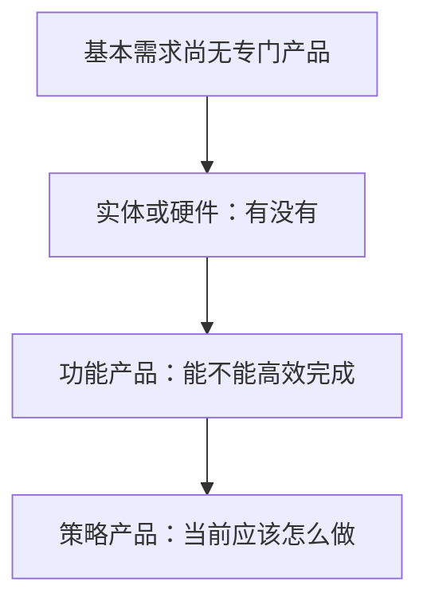
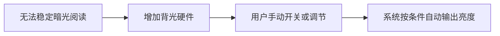
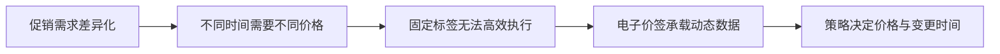

## 策略如何诞生

当固定、统一的解决方案无法继续满足差异化需求时，产品才需要策略。它是产品在效率、体验和个性化方面不断遇到新问题后的解决手段。

课程用来解释产品能力增加的观察框架是：基本需求还没有专门产品时，实体产品或硬件先解决「有没有」；功能产品让用户可以操作，解决「能不能高效完成」；用户、时间、地点、环境等差异越来越重要时，策略根据当前情况决定「应该怎么做」。



核心关系是：策略把个性化决策规模化。它在功能提供的基础能力上，进一步回答「对谁、何时、何地、以什么力度提供」。

这条路径背后有两股驱动力：技术进步让数据收集、远程计算、自动控制和大规模服务成为可能；体验与效率追求让用户不再满足于「能用」，企业也希望在服务规模扩大时，不依赖大量人工逐个决策。

这里的「进化」是观察框架。实体、软件、策略经常组合出现，未必按时间严格分层。策略是对特定约束下的性价比选择。

### 三层能力分工

| 能力层 | 主要回答的问题 | 典型价值 |
| --- | --- | --- |
| 实体 / 硬件 | 有没有承载和执行的能力 | 提供物理载体、传感器、显示或执行部件 |
| 软件 / 功能 | 用户如何操作、系统如何完成流程 | 提供界面、流程、内容管理和基础服务 |
| 策略 | 当前情境下应该采取什么决定 | 根据变化因素进行匹配、排序、定价或控制 |

现实产品往往三者合一。手机是硬件载体，新闻 App 提供软件功能，推荐逻辑负责决定每个人看到什么；电子价签是硬件，显示价格是功能，什么时候显示什么价格是策略。

-   **功能**：给所有用户提供基本浏览、下单、查看和操作流程
-   **策略**：决定不同用户在不同情境下看到什么、得到什么排序、使用什么价格或触发什么动作
-   **分工**：功能让系统可用，策略让系统在条件变化时更合适

如果所有用户都应执行同一个步骤，功能通常足够；如果需要根据用户、内容、环境或时间调整结果，就要考虑策略。这与[策略是什么](01-what-is-strategy.md)中「策略是手段」是同一判断。

### 成本视角

课程强调两层成本降低：

-   软件相对于纯硬件，可以在云端集中管理，以较低边际成本提供更丰富服务
-   策略相对于固定功能，可以在不为每个用户单独配备人工的情况下，大规模提供个性化决策

「低成本」说的是：当服务规模很大、条件变化频繁时，自动化决策能降低逐个处理的边际成本。策略的收益必须和数据、研发、维护、错误风险等成本一起评估。这句话不代表策略一定更便宜、一定更高级、或可以取消人工兜底。

### 同一需求如何一层层被满足

**屏幕阅读。** 最开始液晶屏在暗光下看不清。加入背光灯后，用户可以手动开关或细调亮度：硬件提供发光能力，功能提供入口，用户自己承担「何时开、调到多少」的决策。再往后，系统读取环境并自动输出亮度，决策责任从人转移到系统。



核心关系是：关键变化是系统开始收集环境信息、应用规则、输出随条件变化的亮度值。若只看环境光，是相对简单的自动决策；若再考虑应用类型、时间、光源和用户习惯，便可以进一步细化。多因素如何进入四要素，见[策略四要素](02-four-elements.md)。

**新闻获取。** 人们对新闻的需求很早就有，最早主要靠口口相传。报纸把新闻固定到纸面上，解决「如何集中获取」；版面有限，所有读者看到的基本是同一份内容。门户网站用软件功能提高更新速度和容量。移动信息流则把问题从「有没有内容」变成「应该给谁看什么」：用户兴趣差异增大后，统一列表不再适合所有人，系统根据用户和内容特征做选择，结果再反馈回来持续优化。

新闻产品的演进是同一需求先后由不同能力层解决：实体载体解决传播，软件功能解决获取效率，策略解决个性化组织。

### 电子价签：三层缺一不可

假设策略算出：早上两瓶十元，下午两瓶十二元，临近闭店再调低。若没有电子价签，店员就要不断打印、替换多张标签，人工成本高，执行也容易出错。更完整的方案是：

1.  **硬件**：电子显示屏，承担价格的物理展示
2.  **软件功能**：后台配置商品、价格和促销文案，并把数据发送到价签
3.  **策略**：根据时间和业务规则，决定不同时间显示什么价格、何时变更

三者缺一不可：策略算出了价格但没有显示载体，用户看不到；有电子屏但没有后台功能，管理成本仍高；有后台配置但没有动态策略，仍然需要人工逐时调整。



核心关系是：策略的价值必须通过可执行的载体实现。忽略执行载体，策略输出无法被页面、后台或硬件执行时，不能形成完整产品方案。这个短例不要求便利店必须上动态定价。

### 先判断缺的是哪一层

面对一个需求，先判断产品缺的是载体、功能，还是决策逻辑。不要用复杂策略掩盖基础能力缺陷。

1.  **能力缺失**：没有屏幕、内容、支付或配送能力，优先补硬件、数据或基础设施。
2.  **流程低效**：能力存在但操作成本高，优先改功能、流程或后台工具。
3.  **决策不精细**：流程可用但不同条件下的最佳选择不同，再引入策略。

这不是绝对的先后顺序，真实项目可能并行推进。但它能帮助解释：为什么此时应该做电子价签、推荐或动态促销。

一个新闻产品如果没有稳定的内容获取、存储和展示功能，先做个性化排序不会解决「没有内容可读」；一个门店如果没有库存和价格管理能力，先做动态促销也无法保证价格被正确执行。

用三个问题判断当前处于哪一层：

1.  **用户有没有能力完成基本任务？** 如果没有，首先补实体载体、数据源或基础功能。
2.  **用户是否必须频繁替系统做重复选择？** 如果是，可以先用功能入口、默认值或固定规则降低操作成本。
3.  **不同条件下的最佳选择是否不同，而且差异足够值得处理？** 如果是，再考虑把条件纳入策略。

一个商品每天只有一个固定价格，不一定需要动态定价：先看不同时段需求是否真的不同、改价收益是否覆盖执行成本、以及有没有可靠输入和评估。

### 五步确认是否需要策略

1.  **先确认基础能力是否存在。** 没有可用的数据入口和执行出口，直接设计策略通常没有意义。
2.  **确认统一方案是否足够。** 把用户和场景列出来，问：所有人是否都需要同一种处理？如果统一方案已经能满足绝大多数需求，策略的收益可能不足以覆盖复杂度。
3.  **找出真正造成差异的因素。** 列出这些因素，并判断是否能稳定获得。不要为了显得智能而加入与目标无关的变量。
4.  **确认是否有可执行输出。** 必须能把判断转成价格、顺序、内容、样式或控制动作。
5.  **设计反馈和迭代。** 环境会变化，必须安排数据回收、效果评估和异常兜底。

从功能走向策略，比较三类因素：

-   **收益**：是否减少人工操作、提高匹配或带来更好结果
-   **成本**：数据采集、研发、配置、维护和评估需要多少投入
-   **风险**：误判、不可解释、价格冲突或控制错误的代价多大

如果用户量很小、场景稳定，人工或固定功能可能更经济；如果用户量大、条件变化快且结果可评估，策略的规模化价值更明显。安全责任极高、输入不可靠或错误代价极大的场景，策略需要更强的人工兜底和权限控制。

### 分阶段引入

```text
阶段 0：固定规则
-   建立基本流程和数据记录
-   验证问题是否真实存在

阶段 1：小范围动态规则
-   在少量用户或特定场景试运行
-   暴露输入、输出和异常处理问题

阶段 2：按回归结果扩大
-   保留回滚和人工兜底
-   每次加入变量都要回答：它解决了哪个已观察问题
```

例如自动亮度可以先只根据环境光调节，再观察用户手动修正的场景，最后决定是否加入应用类型和时间等因素。每次加入变量都应能回答「它解决了哪个已观察问题」。

策略提高了个性化和效率，也会带来新的管理问题：输入数据可能过时，规则可能误伤少数用户，多个策略之间可能互相冲突，用户也可能不理解结果。从功能走向策略后，要增加监控、解释、反馈和回滚能力。如何把这套能力做成工作循环，见[策略产品经理的工作循环](04-workflow.md)。

| 观察 | 更可能缺什么 | 优先动作 |
| --- | --- | --- |
| 用户连基本任务都完不成 | 载体或基础功能 | 补硬件、数据源、主流程 |
| 能完成，但每次都要重复操作 | 功能入口或默认值 | 降低操作成本，先用固定规则 |
| 统一方案明显委屈一部分人 | 决策逻辑 | 找可获得的差异因素，设计策略 |
| 策略有判断，但页面 / 硬件执行不了 | 执行载体 | 先补展示、配置或下发能力 |
| 看起来智能，但无法证明变好 | 评估与反馈 | 先补指标、对照和兜底 |

### 误区与边界

-   **把产品进化理解成唯一线性路线。** 实体、软件、策略经常组合出现。
-   **以为策略一定比功能高级。** 策略会增加数据、逻辑和维护成本，简单问题用功能更可靠。
-   **只关注个性化，不关注效率与风险。** 个性化可能造成内容过滤、误判或用户不理解，需要设置边界。
-   **忽略执行载体。** 策略输出无法被页面、后台或硬件执行时，不能形成完整产品方案。
-   **把「自动」当成「策略」。** 自动化只是表现形式，关键仍是系统依据哪些输入做动态决策。

策略适用于：决策对象多、条件持续变化、人工逐个处理成本高、且结果能被数据评估的场景。目标、输入和执行方式不清晰，可能带来错误推荐、价格争议、体验不一致或维护成本。是否使用仍要由问题规模、收益和风险决定。

### 延伸阅读

-   [策略是什么](01-what-is-strategy.md)：先判断这是不是一个策略问题
-   [策略四要素](02-four-elements.md)：决定做策略之后，用问题、输入、逻辑、输出把它写清楚
-   [策略产品经理的工作循环](04-workflow.md)：策略上线后如何评估、回归，并决定下一轮演进
-   [概念基础](index.md)：本模块总览

## 来源说明

???+ note "来源说明"
    本文根据公开课程《策略产品经理》（B 站 [BV1YE411g717](https://www.bilibili.com/video/BV1YE411g717/)）整理为知识点，不是逐课笔记。

    课程中的数字、阈值和公式是教学示意，不能直接当作可上线参数。

    对应原课第 3 集。整理日期：2026-09-04。
