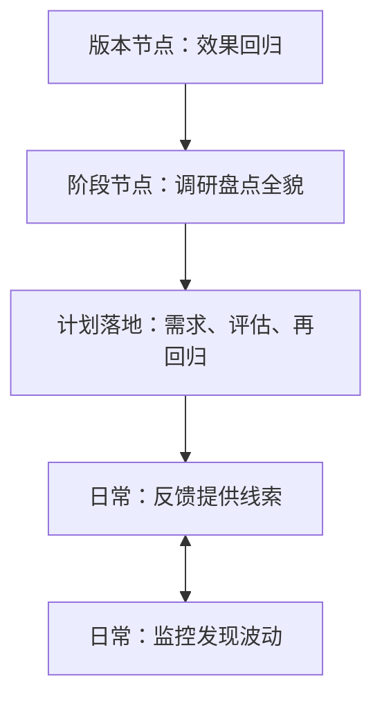

## 发现问题的四条途径

问题是产品优化的原动力。策略工作循环从发现问题开始，经过需求、开发评估，再到上线后的效果回归。如果只知道结果不好、不知道原因，后续迭代容易变成盲目试错。

老板问「课程推荐已经优化很多版本，转化率为什么还是不高」，PM 能罗列按付费能力推荐、按课程类型推荐、多次推送，却答不出「到底卡在哪类用户、哪个环节、什么场景」，这就是只停在结果层。

发现问题的任务，是把「不好」翻译成可解释、可验证、可排期的问题。只有问题清楚了，才知道该收集什么数据、尝试什么方案、用什么指标验收。这一步对应[工作循环](../01-concepts/04-workflow.md)的第一阶段。

| 层次 | 看到的是什么 | 还缺什么 | 典型表述 |
| --- | --- | --- | --- |
| 结果层 | 已经观察到的结果 | 原因、人群、环节、场景 | 转化率低、点击率掉了、成交率不够 |
| 问题层 | 可解释的差距 | 证据与下一步动作 | 哪类用户在哪一步离开、为何离开、解决后改善什么 |

没有问题层，监控看板再多也只是在重复播报结果。四条途径都是为了从结果走进问题，只是取样方式和擅长的问题类型不同。

功能问题相对收敛时，一条反馈加一次回归可能已经够；策略面对分群、场景和统计性需求时，四条途径才需要同时打开。

### 四条途径

发现问题有四条主要途径。它们是同一套循环上的不同传感器。

**用户反馈**：从吐槽、投诉、建议里找实际使用问题。例如用户在西直门桥转了三圈才下来，往往说明导航在某个出口、车道或提示时机上不合理。反馈能提供具体场景和行为线索，适合发现低频但严重、数据里不容易直接显现的问题。处理流程见[用户反馈处理](02-user-feedback.md)。

**系统监控**：用数字指标持续观察，靠阈值报警发现异常。例如首页结果点击率在过去一小时相比上周同期下降 20%。监控擅长及时发现大范围或突发波动，但通常不能直接给出根因，需要再拆链路、查数据和抽样。搭建方法见[效果监控与策略监控](03-monitoring.md)。文中百分比是课程举例，须用自身历史数据重算。

**效果回归**：每个新版本上线后，对照版本目标检查效果。例如上线拼车后，看拼车成功率、拼成后的取消率，判断目标是否达成、是否引入新的不合理问题。回归是直接围绕项目目标的检查。方法见[效果回归](../03-spec-and-validation/05-effect-review.md)。

**阶段性调研**：PM 定期抽出一整天甚至一周，从头到尾梳理产品，评估整体表现，确定下一阶段优化方向。例如搜索 PM 在季度末整体评估网页搜索效果，再决定下个 Q 的重点。调研补足单个反馈、单个报警、单个版本的局部视角。方法见[阶段性调研](05-periodic-research.md)。

| 途径 | 特点 | 局限 | 适合回答的问题 |
| --- | --- | --- | --- |
| 用户反馈 | 随机、具体、贴近个体感受 | 不是随机抽样，难直接估计全体发生率，难单独排优先级 | 用户遇到了什么具体问题？感受如何？ |
| 系统监控 | 持续、自动、及时 | 精度受阈值约束；发现异常但不能直接定位原因 | 哪个指标或环节现在异常？ |
| 效果回归 | 针对上一版本或项目 | 视野受项目范围限制 | 这次方案是否有效？有没有副作用？ |
| 阶段性调研 | 全面、系统、覆盖当前全貌 | 成本高、耗时长 | 当前产品主要问题是什么，下阶段做什么？ |

一个重要问题通常需要多个证据互相印证：反馈提供用户语境，监控发现波动，回归验证版本，阶段性调研负责全局盘点。

### 从结果走到问题

把结果变成可分析问题，至少追问五件事：

1.  低结果集中在哪些用户、内容、渠道或城市？
2.  用户在哪一步离开：看不到、看到了不点，还是点了完不成？
3.  是长期问题，还是最近版本、特定时段的异常？
4.  用户是否明确表达过困难？沉默用户是否也有同样问题？
5.  若被解决，预期改善什么指标？

四条途径如何配合，可以用三条规则判断。

**规则一：用一条途径发现，用另一条途径定量。** 一条「打不到车」的反馈，可能同时暴露高并发丢单和敏感词误杀。反馈负责「发生了什么、用户如何感受」；订单日志和监控负责「影响多大、是否普遍」；复现负责「为什么发生」。

**规则二：监控报异常，不等于已经定位。** 报警把范围缩小到某个指标、某个时段，仍要靠拆链路、抽样和回归来解释原因。把报警当结论，会把「策略指标因项目预期而变化」误判成用户体验故障。

**规则三：回归看上一版本，调研看当前全貌。** 效果回归回答「这个方案有没有用」；阶段性调研回答「现在整盘最大的缺口是什么」。两者都需要先定义[理想态](04-ideal-state.md)，但取样范围不同：回归围绕项目目标与对照，调研围绕当前产品的完整链路。



核心关系是：日常两条途径互相校验，版本节点检验上一方案，阶段节点形成下一计划。

| 情境 | 优先途径 | 还要补什么 |
| --- | --- | --- |
| 客服集中来电、商店差评突然增多 | 用户反馈 | 用监控确认是否大盘异常，避免被吵得最凶的问题带偏 |
| 核心指标短时大幅波动 | 系统监控 | 排除埋点和口径后，再抽样定位 |
| 某版本刚上线 | 效果回归 | 同时看用户反馈里有没有新的副作用 |
| PM 刚接手产品、季度规划、旧报告已过时 | 阶段性调研 | 用监控和反馈校验调研结论是否仍「热」 |
| 低频但涉及支付、安全、误杀 | 用户反馈 + 专项排查 | 不能等它在监控里变成大盘波动 |

成熟产品上，四条途径应同时在跑。缺任何一条，都会在某类问题上失明。新产品或频繁重构时，监控基线还不稳，应更依赖反馈、专项复现和阶段性调研。

判断一份「问题」能不能进入项目，再过一次：它是否已经从结果层落到人群、环节、场景？是否至少有两类途径互相印证？是否写得出「解决后改善什么」？三项都含糊时，先补证据，不要直接写需求。

### 从结果走到问题的记录卡

```text
当前观察到的结果：
这是结果层还是问题层？
已有证据来自：反馈 / 监控 / 回归 / 调研
还缺哪一类证据？
若只靠现有证据决策，最大的盲区是什么？
下一步动作：复现 / 拆指标 / 抽样 / 回归 / 启动阶段性调研
```

```text
问题陈述：
结果层指标与时间范围：
问题层解释（人群 / 环节 / 场景）：
证据：反馈 Case / 监控切片 / 回归对照 / 调研样本
反证：有没有说明「这不是问题」的数据？
若解决，预期改善什么？如何回归？
当前建议：继续观察 / 复现定位 / 进入优先级排序
```

第一张用来决定「现在该启动哪条途径」；第二张用来把已经发现的问题写成可进入[优先级与项目计划](07-prioritization.md)的条目。

成熟产品不必等季度调研才开始拼证据。可以把一周看成一次小循环：每日看监控报警、客服升级和商店新增差评；版本日对照目标做效果回归；周末把本周反馈与监控交叉验证；月末或季末做阶段性调研，形成下一阶段项目计划。

如果日常只有报警没有回归，会变成救火队；如果只有调研没有日常入口，调研会变成过时的问题墙。

### 证据冲突时怎么判

四条途径经常给出看起来相反的信号。处理顺序是先对齐，再解释，最后才决定信谁：

1.  **对齐口径**：反馈里的「打不到车」和监控里的「成交率」是不是同一个分母、同一条产品线、同一个城市？
2.  **对齐时间窗**：商店差评激增，是不是刚好对上某个版本号？监控下跌，是不是节假日或实验分流？
3.  **对齐人群**：总体平稳但新用户崩溃，平均值会把问题藏住。
4.  **解释剩余差异**：口径和时间都对齐后仍冲突，才进入「哪条途径有盲区」。反馈可能被幸存者偏差放大，监控可能漏掉低频严重问题，回归可能只看到项目范围，调研可能用了过时样本。

不要用「我更相信数据」或「我更相信用户」一句话结束争论。

### 误区与边界

-   **把「转化率低」直接当成需求。** 那是结果，还不是问题。没有人群、环节和场景，研发无法知道改输入、改逻辑还是改输出。
-   **只听反馈、不看监控。** 会被幸存者偏差带着走，把叫得最凶的问题当成影响面最大的问题。
-   **只看监控、不听反馈。** 会漏掉低频严重问题和策略误杀。敏感词误杀、支付扣款错误，往往先以单条投诉出现。
-   **用一次版本回归代替季度盘点。** 项目视野会越做越窄：旧问题被优化，新问题从未进清单。
-   **阶段性调研做完却不形成项目计划。** 问题墙无法进入优先级排序，调研变成展示材料。
-   **四条途径互相抢结论。** 信号冲突时，先对齐口径和时间窗。

四条途径适合已经有用户、有数据、有版本节奏的产品。从 0 到 1、几乎没有真实流量时，更应先把[理想态](04-ideal-state.md)和最小可观察指标立住。对安全、合规、资金类问题，即使样本极少，也不能等它在四条途径里「长成大盘」再处理。

四条途径齐备的最低标准：反馈有稳定入口和周处理节奏；监控有指标、基线和负责人；每个策略版本有回归；每个规划周期有一次全貌调研。缺哪一条，就在对应盲区上补。

接到一个「结果不好」的任务时，建议按这个顺序开工：先判断自己手里是结果还是问题；再看四条途径里已经有哪些证据、缺哪一类；用问题记录卡把人群、环节、场景写下来；最后才决定是复现、拆监控、做回归，还是启动阶段性调研。

四条途径可以同时给线索，但进入项目前应收敛成一个问题层表述。表述里至少有人群、环节、场景和「解决后改善什么」。缺一项，就还在结果层。

### 延伸阅读

-   [策略产品经理的工作循环](../01-concepts/04-workflow.md)：发现问题是四阶段循环的第一阶段
-   [用户反馈处理](02-user-feedback.md)：反馈如何收集、清洗标注、形成需求
-   [效果监控与策略监控](03-monitoring.md)：白盒看效果、黑盒看策略是否按预期运转
-   [理想态](04-ideal-state.md)：回归和调研都要先有可衡量的比较基准
-   [阶段性调研](05-periodic-research.md)：如何对当前全貌做系统盘点
-   [效果回归](../03-spec-and-validation/05-effect-review.md)：如何检验上一版本是否有效

## 来源说明

???+ note "来源说明"
    本文根据公开课程《策略产品经理》（B 站 [BV1YE411g717](https://www.bilibili.com/video/BV1YE411g717/)）整理为知识点，不是逐课笔记。

    课程中的数字、阈值和公式是教学示意，不能直接当作可上线参数。

    对应原课第 5、9、10 集。整理日期：2026-09-04。
