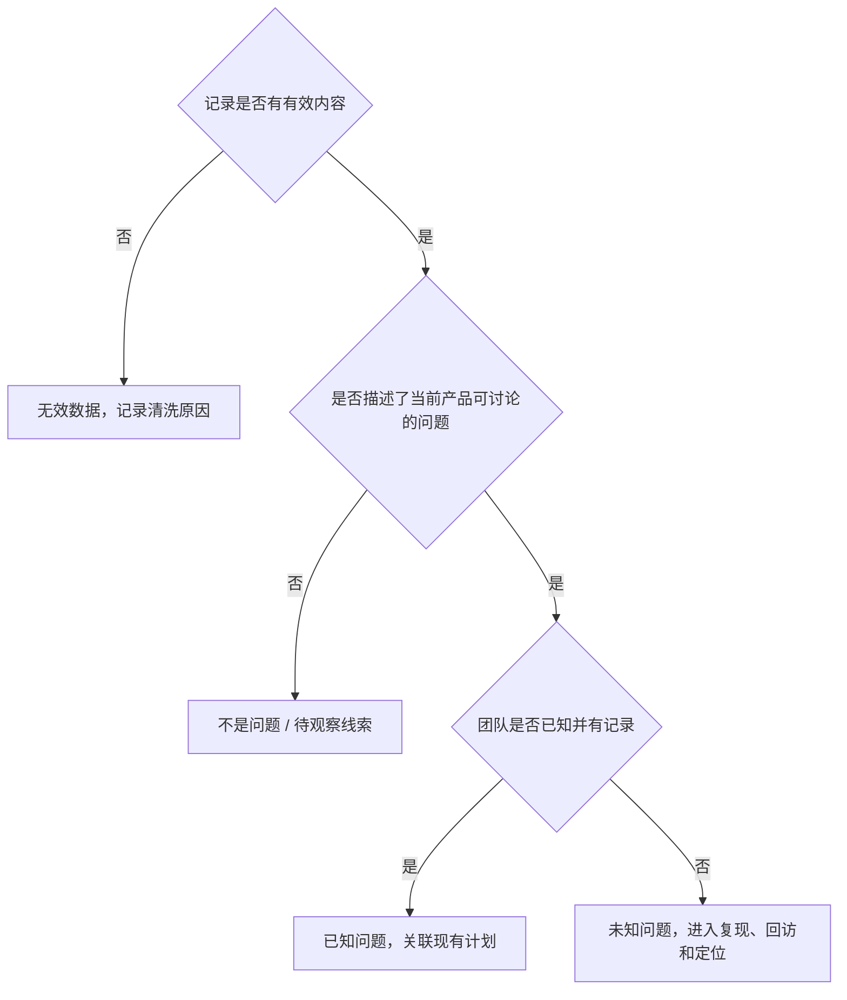

## 用户反馈处理

用户反馈是[发现问题的四条途径](01-four-channels.md)里最贴近个体语境的一条。它擅长提供具体场景和行为线索，不擅长直接代表全体用户。因此反馈是线索：规模靠监控和抽样估计，根因靠复现和链路数据确认，优先级靠[优先级与项目计划](07-prioritization.md)综合判断。

课程把反馈工作拆成四步：


核心关系是：前两步决定后续质量。如果清洗和标注没做完，后面的需求很容易建立在误读之上。前两步的产物是一份结构化问题清单。第三步不能跳过：用户说「搜索不好用」，需求必须说明是召回不足、排序不合理、关键词理解错误，还是用户不熟悉功能。第四步若没有回归，改进是否真的发生过，团队并不知道。

### 第一步：收集

**产品内反馈入口**是成熟产品的常见渠道。入口应尽量记录版本、设备、时间、页面和用户标识，减少后续定位成本。

**客服记录**是课程特别强调的核心渠道。用户愿意打电话或转人工，往往说明情绪已经积累到一定程度，问题可能较深或影响较大。不能只看文字，还要看情绪强度、是否重复来电、是否阻断核心任务，以及客服是否已给出临时处理。

外部渠道包括应用商店评论（观察公开评价和版本变化后的集中问题）和社交媒体。外部渠道里身份、版本、机型和上下文常常不完整，同一用户也可能跨平台重复表达。公开评论适合发现线索，不宜未经核实就统计为受影响用户数。

一条「打不到车」可能值得比它的字面严重得多。朋友说「早上没打到车，只能坐地铁」，单看一句话容易当成早高峰成功率本来就不是 100%。继续查订单后发现：连续五天只有一天成功接单。有一天是高并发丢单，另外几天是目的地店名命中敏感词表被误杀。用户只描述结果，背后可能同时存在两类系统问题。处理时保持三种敬畏：敬畏用户感受、敬畏具体 Case、敬畏策略副作用。过滤和风控本意是保护系统，却可能误伤正常用户，延伸见[风控策略](../07-growth-risk-data/02-risk-control.md)。

### 第二步：清洗与标注

先浏览字段：时间范围、来源、用户标识、版本、评分、原文、已有处理记录。数据提供者未必知道 PM 的分析需求，直接标注容易把无效记录、重复记录和好评混在一起。

清洗是减少无效工作。常见项：接通无声音、同一问题重复回拨、完全重复的抓取记录、广告乱码灌水、明确满分且没有问题描述的好评。四星甚至五星评论里也可能夹带具体问题，不能只按评分机械过滤。清洗要保留可追溯性，避免把真正的重复故障误删。

格式完整、来源真实，不代表它指出了当前产品问题。标注结果分三类，另加「无效数据」作为前置清洗概念。

| 标注 | 含义 | 典型处理 |
| --- | --- | --- |
| 不是问题 | 情绪或偏好，当前阶段还构不成可处理的产品问题 | 记录为待观察线索，不进修复队列 |
| 已知问题 | 团队已知道，可能已在计划中，或评估过但暂未排期 | 补充证据和优先级，关联已有需求 |
| 未知问题 | 看到反馈前不知道 | 复现、回访、定位后再写成需求 |

「不是问题」表示当前阶段尚未形成可处理的产品问题。例如外卖用户说某家米粉太贵，若平台当前没有定价权，就不能直接当产品缺陷；它可能启发补贴或价格展示，但需要另行验证。「未知问题」表示团队尚未掌握，需要继续调查。

### 第三、四步：形成需求并推动改进

已知问题：关联已有需求、版本或负责人；检查这条反馈是否提供了新的场景或严重性证据；若影响范围、风险或场景变了，重新评估优先级。

未知问题：补齐用户、版本、设备、时间和行为路径；尝试复现，必要时回访；与研发、客服、运营确认根因；评估影响规模、严重程度和修复成本；写成带目标、范围、Case、验收和回归指标的需求。

不要把「用户希望增加支付宝支付」直接写成必做需求。还要补充受影响规模、业务限制、替代支付方式、成本和优先级结论。第四步进入项目计划，协同研发、运营或客服实施，并用[效果回归](../03-spec-and-validation/05-effect-review.md)回收效果。

### 标注顺序



核心关系是：先判有效，再判是否构成产品问题，最后才分已知与未知。未知的下一步是复现，不是直接进迭代。

从一句反馈到一条需求：

```text
原始反馈：搜索不到我想找的店
→ 事实：某用户在某版本输入某关键词，结果为空或排序靠后
→ 假设：关键词理解或召回不足，也可能是使用方式超出当前能力
→ 验证：查询日志、召回结果、相似词、用户回访
→ 需求：优化某类查询的召回或引导，并定义成功指标
```

**幸存者偏差。** 愿意留言、打电话或发帖的用户不是随机抽样。强烈不满者更可能发声，沉默的大多数可能有同样问题却没有反馈。因此：反馈中高频的问题不一定是全体影响面最大的问题；低频反馈也不一定不重要，尤其要关注安全、支付、订单和策略误杀。看到 10 条「配送迟到」，并不能推出 10% 用户遇到迟到。还需要分母、时间范围、订单量、用户去重、版本和场景。反过来，只看到一条支付失败或账户扣款，也不能因为数量少就忽略。

优先级至少综合：影响规模、单次严重度、是否阻断核心任务、是否涉及安全合规资金或信任、频率与趋势、修复成本、是否有替代方案。反馈负责「发生了什么、用户如何感受」，数据负责「影响多大」，复现负责「为什么发生」。

### 短例：外卖应用商店评论

课程以一周内外卖 App 的应用商店评论为例：原始约 460 条，先浏览日期、评分、内容，再剔除明显好评和无关记录。演示中先筛出约 146 条进入标注，再得到约 72 条较明确的有效反馈，按配送、支付、搜索等细类整理。这些数字只属于该演示数据，关键在过程：从原始评论到可执行问题，要经过清洗、标注、复核和汇总，而不是直接数低分评论。

逐条判断时，「好评且无问题内容」可清洗；「配送超时」多为已知准时性问题；「希望增加支付宝」是已知但可能暂无计划；「搜索不到」若团队此前没发现，先标未知；「食品价格贵」「越来越辣」若只是对商家的泛化抱怨，当前可标为不是问题，但保留为商业线索。用数据透视按「问题标注 × 细分类别」汇总时，输出应是「数量 + 占比 + 典型案例 + 后续动作」。

### 反馈记录与每周清单

```text
反馈 ID：
来源 / 时间 / 版本 / 设备：
用户原话：
是否有效数据：否 / 是（清洗原因：）
问题标注：不是问题 / 已知问题 / 未知问题
背后问题：
影响人群与场景：
复现信息 / 行为路径：
严重度：高 / 中 / 低
细分类别：
后续动作：无动作 / 关联计划 / 回访 / 复现 / 数据分析 / 运营教育
负责人与状态：
回归指标与结论：
```

标注表至少增加这些列：原始评论、来源 / 时间 / 版本、问题标注、问题备注、细分类别、后续动作、负责人 / 状态。保留原话是为了回访和复核，不是为了把情绪写进需求标题。

每周处理清单：

-   汇总产品内、客服、应用商店和外部舆情
-   标记时间、版本、设备和用户信息
-   清洗无声、重复、广告、乱码和无关记录
-   保留有价值的原始文本与典型 Case
-   先标注不是问题、已知问题、未知问题
-   对未知问题补行为路径、日志或回访
-   汇总数量和趋势，但不把反馈比例当全体发生率
-   与监控、行为数据、版本回归交叉验证
-   输出问题、证据、优先级、负责人和下一步动作
-   处理后回访或回看指标，确认问题是否真的改善

汇总时不要只出饼图。对高频、高严重度或未知问题，必须回到原文和 Case 复核。

| 信号 | 更可能的处理 |
| --- | --- |
| 阻断下单、支付、登录 | 未知也要当天复现，可并行拉监控 |
| 策略误杀、风控误伤 | 按未知问题走完订单路径，不因条数少忽略 |
| 重复来电、情绪激烈 | 提高严重度，但不等于立刻承诺修复 |
| 只有解决方案、没有场景 | 先还原背后问题，再决定是否立项 |
| 纯价格 / 口味偏好 | 标为不是问题或商业线索，不进缺陷队列 |

### 误区与边界

-   **只收集低分评论。** 四星评论和客服记录里同样有具体问题；客服渠道往往更接近核心任务受损。
-   **把用户提出的解决方案直接当需求。** 「希望增加支付宝」可能是支付失败、习惯或运营活动限制，先确认背后问题。
-   **因为语气激烈就承诺修复。** 情绪是严重度信号，不是根因结论。
-   **将重复反馈简单去重。** 会丢掉问题持续时间和影响范围。重复本身就是证据。
-   **只统计数量，不保留原话。** 没有版本和典型 Case，研发无法复现，运营无法回访。
-   **看到未知问题就马上排版本。** 未知表示尚未掌握，下一步是复现。
-   **认为没有反馈就是没有问题。** 沉默用户可能有同样困难却没有发声。

反馈适合发现具体场景、低频严重问题和策略副作用。它不适合单独完成影响面估计和资源排序。没有稳定入口时，先把收集做起来，再谈标注体系；已经有监控和大盘数据时，不要因为反馈少就宣布产品没有问题。安全、支付、误杀类即使只有一条，也要按未知问题走完复现。演示里的 460 / 146 / 72 条只说明清洗过程，不能外推到其他产品的「正常有效反馈比例」。

每周固定留一段时间处理反馈，比「想起来就看一眼商店评论」更重要。入口可以简陋，标注必须诚实。处理节奏一旦中断，客服记录会堆积，未知问题会在下一版本里变成已知事故。确认后的问题如何写成需求，见[简单策略需求文档](../03-spec-and-validation/01-simple-prd.md)。

### 延伸阅读

-   [发现问题的四条途径](01-four-channels.md)：反馈在四条途径里提供语境
-   [效果监控与策略监控](03-monitoring.md)：用指标估计规模、发现大盘波动
-   [优先级与项目计划](07-prioritization.md)：反馈线索如何进入 IoI 排序
-   [简单策略需求文档](../03-spec-and-validation/01-simple-prd.md)：确认后的问题如何写成需求
-   [效果回归](../03-spec-and-validation/05-effect-review.md)：改进落地后如何回收效果
-   [风控策略](../07-growth-risk-data/02-risk-control.md)：过滤和风控误杀为何要敬畏副作用

## 来源说明

???+ note "来源说明"
    本文根据公开课程《策略产品经理》（B 站 [BV1YE411g717](https://www.bilibili.com/video/BV1YE411g717/)）整理为知识点，不是逐课笔记。

    课程中的数字、阈值和公式是教学示意，不能直接当作可上线参数。

    对应原课第 5 集。整理日期：2026-09-04。
