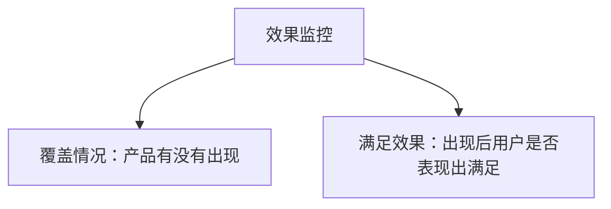

## 效果监控与策略监控

系统监控是：针对相对稳定的产品，通过收集、观察数字性指标，自动、实时地发现问题。三个限定词缺一不可。

1.  **对象是相对稳定的产品**：流程和数据有历史基线可比较。产品三天两头重构时，今天的变化很可能只是改版，很难判断什么是异常。
2.  **观察的是数字性指标**：机器很难完整模拟真实体验，监控对象通常是能统计出来的指标。
3.  **自动、实时**：机器 24 小时运行，异常时尽快通知责任人。

成熟产品模块多、链路复杂，人工不可能频繁检查每个环节。监控把重复观察交给机器，提高发现时效、及时止损。它是[四条途径](01-four-channels.md)里「持续、自动」的那一条，不能替代反馈、回归和阶段性调研。

**白盒**是用户直接与产品发生的交互，例如输入、看到结果、点击、翻页、重新搜索。它直接反映体验，是效果监控的对象。**黑盒**是用户发起请求后，系统内部为了产生下一步反馈所做的一系列动作。用户感知不到，但它们决定最终结果；策略监控的对象主要在这里。

| 维度 | 效果监控 | 策略监控 |
| --- | --- | --- |
| 观察对象 | 用户可感知的白盒结果 | 用户不可直接感知的黑盒策略模块 |
| 主要指标 | 产品核心目标、体验指标 | 策略核心指标或中间指标 |
| 与体验的关系 | 通常直接反映体验变化 | 可能只是内部过程变化 |
| 主要用途 | 判断最终效果是否变差 | 监测策略是否按预期运转、辅助定位 |
| 异常后 | 需要重点响应 | 先判断是否是项目预期造成的变化 |

策略指标变化不一定等于体验变差。内容分类从「社会新闻」调成「军事新闻」，策略监控会看到两类占比对调，但用户看到的仍是同一条新闻，点击率可能平稳。促销从「一件五折」改成「七件九折」，影响面可能从 10% 升到 70%，销售额却不一定同向变化。文中比例是课程举例。看到策略监控异常，先确认近期是否有项目或规则调整，再结合效果监控判断是否真的影响用户。纯功能产品的技术模块监控通常由研发维护；功能和策略共存时，黑盒里的策略模块需要策略 PM 提出并发起搭建。

### 两步搭建

搭建监控体系是两步：先拆流程选指标，再定波动区间与报警。报警规则 = 触发报警的条件 + 报警方式。

#### 第一步：拆流程，选指标

画出从输入到结果的完整流程；标注用户可见的白盒、用户不可见但影响结果的黑盒；对白盒提取体验核心指标，对黑盒提取策略核心指标、中间指标、分布指标；确认每个指标的分子、分母、统计周期和数据来源。

搜索：意图识别、检索、排序、展现选择属于黑盒；点击、翻页、改词属于白盒。打车：发单、看到接单、等待到达是白盒；计算订单价值、找空闲司机、匹配派单是黑盒。消息推送：收到、点击、浏览是白盒；素材准备、分群、定向匹配是黑盒。

白盒效果监控不要罗列事件，先归成覆盖和满足：



核心关系是：只看点击率，会把「根本没展现」和「展现了但不点」混在一起；只看展现量，又不知道用户是否满意。覆盖异常优先查展现链路；覆盖正常但满足变差，优先查内容、位置、样式或体验。

覆盖用影响面。课程用搜索中的图片类特性结果（一个产品楼层，不是某一张图）演示，下列公式是教学示意：

```text
影响面 = 图片类特性结果展现流量 ÷ 网页搜索总流量
第 k 位影响面 = 展现在第 k 位的流量 ÷ 网页搜索总流量
```

总影响面理论上等于各位置影响面之和。位置细分用来定位：总覆盖下降时，是高位置少了还是低位置少了。

满足效果同时看正向和负向行为。正向：点击率（CTR）= 点击次数 ÷ 该结果展现次数，并按位置拆。负向：翻页比例、更改搜索词比例，分母都是结果展现次数。改词通常是比翻页更强的未满足信号。这些指标要联动。点击是满足的正向代理，不等于用户最终完成了任务。

黑盒按课程简化模型拆成三段（真实架构更复杂，这是为了理解监控）：搜索词 → 需求识别 → 检索 → 展现 → 用户看到结果。对每个策略问同一串问题：目标是什么？机器能否直接判断？不能的话，代理指标是什么？正常波动范围？异常时对用户影响？用哪种报警？

**需求识别**的理想目标是该识别的都识别、不该识别的不误识别。真实准确率和真实覆盖率机器不能直接统计。如果机器已经知道对错，它就不会那样识别。可观测的是识别覆盖率 = 识别为图片需求的流量 ÷ 网页搜索总流量。它不等于产品影响面：受限内容可能识别为图片需求却不能展现；过长的明确需求可能检索为空。再用强 / 中 / 弱需求比例做分布，提高定位精度。

**检索**用平均相关性打分观察结果质量。正常时应相对稳定；大幅波动通常意味着某模块或特征抽取出问题。该指标受实时需求、内容抓取、资源库影响，历史波动较大，阈值要更宽。

**展现**对每类样式分别监控展现率和点击率。课程示例四种样式（多排筛选、多排、单排筛选、单排）共 8 个指标。样式差异对用户影响相对较小（用户已经看到结果），报警即时性可以下调。搜索侧的展开见[搜索策略](../05-function-oriented/02-search.md)。

#### 第二步：定波动区间与报警

数据每天都会波动，不能把「和昨天不同」当成异常。先定义正常波动区间：落在区间内暂不报警，超出再进入报警判断。报警方式的核心是即时性：重要且紧急用电话；中间策略、紧急程度较低用邮件；中间状态用短信。方式由指标重要程度和本次波动幅度共同决定。

正常区间有两种常用来源：历史数据（需剔除已确认的历史故障噪点）；以及在波动近似正态时用三 Sigma：`正常波动区间 ≈ [μ - 3σ, μ + 3σ]`。课程只介绍了这一方法，实际使用前仍要确认指标是否适合这种分布假设。这不是对所有指标的统计定理。公式是教学示意。

指标重要程度用影响面和影响程度来看。两者都高，重要程度高。娱乐类内容抓取比生物科技类影响面更大；抓取挂了用户还能看旧新闻，展现策略挂了打开 App 可能全是乱结果，后者影响程度更高。影响面低但波动极端（某类抓取完全挂掉）仍可能需要马上响应。

| 指标重要程度 | 本次波动幅度 | 通常的报警方式 |
| --- | --- | --- |
| 高 | 高 | 自动电话 |
| 高 | 一般 | 短信 |
| 一般 | 高 | 短信；极端时可电话 |
| 低 | 低 | 邮件 |

对比基准在课程案例里主要用上周同期。周期越短随机波动越大；行为指标小时级可能很不稳，课程仍保留小时监控但提高阈值，同时用天级做低时效提醒。5%、20%、50% 是图片类结果案例按历史波动给出的示例阈值，必须用自身历史数据重算，不能当通用标准。

### 从目标反推指标

不要从已有埋点出发堆看板，而要从目标反推指标：写清用户和业务目标 → 画出端到端链路 → 每个节点至少定义结果指标 → 为异常配置负责人、排查入口和处置动作。没有动作的指标只是报表。实验设计和指标拆解，见[评测](../../../ai/evaluation.md)。

| 模块 | 主要问题 | 示例指标 |
| --- | --- | --- |
| 覆盖 | 用户是否看到结果 | 有结果率、目标样式覆盖率 |
| 满足 | 用户是否使用结果 | 点击率、负向行为、负反馈 |
| 需求识别 | 是否识别到目标需求 | 识别比例、识别覆盖率、强度分布 |
| 检索 | 候选是否相关 | 相关性分、空结果率 |
| 展现 | 是否以合适样式呈现 | 样式展现率、样式点击率 |

报警触发后先判断是覆盖问题还是满足问题，再决定查哪一段黑盒。识别覆盖率上升但产品影响面不变，可能是检索为空或内容限制没有承接。第三位图片结果影响面异常，仍不能断言是哪个模块：可能是识别、检索、展现配置、埋点口径或外部流量结构。监控负责及时发现和缩小范围，定位仍需拆系统、查链路、比对版本和抽样。

两大局限要写进设计：

1.  **精度与阈值。** 口径先于阈值。阈值过严，误报多，会形成「狼来了」；阈值过宽，漏掉小幅度或局部问题。课程用从 5% 放宽到 20% 的例子说明：为提高报警准确率，异常监控覆盖会受限。
2.  **发现异常但不能直接定位。** 报警是调查信号，不是根因结论。修复后还要用[效果回归](../03-spec-and-validation/05-effect-review.md)确认指标恢复且没有新的副作用。

### 监控项与报警处理

```text
监控项名称：
对应目标：希望保护用户 / 业务的什么结果？
策略环节：覆盖 / 满足 / 需求识别 / 检索 / 展现
盒子类型：白盒 / 黑盒
指标定义：分子、分母、时间窗口、去重和过滤口径
基线：历史范围、上周同期或实验对照
拆分维度：用户、查询、设备、版本、位置
触发条件：阈值、持续时间、最小样本量
通知方式：邮件 / 短信 / 自动电话
负责人、排查入口、处置动作、回归方式：
```

报警处理顺序：

1.  先确认是否来自真实数据变化，排除统计和埋点问题
2.  查看样本量、时间窗口和业务背景，判断是否自然波动或项目预期
3.  按版本、设备、查询类型、用户群和模块拆分
4.  对照白盒结果和黑盒链路，确认问题发生在哪一层
5.  回放代表性查询或用户路径，补充定性证据
6.  评估是否需要降级、关闭某样式、回滚或继续观察

图片类特性结果的案例里，覆盖类影响面在小时级相对稳定，课程用上周同期波动大于 5% 发短信、大于 20% 自动电话；用户行为小时级波动更大，因此保留小时监控但把阈值提高到 50%，同时用天级数据做邮件和短信。需求识别覆盖率的波动与产品影响面接近，规则同类；检索平均相关性历史波动更大，普通报警用 20%、严重用 50%；展现样式对用户影响相对小，大于 5% 邮件、大于 20% 短信。

这些数字只说明「按历史波动和影响程度分级」，不是可抄的行业标准。换产品后必须重看自己的历史区间、统计周期和影响程度。

需求识别是课程用来说明可观测性边界的例子。理想目标有覆盖和准确两维，但机器会把自己的输出视为正确，因此无法靠自身结果计算真实准确率、真实覆盖率。推导链是：理想目标 → 机器无法直接知道真实对错 → 可观测结果是机器判定为图片需求的流量 → 核心指标是识别覆盖率 → 辅助指标是强 / 中 / 弱需求比例 → 报警按历史波动和重要程度分级。这与[理想态](04-ideal-state.md)里「理想态必须可衡量」是同一件事，监控还多了一层：可衡量的东西还得能自动、实时地算。

### 误区与边界

-   **把每天的变化都当成故障。** 必须先建立正常区间。节假日、实验分流和采样误差都会让「和昨天不同」变成常态。
-   **只监控最终结果，不监控策略过程。** 效果指标可以告诉你体验是否变化，但不一定能告诉你哪个策略模块出了问题。
-   **策略指标异常就等于用户体验变差。** 分类比例、促销影响面可能因为项目调整而变化。
-   **阈值越敏感越好。** 频繁误报会降低团队对真正异常的重视。
-   **低影响面指标永远不需要紧急响应。** 某类抓取完全挂掉时，仍可能需要马上处理。
-   **只看总影响面或只看点击率。** 总覆盖下降不能告诉你是首位还是末位；点击率不看负向行为，会漏掉翻页和改词。
-   **为了稳定而只做天级监控。** 天级更稳，但早上的问题要到第二天才知道。
-   **把机器输出当成客观标签。** 用自身识别结果计算「真实准确率」，在逻辑上不成立。

监控最适合关键结果可量化、流量规模较大、模块复杂且需要持续运行的线上系统。小流量、低频、指标不稳定时，应先解决样本量和口径。产品频繁改版、基线尚未稳定时，直接套用历史区间可能不可靠。三 Sigma 依赖稳定分布的近似。高风险场景即使有监控，也不能取消人工兜底。课程把复杂搜索引擎简化为需求识别、检索、展现三段，适合学习监控思路，不等于真实系统架构图。报警之后如何用 Case 定位，见[抽样分析](06-sampling.md)。

### 延伸阅读

-   [发现问题的四条途径](01-four-channels.md)：监控负责及时发现波动
-   [理想态](04-ideal-state.md)：理想目标与机器可观测指标之间常有差距
-   [抽样分析](06-sampling.md)：报警之后如何用 Case 定位原因
-   [效果回归](../03-spec-and-validation/05-effect-review.md)：修复或改策略后如何验证
-   [搜索策略](../05-function-oriented/02-search.md)：覆盖、满足、识别、检索、展现在搜索中的展开
-   [评测](../../../ai/evaluation.md)：指标口径与实验设计

## 来源说明

???+ note "来源说明"
    本文根据公开课程《策略产品经理》（B 站 [BV1YE411g717](https://www.bilibili.com/video/BV1YE411g717/)）整理为知识点，不是逐课笔记。

    课程中的数字、阈值和公式是教学示意，不能直接当作可上线参数。

    对应原课第 6 至 9 集。整理日期：2026-09-04。
