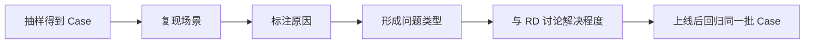
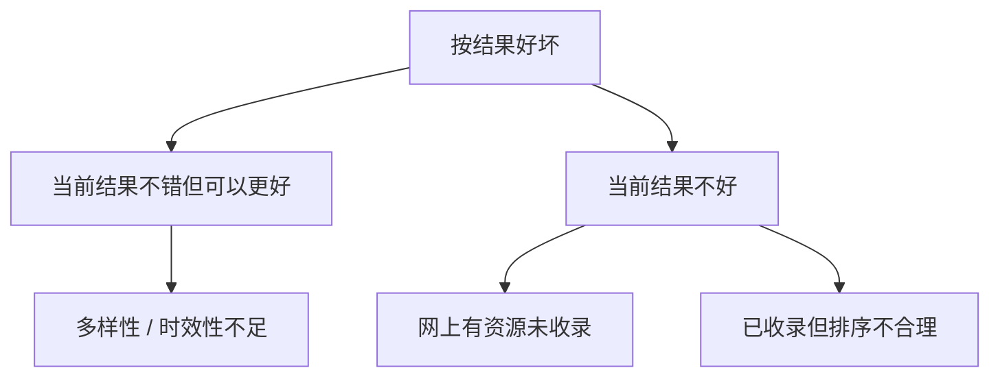
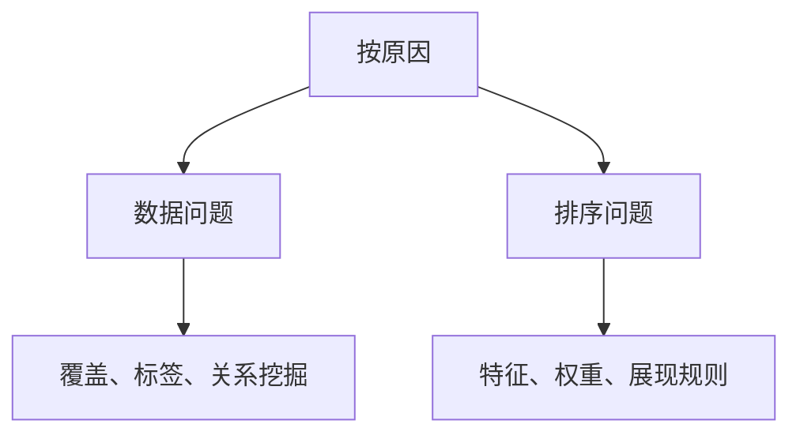

## 抽样分析

功能设计里的访谈，主要用于深入理解场景、判断需求有无和启发方案，样本量通常不直接决定方案覆盖到什么程度。策略 PM 面对的是一群人在变化环境中的各种问题，目标是借助机器规模化地服务每个人，因此必须对用户群体有全面、细致和宏观的认识。

不考虑成本，当然希望把所有数据看完。但有两个硬约束：时间不允许人工看完全部记录；即使时间够了，人脑面对一万条记录也可能失去归纳能力。所以需要抽样：用足够多样本近似代表整体。

**总体**是本次调研希望认识的完整数据集合，例如全国一周内的未成交订单，或一天内包含搜索动作的用户 Session。总体不等于数据库全部数据，而是由调研目标和代表性时间窗口筛出的可分析集合。**抽样对象**是经过规则筛选、需要被分析的总体数据集合。选哪一种不由习惯决定，而由产品类别、理想态指标和调研目标决定。

Case 会贯穿策略工作全流程：分析问题、描述[理想态](04-ideal-state.md)、和 RD 讨论、验证效果时都会反复使用。一个合格的 Case 至少应能回答：发生了什么、用户 / 系统处于什么上下文、为什么判断它没有达到理想态、证据是什么。这是[阶段性调研](05-periodic-research.md)的第二步。



核心关系是：Case 从发现一直用到回归，不要每次重新找「感觉差不多」的例子。

| 调研关注点 | 更合适的抽样实体 |
| --- | --- |
| 某类用户长期行为 | 用户个体 |
| 一次完整使用体验 | Session |
| 每个查询的满足情况 | query / 搜索词 |
| 交易是否完成 | 订单 |
| 某内容下推荐是否合理 | 商品 / 视频及其推荐列表 |

时间窗口应覆盖一个能代表全体用户行为的最小周期。计算器类产品每天差异不明显，可能一天就够；有周末效应的外卖，通常以一周为窗口；有月底效应的现金贷，需要考虑完整月度周期。核心是避免把重要周期性行为排除在外。

### 六步

全程顺序不能倒：调研目标 → 理想态 / 未达成类型 → 抽样对象 → 时间窗口 / 维度 → 抽样方法 → 样本量 → 标注 → 问题框架与结论。任何一步都不能因为「数据已经拉出来了」而倒推目标。

**第一步：明确调研目标。** 最容易被低估、却会决定后续对象和方法。不要只照抄任务名，写成可判断的问题：这次要判断什么？理想态是什么？哪些未达情况必须被发现？最终要支持什么决策？目标错误的典型坑：相关视频详情页固定都有列表，重点可能是内容和排序；广告视频还有「本来应该展示却没有展示」的覆盖问题。如果只抽「已经展示广告的结果」，只能研究准确率，发现不了应展未展，前面的工作就要返工。抽样范围必须能覆盖调研目标中的每一种问题类型。

**第二步：确定抽样对象。** 根据理想态指标筛选总体：只分析核心指标未达理想态的数据，或分析能代表当前版本的数据；数据量极大且有稳定周期时，先截取代表性时间窗口。对象必须与目标和理想态相关，并且能够代表总体。

**第三步：确定时间窗口和业务维度。** 检查周末、月底、节假日、地域、新老用户、设备、渠道或业务线。这些差异会改变行为时，不能擅自删掉。必要时按维度分层，再在各层内随机抽。

**第四步：选择抽样方式。** 默认检查：总体是否已确定？每个单位是否有唯一标识？每个单位抽中机会是否相等？是否有必须单独观察的群体？是否需要分层保证小群体被覆盖？没有特殊目的，用简单随机抽样；有明显分群且各层都必须得到结论，再分层，并在报告里写清各层样本量和权重口径。

**第五步：确定抽样数量。** 在统计精度与人工成本之间平衡。见下文经验规则。

**第六步：分析标注并汇总。** 逐个 Case：复现当时用户和系统场景 → 观察上下文、策略输入、结果和后续行为 → 判断是否达到理想态 → 标注未达成的直接表现 → 追问原因 → 记录证据、边界和不确定性。然后用金字塔原理汇总。

### 随机与分层

课程介绍随机、系统、分层、整群等方法，重点是最常用的简单随机抽样：从总体 N 个单位中任意抽取 n 个，使每个可能的样本被抽中的概率相等。「概率相等」是为了让样本尽量代表总体。除非有特殊调研目的或明显分群需要，否则优先简单随机抽样。它不是「随便抽」。

分层用于必须单独观察的小群体，否则简单随机可能抽不到。分层后的比例不再是总体比例的直接估计，报告必须写清权重。对非常严重、不能漏掉的安全 / 合规问题，不能只依赖随机抽样，应另设专项全量或规则扫描。

推荐或广告常同时存在覆盖和准确两个问题。先判断「是否应展示」，再判断「展示得好不好」。只抽展示结果，会漏掉覆盖；只抽未展示，又无法评价展示质量。

### 样本量：课程经验，不是统计定理

课程给出的实践经验：如果希望某类问题的影响面具有统计意义，尽量让该问题的 Case 数量大于 5，或者影响面达到 3% 及以上。这是课程经验，不是所有项目都适用的严格统计功效计算。

课程示例：若最小关心的问题影响面是 1%，希望这类问题至少有 5 个 Case，则最低总体样本量约为 `5 ÷ 1% = 500`；若希望精度更高，可提高到约 1000，使 1% 问题约有 10 个 Case。下列公式是教学示意：

```text
最低样本量 ≈ 目标最小影响面对应的最小 Case 数 ÷ 目标最小影响面
问题影响面估计 = 某问题 Case 数 ÷ 有效样本总数
```

抽样得到的影响面会有统计误差。不能把一次小样本的 1% 当作精确事实。报告应记录样本量、抽样方式、时间窗口和不确定性。实际还要考虑标注成本、总体大小、分群和误差要求。样本不是越多越好：过多会让标注失去可控性。

滴滴成交率示例（方法，非套用参数）：指标是订单成交率，目标分析未成交，时间选一周，地域选全国，实体是订单，总体是全国一周未成交订单，方法为随机抽样。搜索满足度示例：无法用单一指标筛出不满足，先从总体抽样再人工标注；实体是包含搜索动作的 Session，排除不含搜索的浏览和下单片段。

### 用金字塔原理汇总问题

问题汇总要有合理逻辑框架：上下级是总分关系；同级之间相互排斥、不重叠；同级合起来覆盖、不遗漏。调研开始时不一定能预先写出完美框架。可以先有初版，随着标注发现新问题实时调整，但要保持框架自洽。同一批零散发现可以有多种合理框架，只要层级清楚、同级互斥、总体覆盖完整。

课程用相关视频推荐的零散问题（应展示但未收录、同质化、缺关系维度、热点未及时出现、已收录但排序不合理）演示两种拆法：





核心关系是：发现框架和落地框架可以不同。前者便于识别，后者便于按部门执行。

先目标，后样本。先判断「是否应展示」，再判断「展示得好不好」。从数据量出发选择实体粒度，不要因为「订单表最好取」就永远抽订单。影响面是估计，不是绝对真值。

如果最小关注影响面为 2%、希望至少 6 个 Case，按课程经验最低样本量约为 `6 ÷ 0.02 = 300`。算出数字后仍要问：标注成本是否扛得住？小群体是否会被随机抽漏？安全问题是否另有全量扫描？这三问过不了，就把经验公式得到的数字当成上限参考，不要当成开工指令。

### 三张表

**抽样设计表**

| 字段 | 内容 |
| --- | --- |
| 调研目标、理想态 / 核心指标 | |
| 总体定义 | |
| 抽样对象 | 用户 / Session / query / 订单 / 其他 |
| 时间窗口、必须覆盖的业务维度 | |
| 抽样方法 | 简单随机 / 分层 / 其他 |
| 计划样本量、最小关注影响面 | |
| 预计单个 Case 标注成本 | |

**Case 标注**

| Case ID | 场景 / 上下文 | 实际结果 | 是否达理想态 | 问题类型 | 原因 | 证据 | 置信度 |
| --- | --- | --- | --- | --- | --- | --- | --- |
| C-001 |  |  |  |  |  |  |  |

**问题汇总**

| 一级问题 | 二级问题 | Case 数 | 影响面 | 代表 Case | 证据 | 待确认项 |
| --- | --- | ---: | ---: | --- | --- | --- |
|  |  |  |  |  |  |  |

设计表决定抽什么，标注表决定每个 Case 说什么，汇总表决定问题如何进入[优先级与项目计划](07-prioritization.md)。三张表缺一，抽样就会停在「看了一些例子」。

广告、推荐、特殊样式这类策略，抽样对象要能回答两个问题：该出现的有没有出现，出现的好不好。一个可执行的折中是：总体 A 为目标场景的全部实体（含未展示），总体 B 为已经展示的结果；A 中随机抽一部分看覆盖，B 中随机抽一部分看质量。报告分别给覆盖影响面、质量影响面，不要合成一个看不懂的百分比。如果资源只够抽一批，优先保证总体定义能覆盖「应展未展」。质量问题至少还能从已展示结果里补抽；覆盖问题一旦总体错了，只能返工。

写给 RD 的 Case 不要只有一句「这个不好」。至少包括：发生时间与版本、用户或订单标识、当时输入（位置、query、候选）、当时输出、后续行为、为何判定未达理想态、不确定之处。上线回归时应能拿同一批 Case 再走一遍。

### 误区与边界

-   **老板一提调研就立刻拉数据。** 目标不清会导致抽样对象与结论不匹配。
-   **沿用上一个项目的抽样范围。** 不同目标可能需要同时观察覆盖和准确。
-   **只抽已经展示的结果。** 会漏掉应该展示却没有展示的问题。
-   **只抽一天且忽略周期效应。** 周末、月底会让样本失真。
-   **只看总体数量，不看实体粒度。** 用户、Session、query、订单回答的问题不同。
-   **把简单随机抽样理解成随便抽。** 关键是每个总体单位有相等的抽中机会。
-   **样本越多越好，不管人工成本。** 过多会让标注失去可控性。
-   **把经验阈值当成严格统计定律。** 「Case 大于 5 / 影响面不低于 3%」是课程经验，不应替代正式统计设计。
-   **过早固定问题框架。** 框架要随新 Case 调整，但不能失去互斥、不遗漏和层级关系。
-   **把 Case 当成一句结论。** Case 必须有上下文、证据和可复现路径。

抽样适合策略问题复杂、用户差异大、无法逐条分析全量数据的场景。小群体极其关键时需要分层或定向抽样，并明确它不再是总体比例的直接估计。对实时变化非常快的产品，抽样窗口和数据新鲜度要优先确认。对搜索 / 推荐等无法单一指标衡量的产品，需要人工标注。对不能漏掉的安全 / 合规问题，应另设专项全量或规则扫描。

抽样报告至少应让没参加标注的人看懂：总体是什么、为什么抽这个实体、时间窗口覆盖了哪类周期、用的是随机还是分层、样本量如何按课程经验估算、问题框架如何满足总分与互斥。缺其中一项，影响面就很难拿去和别的项目比较。

开始标注前，先用 10 个 Case 试跑问题框架。若 10 个里已经出现「不知道该进哪一类」，先改框架再加大样本量。框架不自洽时，多抽只是把混乱放大。试跑成本很低，返工整批标注的成本很高。

### 延伸阅读

-   [理想态](04-ideal-state.md)：抽什么、标什么，由理想态决定
-   [阶段性调研](05-periodic-research.md)：抽样是调研三步的第二步
-   [优先级与项目计划](07-prioritization.md)：影响面如何进入收益估算
-   [效果回归](../03-spec-and-validation/05-effect-review.md)：上线后回到同一批 Case
-   [搜索策略](../05-function-oriented/02-search.md)：以 Session / query 为抽样单位
-   [出行匹配策略](../06-business-oriented/03-ride-matching.md)：以未成交订单为总体时的拆法

## 来源说明

???+ note "来源说明"
    本文根据公开课程《策略产品经理》（B 站 [BV1YE411g717](https://www.bilibili.com/video/BV1YE411g717/)）整理为知识点，不是逐课笔记。

    课程中的数字、阈值和公式是教学示意，不能直接当作可上线参数。

    对应原课第 12 集。整理日期：2026-09-04。
